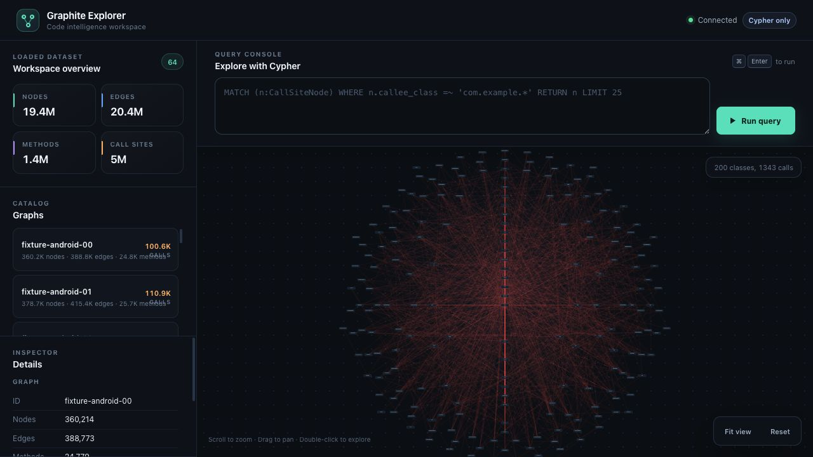

# Graphite

[](LICENSE)

English · [简体中文](README.zh.md)

**Structured codebase context for LLMs.** Graphite turns JVM bytecode into a queryable program graph — so AI agents can understand your codebase without reading every file.

[Production scale](#production-scale) · [Run the demo](docs/quickstart-demo.md) · [Quick start](#quick-start) · [Connect an AI agent](#mcp-integration) · [Kotlin API](#kotlin-api)



**64 graphs · 19.4M nodes · 20.4M edges.** Explore class relationships within a
loaded corpus of Android, Tika, Hive, and Kotlin compiler bytecode.
[Reproduce this view](docs/public-scale-demo.md).

## The Problem

LLMs working with code face a fundamental constraint: **a codebase can exceed
what fits in a single prompt.** Finding a method is only the beginning. To answer “which
constants reach this API?” or “what calls this method?”, an agent must connect
information spread across callers, fields, types, and dependencies.

Source files contain the evidence, but retrieving files still leaves the agent to
reconstruct those relationships. Graphite makes the relationships queryable so an
agent can retrieve focused context for the question it is trying to answer.

## The Solution

Graphite builds a **program graph**: nodes represent program elements and edges
represent relationships such as calls and dataflow. An agent can discover the
schema, query the graph with Cypher through MCP, and receive structured results.
The same graph is available through the CLI and web Explorer.

For example, to investigate a feature flag, query the constants that flow into the
flag API and the methods containing those call sites. The result gives the agent
specific evidence to inspect further. The walkthrough below demonstrates both
queries and their actual output.

## Why Not Just Tree-sitter?

**Program semantics are Graphite's foundation.** Its graph models values,
parameters, returns, fields, calls, and types so that code relationships become
queryable context for agents.

The JVM frontend starts from **compiled bytecode**: method descriptors, field
references, and instructions already carry information established by the
compiler. Graphite builds its program model from that foundation and can analyze
application artifacts and third-party dependencies **without their source code**.
Its JVM analysis API includes backward slicing across method parameters to find
which caller arguments supply a value.

[Tree-sitter](https://tree-sitter.github.io/tree-sitter/) supplies syntax trees.
Building comparable program analysis on top requires symbol and type resolution,
control-flow and dataflow models, argument/parameter mapping, and interprocedural
analysis. Those are substantial analysis layers beyond the parser. Graphite
provides a program-graph foundation, persistent storage, and Cypher/MCP access
in one system.

That foundation also operates at production scale: **100M+ nodes across 40+
graphs in one process**, with a [reproducible public 64-graph demonstration](docs/public-scale-demo.md)
containing 19.4 million nodes.

| Question | Information beyond syntax | Graphite's queryable context |
|----------|---------------------------|-----------------------------|
| Which constants reach this argument? | Dataflow through assignments, fields, and calls | Constant nodes and dataflow relationships |
| Where is this method called? | Method identities and call targets | Call sites with caller and callee descriptors |
| Which types implement this interface? | Resolved type relationships | Indexed class and interface hierarchy |
| What does this lambda or method reference run? | Compiler-generated linkage | Implementations resolved from method handles and compiler-generated lambda classes |
| Where is this configuration key read? | Connections between code and packaged resources | Resource values and supported lookup relationships |

The graph is a static analysis of the supplied artifacts. Coverage depends on the
included classes, dependencies, and supported analysis patterns; reflection and
dynamic loading can leave relationships unresolved.

**Measured against CodeGraph 1.6.0:** Graphite identifies verified Kotlin-to-Java
property calls missing from its graph, exposes programmable aggregation through
MCP, and delivered **2.38–2.65× lower median latency** across five runs of the same
nine-caller lookup on Commons Lang. See the [comparison, raw results and reproduction steps](docs/codegraph-comparison.md)
for the exact versions, query scope and larger-project findings.

## Production Scale

**100M+ nodes across 40+ graphs, served by one process.**

Measured on a production deployment of `graphite serve` (Rust backend, graphs
memory-mapped):

| | |
|---|---|
| Graphs served by one process | 40+ |
| Nodes | 100M+ |
| Edges | 100M+ |
| Methods | 10M+ |
| Call sites | 20M+ |
| Cypher latency, P50 | ~500 ms |
| Cypher latency, P95 | ~15 s |

Latency is over the mixed production query stream, most of it cross-graph. Narrow
queries (a class, a method, a constant) answer from the string indexes in
milliseconds; the P95 is the broad shapes that search every property of every
node. `--metrics` exposes the same figures for your own deployment as
`http_server_requests_seconds` and the Cypher families.

## Try It Locally

Ask **“Which constant reaches `enableFeature`, and who calls it?”** The
[runnable Java example](docs/quickstart-demo.md) compiles a small JAR, builds its
graph, and returns `42` and `demo.Checkout.startCheckout()` from two queries.
No application server or AI subscription is needed.

After installing Graphite and JDK 17 or newer:

```bash
git clone https://github.com/johnsonlee/graphite.git
cd graphite
bash examples/quickstart/run.sh
```

See the walkthrough for the complete queries, expected JSON, and the command to
open the saved graph in the web Explorer.

## What the Graph Captures

| Relationship | Example | Question it helps answer |
|-------------|---------|-------------------------|
| **Dataflow** | `x = 42; foo(x)` → constant 42 flows to `foo` | Which constants can reach this argument? |
| **Call graph** | `UserService.save()` calls `Repository.insert()` | Where is this method called? |
| **Type hierarchy** | `AdminUser extends User implements Auditable` | Which indexed types implement this interface? |
| **Annotations** | `@GetMapping("/api/users")` on `listUsers()` | Which endpoints are declared in this app? |
| **Lambda/method ref** | `items.stream().map(User::getName)` | Which method does this reference target? |
| **Resources** | `config/application.yml` inside a fat JAR | Where is a packaged configuration key read? |

Graphite uses a **read-oriented Cypher subset** for querying. The `graphite` binary
runs the Rust engine in `backend/cypher` for `query`, `serve`, and `mcp`; the Kotlin
API's `graph.query(...)` runs the ANTLR-based engine in `frontend/jvm/cypher`. A
differential harness (`backend/bench`) checks the two implementations against each
other.

## Frontend Support

The current released frontend reads JVM and Android artifacts. Graph building
requires Java; APK analysis also requires Android platform jars. These inputs
can be analyzed without their source checkout.

**In progress:** [Swift / iOS support (#154)](https://github.com/johnsonlee/graphite/pull/154)
adds an Apple frontend for Swift packages and Xcode projects, feeding the shared
program graph through Graph IR. This work is not yet merged. Language frontends
extend the input paths to Graphite's structured context and query tools.

## Quick Start

```bash
# Install via Homebrew
brew tap johnsonlee/tap
brew install johnsonlee/tap/graphite
graphite --version

# Build a graph from your JAR
graphite build app.jar -o /data/app-graph --include com.example

# Build a graph from an Android APK
graphite build app.apk \
  -o /data/apk-graph \
  --include com.example

# Query with Cypher
graphite query /data/app-graph \
  "MATCH (c:IntConstant)-[:DATAFLOW*]->(cs:CallSiteNode)
   WHERE cs.callee_class =~ 'com.example.*'
   RETURN c.value, cs.callee_name"

# JSON output (for LLM consumption)
graphite query --format json /data/app-graph \
  "MATCH (n:CallSiteNode) RETURN n.callee_name LIMIT 10"

# Launch the web UI
graphite serve --id app /data/app-graph --port 8080

# Serve every .graphite file in a directory, each under its file name
# (/data/graphs/orders.graphite is served as `orders`).
graphite serve --data /data/graphs --port 8080

# Serve multiple graphs by id. Relative graph paths resolve under --data, and any
# .graphite file directly under --data is served too.
graphite serve --data /data/graphs \
  --graph orders:orders-graph \
  --graph billing:/data/billing-graph \
  --topology /rules/company-topology.cypher \
  --max-concurrent-cypher 4 \
  --cypher-max-timeout-ms 60000 \
  --port 8080

# Hot-load or replace a graph without restarting the server
curl -X PUT http://localhost:8080/api/graphs/orders \
  -H 'Content-Type: application/json' \
  -d '{"path":"/data/graphs/orders-graph-v2"}'
```

### What the formula installs

`graphite` is a native binary (Rust). It carries `query` and `serve` itself and runs
`build` through a frontend: the JVM frontend, `graphite.jar`, which the formula installs
next to it together with `openjdk@17`, and the Apple frontend, `graphite-frontend-apple`,
which it installs next to it too (macOS, and Linux x86_64). Every command line written for the jar-based formula works
unchanged, `--profile` and the `JAVA_OPTS`/`JAVA_TOOL_OPTIONS` heap settings included.

When no JVM options are supplied, `graphite build` checks whether the selected
JVM supports the following G1 configuration and uses it for the JAR frontend,
including JAR and APK inputs. The maximum heap remains 8 GiB:

```text
-Xmx8g -XX:+UseG1GC -XX:+UnlockExperimentalVMOptions -XX:G1MaxNewSizePercent=30 -XX:MinHeapFreeRatio=20 -XX:GCTimeRatio=4
```

The check runs once per build command, including a two-pass fold build. A JVM
that does not confirm support keeps the previous `-Xmx8g` fallback. Executable
frontend launchers manage their own settings.

Explicit nonempty `JAVA_TOOL_OPTIONS`, `JAVA_OPTS`, `JDK_JAVA_OPTIONS` or
`_JAVA_OPTIONS` bypass this check and automatic GC tuning. The CLI preserves
`JAVA_TOOL_OPTIONS` precedence over `JAVA_OPTS`; the JVM handles its own
`JDK_JAVA_OPTIONS` and `_JAVA_OPTIONS`. For example, use `JAVA_OPTS='-Xmx2g'`
for a smaller heap when `JAVA_TOOL_OPTIONS` is unset. These settings do not tune
native `query` or `serve`. Maximum heap is separate from peak process RSS.

The matched performance evidence for this G1 configuration uses HotSpot 17 on
macOS ARM64 with Kotlin compiler 2.0.21 and Tika 2.9.2 JARs. See the
[experiment history](docs/webgraph-optimization-attempts.md) for results,
measurement boundaries and limitations; capability detection does not imply
identical performance on every JVM or workload.

```bash
graphite frontend list           # which frontends `build` will run, and where each came from
graphite frontend describe jvm   # JSON: version, accepted inputs (also: apple)
graphite frontend install jvm    # fetch the jar for this CLI's version into ~/.graphite/frontends
graphite frontend install apple  # fetch the Swift frontend for this machine, checksum verified
```

Outside Homebrew, `graphite build` finds the frontend through, in order:
`GRAPHITE_FRONTEND_JVM` (a jar or launcher), a `graphite.jar` next to the binary or in a
sibling `libexec/`, `graphite-frontend-jvm` on `PATH`, then `~/.graphite/frontends/jvm/`.
It finds `java` through `GRAPHITE_JAVA`, `JAVA_HOME`, then `PATH`. The release also ships
`graphite.jar` on its own; `java -jar graphite.jar build|query|serve` still works.

### Inputs by language

`graphite build` picks the frontend by its input. A build artifact goes to the JVM
frontend; a Swift package or an Xcode index store goes to the Apple frontend.
`--lang jvm|apple` (aliases `swift`, `ios`, `macos`) overrides the detection and
`--frontend <executable>` names a frontend directly.

| Language / platform | Input | Frontend | Notes |
|---|---|---|---|
| Java, Kotlin (JVM) | `.jar`, `.war`, a class directory | jvm | `--include com.example` limits the packages; build the artifact first (`./gradlew assemble`, `mvn package`) |
| Android | `.apk`, `.aar` | jvm | `--android-sdk`, or the SDK lookup below |
| Swift package | `Package.swift`, or a directory holding one | apple | runs `swift build`, graphs every built target the manifest lists (custom `path:` included) from its index store; `--skip-build` when it is already built |
| Swift app (Xcode) | `.xcodeproj`, `.xcworkspace` | apple | runs `xcodebuild` on the project's only scheme (`--scheme` otherwise), with `--destination`, `--configuration`, `--derived-data`; or `--index-store` + `--sources` for a store Xcode already wrote |

For APK inputs, Graphite uses Android platform jars to resolve the APK's target
API level. Pass `--android-sdk` with the Android SDK root. If omitted,
Graphite searches in this order:

1. `ANDROID_HOME`, then `ANDROID_SDK_ROOT`.
2. Default SDK roots for the current OS:
   - macOS: `~/Library/Android/sdk`,
     `/opt/homebrew/share/android-commandlinetools`,
     `/usr/local/share/android-commandlinetools`
   - Linux: `~/Android/Sdk`, `~/android-sdk`, `/opt/android-sdk`,
     `/usr/local/android-sdk`, `/usr/lib/android-sdk`
   - Windows: `%USERPROFILE%\AppData\Local\Android\Sdk`
3. SDK roots inferred from `adb`, `emulator`, or `sdkmanager` on `PATH`.

### Other languages: the Swift frontend

Swift inputs go to the **Apple frontend**, `graphite-frontend-apple`, a Swift binary
that indexes the package with the compiler's index store, SwiftSyntax and
`swift-demangle`. It needs the Swift toolchain that builds the package (Xcode, or
swift.org's on Linux). The Homebrew formula installs it next to the CLI; elsewhere, one
command fetches it from the release:

```bash
graphite frontend install apple      # ~/.graphite/frontends/apple/<version>/, checksum verified
graphite frontend list               # jvm and apple, with version and where each was found

# Index a package: runs `swift build`, reads its index store, writes the graph
graphite build ~/src/MyApp -o myapp.graphite
graphite build ~/src/MyApp -o myapp.graphite --skip-build     # the package is already built

# Index an Xcode project or workspace: runs xcodebuild (index store on, signing off),
# reads the derived data's index store, writes the graph
graphite build ~/src/MyApp/MyApp.xcworkspace -o myapp.graphite
graphite build ~/src/MyApp/MyApp.xcworkspace -o myapp.graphite --scheme MyApp \
  --destination 'generic/platform=iOS Simulator' --configuration Release
# Or an index store Xcode already wrote, without building
graphite build --lang swift --index-store ~/Library/Developer/Xcode/DerivedData/MyApp-*/Index.noindex/DataStore \
  --sources ~/src/MyApp -o myapp.graphite

# Then as any other graph
graphite query myapp.graphite "MATCH (s:Constant)-[:DATAFLOW]->(c:CallSite) WHERE c.callee_name = 'isEnabled(_:default:)' RETURN s.value"
graphite serve --graph myapp:myapp.graphite
```

`graphite build` finds the Apple frontend through `GRAPHITE_FRONTEND_APPLE`,
`graphite-frontend-apple` next to the binary or in a sibling `libexec/`, on `PATH`, then
`~/.graphite/frontends/apple/`.

Under the hood every non-JVM frontend writes a **Graph IR** (`ir/graphite_ir.proto`, a
stream of protobuf chunks) and `graphite import <ir> -o <graph>` persists it with the
JVM frontend's writer; `build` does both steps and removes the IR. The frontend itself
speaks a three-command protocol (`describe`, `build --out`, `version`) and can be run on
its own, or built from source with `frontend/apple/swift.sh build -c release`.

For a project or workspace the frontend picks the scheme when there is exactly one
(shared schemes, as `xcodebuild -list` reports them) and asks for `--scheme` otherwise; it
builds with `COMPILER_INDEX_STORE_ENABLE=YES` and code signing off, into a per-project
derived data directory under the temporary directory (`--derived-data` names another,
Xcode's own included, and `--skip-build` reads it without building), and walks every
`.swift` file under the project's directory unless `--sources` says which.

What the Swift graph holds today: every type with its module (`Module.Outer.Inner`
names), supertypes and protocol conformances as `EXTENDS`/`IMPLEMENTS`, methods with
demangled signatures (`checkout(order:method:)`, parameter and return types as Swift
prints them), stored and computed properties as fields, enum cases, attributes as
annotations, and every call site with its caller and callee; literal arguments (strings,
numbers, booleans, `nil`) are `Constant` nodes flowing into the call with
`PARAMETER_PASS`, other arguments keep their position as `LocalVariable` nodes named by
their source text. Declarations exposed to Objective-C (`@objc` members, UIKit delegate
and action methods, `NSObject` subclasses' overrides) are keyed by Clang USRs that
`swift-demangle` cannot read; their declaring type comes from the USR and their parameter
and return types from the source, qualified where the name is known (`Bool` → `Swift.Bool`,
the project's own types with their module, UIKit types bare). Objective-C sources are in the
graph too: the frontend indexes every `.m`/`.mm` file and the `.h` files under the source
roots along with the Swift files, so an Objective-C class, its methods (named by selector,
`storeValue:forKey:`), its properties and instance variables, and every call it makes, to
Objective-C or, through the generated `-Swift.h`, to Swift, come from the same index store,
and Swift calls into Objective-C through a bridging header are attributed to the same
class. Their types are read from the source (the `@interface`, `@implementation` and
`@protocol` blocks, the C functions, globals and `struct` fields around them, the
accessors a property names with `getter=`/`setter=`, the instance variables `@synthesize`
creates) and spelled as Clang spells them, nullability included (`NSString * _Nonnull`,
`instancetype _Nullable`, `void (^ _Nonnull)(BOOL)`, `NSDictionary<NSString *, id> *`,
`char *const`; under `NS_ASSUME_NONNULL_BEGIN` an unannotated pointer is `_Nonnull`), the
header's declaration before the `.m`'s definition, and a call site into Objective-C
carries the same descriptor as the declaration. Objective-C call sites carry no literal arguments yet
(the Swift syntax pass reads Swift only), and data flow through variables and returns
(SIL) is the next step.

Type enrichment uses a lightweight source parser and does not evaluate preprocessor
conditionals. Conditional branches with unmatched braces in the unprocessed source,
and C declarations wrapped in `extern "C"` blocks, can retain empty type information
even when their indexed declarations and calls are present. Validation against Signal
and Swift Package Manager, including these remaining limits, is recorded in
[the Apple frontend validation report](docs/apple-frontend-validation.md).

### Upgrading a legacy installation

An older installer may have placed `~/.graphite/bin/graphite` before Homebrew in `PATH`. In that case, installing or
upgrading the formula does not change the executable invoked by `graphite`. Move the legacy installation aside,
refresh command lookup, and rebuild saved graphs so they contain the current resource store:

```bash
type -a graphite
mv ~/.graphite ~/.graphite.legacy
hash -r
brew upgrade johnsonlee/tap/graphite
graphite --version
graphite build app.jar -o /data/app-graph --include com.example
```

### Folding gates while the graph is built

A PR that puts new code behind a feature flag or experiment changes the graph even when the
flag is off. `--fold` names call sites whose every match becomes a constant while the graph is
built, before any node exists: the branches that test the value fold, the side they rule out
is removed, and a gated block whose gate folds to `false` leaves nothing in the graph whatever
its shape (`if (gate) { ... }`, `if (!gate) return;`, `x = a && gate()`). Build base and head
with the same file and the gated code is invisible to a diff of the two graphs.

```bash
graphite build app.jar -o /data/app-graph --include com.example --fold folds.yml
```

#### The fold file

A rule is written the way a Cypher `MATCH` names a node, in the graph's own vocabulary: the
`CallSite` properties to match, the constant that must flow into each argument, and the
constant the call becomes. Where the properties and the argument constants cannot say which
calls to fold, a rule is a Cypher query instead (`select`, below). JSON and YAML carry the
same keys.

```yaml
# folds.yml
version: 1
folds:
  # Flags.isEnabled("new_checkout") is false everywhere
  - match:
      CallSite: { callee_class: com.example.Flags, callee_name: isEnabled }
    args:
      0: new_checkout
    value: false

  # Flags.isEnabled(Flag.DARK_MODE) is true, but only in the checkout package
  - match:
      CallSite: { callee_class: com.example.Flags, callee_name: isEnabled, caller_class: "com.example.checkout.*" }
    args:
      0: { EnumConstant: { enum_type: com.example.Flag, name: DARK_MODE } }
    value: true

  # Experiments.variant(<any string>, 7L) is 0; the labels pin the kinds
  - match:
      CallSite: { callee_signature: com.example.Experiments.variant(java.lang.String,long) }
    args:
      0: { StringConstant: {} }
      1: { LongConstant: { value: 7 } }
    value: { IntConstant: { value: 0 } }

  # every call of Flags.limit(), whatever its arguments
  - match:
      CallSite: { callee_class: com.example.Flags, callee_name: limit }
    value: 3
```

| Key | Meaning |
|---|---|
| `version` | `1` |
| `folds` | The rules, in order. The first rule a call matches is the one applied |
| `match` | The one label `CallSite` with the properties the call site must have. Every listed property must match; `*` in a value matches any run of characters |
| `args` | Optional. Argument index (`0` is the first) to the constant node that must flow into that argument. An index the call does not have never matches |
| `select` | Instead of `match`: a Cypher query over a graph built without rules, returning the `CallSite` nodes to fold. Every selected call folds, whoever calls the method around it; `args` (as on `match`) and `receiver_args` (the constants the call that produced the receiver must pass: `Box a = boxed(1234); if (a.isOn())` with `receiver_args: {0: 1234}`) are extra conditions, and a call they cannot be shown to hold on is reported and left alone |
| `value` | The constant the call becomes |
| `frontend` | Optional. A rule naming another frontend (`jvm`, `swift`, `js`) is skipped by the others |

`CallSite` properties are the ones queries use: `callee_class`, `callee_name`,
`callee_signature` (`pkg.Cls.name(p1,p2)`, which picks one overload), `callee_descriptor` (the
JVM descriptor, `(Ljava/lang/String;)Z`, return type included), `caller_class`, `caller_name`,
`caller_signature`, `caller_descriptor` and `ordinal`. At least one `callee_*` property is required.
As in the graph, `callee_class` is the class that declares the method: a call spelled
`Sub.isEnabled()` for a method `Base` declares is `callee_class: Base`. `ordinal` counts the
invokes of that callee in the calling method's bytecode, in statement order from `0`, every
invoke, including the boxing and unboxing calls the graph shows as dataflow rather than as
call sites, so
`{caller_signature, caller_descriptor, callee_signature, callee_descriptor, ordinal}` names one
call site, and the key a `select` query reads off a graph built without rules folds exactly
that call on the same input.

A constant node is a scalar or `{Label: {properties}}`:

| Written as | Matches |
|---|---|
| `new_checkout`, `7`, `true`, `0.5` | A constant of any label with that value; numbers compare as numbers whatever their width, so `7` matches `7L`, integers exactly (every bit of a `long`), floating-point as IEEE 754 does (`-0.0` matches `0.0`, `NaN` matches nothing) |
| `null` | `NullConstant` |
| `{StringConstant: {value: "checkout_*"}}` | A string constant; the value is a glob too |
| `{BooleanConstant: {value: true}}`, `{IntConstant: {value: 7}}`, `{LongConstant: {value: 7}}`, `{FloatConstant: {value: 1.5}}`, `{DoubleConstant: {value: 0.5}}` | A constant of exactly that kind and value |
| `{StringConstant: {}}`, `{LongConstant: {}}`, ... | Any constant of that kind |
| `{EnumConstant: {enum_type: com.example.Flag, name: DARK_MODE}}` | The enum constant, a field the enum declares as one (`ACC_ENUM`; an enum's other static fields are `FieldNode`s). As a `value`, the call becomes that constant (the method must return the enum), and `==`/`!=` against enum constants fold, as does `equals(Object)` with known operands and a nonnull enum receiver |
| `{FieldNode: {class: com.example.Flags, name: MARKER}}` | Any other static field read |

After a rule replaces a lookup, known String and primitive-wrapper `equals(Object)` comparisons
also fold. `Objects.equals(Object, Object)` and Kotlin's object `Intrinsics.areEqual` handle
known values and nulls. Runtime scope conditions remain intact; unknown values and custom
`equals` implementations remain calls.

An argument matches where it is a constant: a literal, a `static final` the compiler inlined,
or an enum constant. A key that reaches the call through a parameter, a field or a computation
is not one; the call is reported, not folded. `value` as a scalar is carried by whatever the
return type is (`false` on a `boolean`, `3` on an `int`, `long`, `float` or `double`, `null` on
any reference); as a labelled constant it must fit the return type exactly. A call whose
return type cannot carry the value is reported, not changed.

YAML 1.1 reads a bare `on`, `off`, `yes` or `no` as a boolean: quote a method or key of that name.

#### Selecting call sites with Cypher

A `match` sees one call: its properties and the constants that reach its arguments. A gate
whose key is built elsewhere (`getAbTestOption(fn)` where `fn` returns
`ABTest.of(ImmutableList.of(ABKey.of(1234)))` from a helper) is not one call's business; it
is a path through the graph, and Cypher already says it. A `select` rule is that query:

```yaml
version: 1
folds:
  # every getAbTestOption(...) call that the constant 1234 reaches, through any helpers
  - select: >
      MATCH (k:IntConstant {value: 1234})-[:DATAFLOW*1..8]->(cs:CallSite {callee_name: 'getAbTestOption'})
      RETURN cs
    value: { EnumConstant: { enum_type: com.example.ABTestOption, name: CONTROL } }
```

Strings inside the query are Cypher strings and take quotes, unlike the bare scalars of a
`match`. `graphite build` resolves it: it builds the graph without rules into a staging directory
next to the output, runs every `select` on that graph with the Rust engine, reads the stable
key of each `CallSite` row (`caller_signature`, `callee_signature`, `ordinal`), and builds
again with those call sites folded. The query must return one column of `CallSite` nodes
(`RETURN cs`); a query that returns a property, several columns or another node is refused
with the row and what it held. A rule whose query selected nothing is reported like a `match`
that matched nothing, and `--fold-strict` fails on it. The report repeats the query under
`select` and the keys under `selected`; a file with `selected` already filled in (the report's
own `folds`, or keys written by hand from `RETURN cs.caller_signature, cs.callee_signature,
cs.ordinal`) builds in one pass, on the CLI and on `graphite.jar build` alike. `graphite.jar
build` alone refuses an unresolved `select`, since it has no graph to run it on.

Keys are stable because `ordinal` ranks the call among the caller's invokes of that callee in
statement order (the graph and the fold pass count them with one function over the same body),
which moves only when a call of the same callee is added or removed earlier in the same method; a call the fold pass removes leaves a gap, the calls that survive it keep the ordinal the bytecode gave them, so a key read off a folded graph names the same call; a derived call (a lambda body reached through a function value) counts
from `-1` downwards and is never a gate: a query that returns one is refused, select the call
on the function value instead. The selection is made on the graph built without
rules and applied to the same bytecode, so it names the same calls.

#### What the build tells you

The file is validated before any bytecode is read. Every error names the file, the rule, the
key and what to write instead:

```
folds.yml: folds[0]: unknown CallSite property 'callee_clas' (did you mean 'callee_class'?); use callee_class, callee_name, callee_signature, caller_class, caller_name, caller_signature or ordinal
folds.yml: folds[1]: 'args.0': unknown constant label 'String' (did you mean 'StringConstant'?); use BooleanConstant, Constant, DoubleConstant, EnumConstant, FieldNode, FloatConstant, IntConstant, LongConstant, NullConstant or StringConstant
folds.yml: folds[2]: 'match.CallSite.callee_name' must be a string, got boolean true (YAML reads a bare on, off, yes or no as a boolean: quote it)
```

The build prints one line per rule. A rule that folded nothing gets a warning with the nearest
calls, so a wrong class, a wrong key or a gate scoped to the wrong callers is visible at once,
and the Cypher query that previews the rule on a graph built without it:

```
fold CallSite {callee_class: com.example.Flags, callee_name: isEnabled} [0: "new_checkout"] = false: 0 call(s) in 0 method(s), 0 statement(s) removed, 1 unsupported
  warning: this rule folded nothing, no call matched; the nearest are:
    com.example.Flags.isEnabled(java.lang.String) is called with argument 0 = StringConstant {value: "new-checkout"} (12 call(s))
    com.example.Flags.isEnabled(java.lang.String) is called with argument 0 = not a constant (1 call(s))
    preview on a built graph: MATCH (cs:CallSite {callee_class: "com.example.Flags", callee_name: "isEnabled"}), (a0:Constant {value: "new_checkout"})-[:DATAFLOW*1..2]->(cs) RETURN cs.caller_signature AS caller, count(cs) AS calls
Warning: no fold rule folded any call; the graph is the same as a build without --fold
```

`--fold-strict` turns a rule that matched no call into a build failure. `graph.folds.json` in
the output directory repeats every rule in the file's own shape and adds, per rule, the
preview query, the calls folded, the calling methods with their statement counts before and
after, the calls it matched but could not fold with the reason, and the near misses; it is
itself a fold file (`--fold graph.folds.json` reads the rules and drops the rest). Methods
no rule touches go through the frontend's default passes unchanged, so a fold changes only
the methods that call a folded method. See `docs/constant-folding.md` for what the passes do.

## Kotlin API

### Build & Query

```kotlin
// Build graph from bytecode
val graph = JavaProjectLoader(LoaderConfig(
    includePackages = listOf("com.example")
)).load(Path.of("/path/to/app.jar"))

// Cypher query
val result = graph.query("""
    MATCH (c:IntConstant)-[:DATAFLOW*]->(cs:CallSiteNode)
    WHERE cs.callee_class =~ 'com.example.*'
    RETURN c.value, cs.callee_name
""")
result.rows.forEach { row ->
    println("${row["c.value"]} -> ${row["cs.callee_name"]}")
}

// Bind values without interpolating them into the query text
val selected = graph.query(
    "MATCH (c:IntConstant) WHERE c.value = \$value RETURN c",
    mapOf("value" to 42)
)

// Programmatic query DSL
val results = Graphite.from(graph).query {
    findArgumentConstants {
        method {
            declaringClass = "com.example.ab.AbClient"
            name = "getOption"
        }
        argumentIndex = 0
    }
}

// Annotations, dataflow analysis
val annotations = graph.memberAnnotations("com.example.User", "name")
val slice = DataFlowAnalysis(graph).backwardSlice(nodeId)
slice.constants()  // all constant values that reach this node
```

### Persist & Load

```kotlin
// Save to disk (WebGraph compressed format)
GraphStore.save(graph, Path.of("/data/app-graph"))

// Load — auto-adaptive based on graph size:
//   < 1M nodes → eager (all in heap, fastest queries)
//   >= 1M nodes → mmap (nodes off heap, 75% less memory)
val graph = GraphStore.load(Path.of("/data/app-graph"))

// Or force a specific strategy
val graph = GraphStore.load(dir, GraphStore.LoadMode.EAGER)   // always in-heap
val graph = GraphStore.load(dir, GraphStore.LoadMode.MAPPED)  // always mmap
```

### Access Resources

```kotlin
graph.resources.list("**/*.xml").forEach { entry ->
    println(entry.path)  // e.g., "config/application.yml"
}
```

### Query Resources With Cypher

Resources are also indexed into the graph, so you can query them with Cypher and
cross-reference them with call sites:

```cypher
// Structured resource values
MATCH (r:ResourceValue {key: "feature.mode"})
RETURN r.path, r.value

// Nested JSON / XML values
MATCH (r:ResourceValue)
WHERE r.key IN ["feature.enabled", "service.endpoint", "service.@enabled"]
RETURN r.path, r.key, r.value

// Which call sites read a specific key
MATCH (r:ResourceValue {key: "feature.mode"})-[:RESOURCE_LOOKUP]->(cs:CallSiteNode)
RETURN cs.caller_signature, cs.callee_signature

// Resource files opened by code
MATCH (f:ResourceFile)-[e:RESOURCE_OPEN|RESOURCE_LOAD|RESOURCE_BUNDLE_CANDIDATE]->(cs:CallSiteNode)
RETURN f.path, e.kind, cs.caller_signature, cs.callee_signature
```

Resource relationships are exposed as dedicated edge types:

| Type | Meaning |
|------|---------|
| `RESOURCE_CONTAINS` | `ResourceFile -> ResourceValue` |
| `RESOURCE_OPEN` | Resource file opened directly by code |
| `RESOURCE_LOAD` | Resource content loaded by parsers/bundles |
| `RESOURCE_BUNDLE_CANDIDATE` | `ResourceBundle.getBundle(...)` candidate resolution |
| `RESOURCE_LOOKUP` | Concrete key/value lookup (`getProperty`, `getString`, `getObject`) |
| `RESOURCE_KEYS` | Key enumeration (`getKeys`) |

Resource path indexing currently covers:
- `.properties`
- `.yml` / `.yaml`
- Java properties XML (`Properties.loadFromXML`)
- `.json`
- generic `.xml`
- `ListResourceBundle` / provider-backed class bundles via path-level class indexing

Generic JDK resource linking currently covers:
- `ClassLoader.getResource*`
- `Properties.load(...)`
- `Properties.loadFromXML(...)`
- `PropertyResourceBundle(...)`
- `ResourceBundle.getString/getObject/getKeys`
- `ResourceBundle.getBundle(...)` with locale-aware candidate resolution
- common `ResourceBundle.Control` cases including `FORMAT_*`, no-fallback controls, and simple custom `getFormats/getCandidateLocales` overrides

### Explore Resource APIs

`graphite serve` exposes resource-aware HTTP APIs for agents and tooling:

| Endpoint | Description |
|----------|-------------|
| `/api/graphs` | List loaded webgraphs with cached per-graph statistics and aggregate totals |
| `/api/graphs/{graphId}` | Get, load, replace, or unload a webgraph by id |
| `/api/graphs/{graphId}/...` | Query one explicit webgraph with the direct single-graph response shape |
| `/api/topology` | Get the graph-to-graph call topology derived at startup from the `--topology` rules |
| `/api/cypher` | Run one Cypher query over the union of every loaded graph |
| `/api/cypher/graphs` | Run one query over an explicit graph set, or explicitly fan out per graph |
| `/api/resources` | List indexed resources in every graph, grouped by `graphId` |
| `/api/resources/{path}` | Read every matching resource without path collisions, grouped by `graphId` |
| `/api/endpoints` | Extract framework HTTP endpoints from every graph, grouped by `graphId` |
| `/metrics` | Prometheus performance metrics when the server starts with `--metrics` |
| `/openapi.json` | Machine-readable OpenAPI document for the explore server |
| `/swagger.json` | Swagger-compatible alias of the same API document |

Graph-local node IDs are accepted only by graph-scoped routes such as
`/api/graphs/{graphId}/node/{id}` and
`/api/graphs/{graphId}/subgraph?center={id}`. The corresponding root routes do
not exist because the same local ID can identify unrelated nodes in different
graphs.

There is no default graph and no automatic graph selection. Root graph APIs
always mean all loaded graphs; `/api/graphs/{graphId}/...` always means exactly
one graph. Every root non-Cypher result is grouped by `graphId`, while every
cross-graph Cypher row includes `$metadata.graphIds` and returned graph elements include
qualified identities such as `elementId = "orders:42"`.

The legacy `/api/nodes`, `/api/call-sites`, and `/api/methods` search routes and
the MCP `methods` tool are gone (removed during 2.x). Use Cypher for
agent-driven node, call-site, and method discovery. `/openapi.json` describes
the complete supported surface.

Declared method metadata, including indexed methods without graph nodes, is
available through the virtual `Method` source:

```cypher
MATCH (method:Method)
RETURN method.signature, method.class, method.name,
       method.parameter_types, method.return_type
LIMIT 50
```

`Method` values are virtual metadata records rather than stored graph nodes.
Their stable string identity is available through `elementId(method)`;
`id(method)` returns `null` because no numeric graph-node id exists.

Every Cypher response says whether the rows it returned are all there are. Next
to `rowCount` (the rows in the response) there is `total`, in the shape
Elasticsearch gives `hits.total`:

```json
{ "columns": ["n.callee_name"], "rows": [ … ], "rowCount": 1000,
  "total": { "value": 1001, "relation": "gte" } }
```

`relation` is `eq` when `value` is the exact number of rows the query has, and
`gte` when at least `value` rows exist and the response was cut by a `LIMIT`, the
`limit` parameter (default 1000, at most 5000), or a fan-out `perGraphLimit`. The
engine learns this by matching one row past the limit, so nothing is counted;
`LIMIT 0` therefore answers "does any row exist". On `/api/cypher/graphs` every
per-graph entry carries its own `total` as well.

A global discovery query belongs on `/api/cypher`. Enumerating `/api/graphs`
and then calling `/api/graphs/{graphId}/cypher` for each entry performs
client-side fan-out and repeats HTTP and Cypher parsing overhead.

Cypher endpoints admit at most four executing queries by default and enforce a
60-second maximum request timeout. Configure these bounds with
`--max-concurrent-cypher` and `--cypher-max-timeout-ms`. Clients may request a
shorter positive `timeoutMs` in the query string or JSON body; the effective
timeout is the smaller of the client value and the server maximum. A timeout
automatically cancels and interrupts the corresponding query, returning HTTP
504 with `code` set to `cypher_query_timeout`. Concurrency rejection returns
HTTP 429 with `code` set to `cypher_concurrency_limit`.

`--cypher-work-budget` is deprecated and ignored. It remains accepted for
command-line compatibility but no longer constrains server requests. Core
library callers may still use `CypherExecutionBudget` directly.
The `=~` operator in the `graphite` binary accepts the syntax of Rust's `regex` crate:
linear-time matching, no backreferences, look-around or possessive quantifiers. A pattern
that uses such a construct fails the query with `Unsupported regex construct in pattern`
rather than matching nothing. The Kotlin engine (`graph.query(...)` and the legacy
`graphite.jar serve`) keeps Java `Pattern` syntax in full.
A query that stops for any reason other than its timeout returns HTTP 503 with `code`
set to `cypher_query_cancelled`; it is never reported as an empty HTTP 200 response. The
legacy `graphite.jar serve` additionally cancels a query when it observes a connection
close, TCP reset or socket error, and suspends Jetty's idle clock while Cypher executes;
see [docs/cypher-client-cancellation-attempts.md](docs/cypher-client-cancellation-attempts.md).

Start the server with `--metrics` to expose Prometheus output at `/metrics`.
Metrics are opt-in, so the default request path carries no instrumentation cost.
The `graphite` binary exports what a native process knows about itself: `process_*`
(CPU seconds, resident and virtual memory, threads, open and maximum file
descriptors, start time, uptime), `system_load_average_1m` and `system_cpu_count`;
`http_server_requests_seconds`, a latency histogram by HTTP method, route template,
status and outcome, plus `http_server_requests_active`; and the graphs it serves,
`graphite_graphs_loaded`, `graphite_graph_nodes`, `graphite_graph_edges` and
`graphite_graph_mapped_bytes`. Two `_info` gauges carry identity for a fleet:
`graphite_build_info{version,commit}` (the commit when the release build set it,
`unknown` otherwise) and `graphite_graph_info{graph,fingerprint}`, one per served
graph, where the fingerprint is the SHA-256 of the graph's manifest, the same for a
directory and for the `.graphite` file packed from it, so a rollout can check that
every instance serves the same build and the same graphs. Which instance a scrape
came from is the scraper's `instance` label, as usual; no series carries a host
name. Cypher metrics cover active queries, concurrency
limit, rejections and duration by fixed outcome. MCP over `POST /mcp` is covered
too: `graphite_mcp_requests_total` counts JSON-RPC requests by method
(`initialize`, `ping`, `tools/list`, `tools/call`, anything else as `other`) and
`graphite_mcp_tool_duration_seconds` is a latency histogram by `tool` (the names
`tools/list` returns) and `outcome` (`ok`, or `error` when the tool answered
`isError`), with the same buckets as the Cypher histogram. A tool call is one
`/mcp` request in `http_server_requests_seconds`; the API hop it makes inside the
process is not counted again. `graphite mcp` over stdio has no `/metrics` and
records nothing. (The legacy `graphite.jar serve`
exports JVM heap, GC and thread metrics and Jetty's request timer instead.)
Graph ids, query text, keywords, classes and methods are never used as metric
labels. HTTP URI labels are route templates and are capped at 64 distinct values;
a request that would create a 65th template is not recorded.

For label discovery, use the metadata-backed histogram shape below. Graphite
answers it from node type counts without visiting graph nodes:

```cypher
MATCH (n)
UNWIND labels(n) AS label
RETURN label, count(*) AS count
ORDER BY count DESC
LIMIT 50
```

For multi-graph startup, `--topology` accepts one Cypher file (or a directory
of `.cypher` files). The configured `--graph` entries are the catalog: Graphite
loads them once, runs the topology query over those loaded graph instances,
and aggregates the returned rows into an in-process topology graph that is
rebuilt whenever a graph is loaded, replaced or unloaded. Nothing is written
beside the service graphs. The query must return `source` and `target`; it may also return `protocol`,
`operation`, `weight`, and `evidence`. For example, a generated RPC adapter can
encode its provider in a package segment:

```cypher
MATCH (call:CallSiteNode)
WHERE call.callee_class =~ 'com\\.company\\.rpc\\..*\\.Adapter'
RETURN graphId(call) AS source,
       split(call.callee_class, '.')[3] AS target,
       'company-rpc' AS protocol,
       call.callee_name AS operation,
       call.callee_class AS evidence
```

The Explorer homepage displays this topology by default when more than one
graph is loaded. Isolated graphs remain visible, and double-clicking a graph
drills down to its class overview.

## Architecture

Graphite is split into per-language *frontends*, which turn compiled artifacts into a
graph, one Rust *backend*, which stores, serves, and queries those graphs, and one Rust
*CLI* (`graphite`) that drives both. See
[docs/architecture-frontend-backend.md](docs/architecture-frontend-backend.md).

```
graphite/
├── ir/                     # graphite_ir.proto: the Graph IR other frontends write
├── frontend/
│   ├── jvm/                # JVM frontend (Kotlin, Gradle projects keep their short names)
│   │   ├── core/           # Graph interface, nodes, edges, analysis
│   │   ├── ir/             # Graph IR reader (protobuf bindings + DefaultGraph builder)
│   │   ├── cypher/         # Cypher query engine (ANTLR parser + executor)
│   │   ├── sootup/         # SootUp bytecode → graph builder
│   │   ├── webgraph/       # WebGraph disk persistence (BVGraph + LAW tools)
│   │   ├── query/          # `graphite.jar`: build and import, plus legacy query/serve
│   │   └── explore/        # Legacy Kotlin Explorer server
│   └── apple/              # Swift frontend: index store + SwiftSyntax → Graph IR
├── backend/                # Rust backend
│   ├── storage/            # mmap reader of the persisted graph, indexes, columns
│   ├── cypher/             # Cypher parser, planner, executor
│   ├── explore/            # HTTP server, UI, C4, topology
│   └── bench/              # Kotlin-vs-Rust differential harness and benchmarks
├── cli/                    # `graphite` CLI (Rust): build, import, query, serve, mcp, frontend
├── Cargo.toml              # Cargo workspace: backend/* and cli
└── docs/
```

### Storage Format

Graphs are persisted using the [WebGraph](https://webgraph.di.unimi.it/) ecosystem:

| Data | Format |
|------|--------|
| Adjacency | BVGraph (2-4 bits/edge) |
| Edge labels | Byte array in BVGraph order |
| Strings | FrontCodedStringList (prefix compression) |
| Node data | Compact binary with string table indices |
| Metadata | Compact binary with string table indices |

A saved graph is a directory of these files, or the same files packed into **one
`.graphite` file**: `graphite build app.jar -o app.graphite` writes the file, and
`graphite query`, `serve` and `mcp` open either form. The file is a plain uncompressed
(STORED) zip, so `unzip -l` and `jar tf` list it, with every entry page-aligned so the
server serves it from one memory map exactly as it serves a directory, and a
`META-INF/graphite.manifest` entry carrying each file's size and SHA-256; `pack` refuses a
set of files that is not a whole graph, and `verify` reports a missing required entry. Because the
central directory is written last, a truncated file does not open at all, and packing is
deterministic: the manifest's SHA-256 is the graph's fingerprint. A `.sha256` file in
`sha256sum -c` format is written next to the container, so a copy or download is checked
with standard tools; the fingerprint says what the graph is, the file digest whether these
are the bytes that were built.

```bash
graphite verify app.graphite              # CRC-32 per entry, SHA-256 against the manifest and app.graphite.sha256
sha256sum -c app.graphite.sha256          # the same file check without graphite
graphite info app.graphite                # entries, sizes, fingerprint, file digest as JSON
graphite pack saved-graph/ -o app.graphite
graphite unpack app.graphite saved-graph/ # for graphite.jar or the Kotlin API (default: current directory)
```

Replacing a served graph is then one atomic `rename` of a new file over the old: the
server's mapping stays bound to the old inode until the last in-flight query finishes.

## Analysis Capabilities

| Capability | Description |
|-----------|-------------|
| Constant tracking | Direct, local variable, field, cross-class, enum |
| Auto-boxing | `Integer.valueOf()` transparent handling |
| Lambda / method ref | Java and Kotlin lambdas, method and callable references, `suspend` lambdas, anonymous classes, SAM conversions and D8/R8 desugared lambdas → actual target |
| Functional dispatch | Callbacks (also forwarded), return values, fields, constructor injection, captures, varargs, conditionals, interface and override boundaries; a value that more than 64 function values reach resolves to none of them |
| Controller inheritance | Endpoint discovery follows class hierarchy |
| Generic type analysis | `ApiResponse<PageData<User>>` nested structure |
| Branch reachability | Dead code via condition constant analysis |
| Annotations | Generic `memberAnnotations()` for any framework |
| Cypher queries | `graph.query("MATCH ...")` -- read-oriented Cypher subset |
| Resource access | Files inside JAR/WAR/fat JAR (nested JARs) |

## Extension Mechanism

Pluggable via `GraphiteExtension` SPI (ServiceLoader):

```kotlin
class MyExtension : GraphiteExtension {
    override fun visit(sootClass: SootClass, context: GraphiteContext) {
        // Extract domain-specific metadata during graph building
        context.addMemberAnnotation(className, memberName, annotationFqn, values)
    }
}
```

Register in `META-INF/services/io.johnsonlee.graphite.sootup.GraphiteExtension`.

## Kotlin Dependencies

The JVM modules are published to Maven Central under `io.johnsonlee.graphite` with
prefix-free artifact ids (`core`, `sootup`, `cypher`, `webgraph`), unchanged since 2.x.

```kotlin
repositories {
    mavenCentral()
}

dependencies {
    implementation("io.johnsonlee.graphite:core:2.8.0")
    implementation("io.johnsonlee.graphite:sootup:2.8.0")
    // Optional: Cypher query support (graph.query("MATCH ..."))
    implementation("io.johnsonlee.graphite:cypher:2.8.0")
    // Optional: disk persistence (WebGraph format)
    implementation("io.johnsonlee.graphite:webgraph:2.8.0")
}
```

## MCP Integration

The `graphite` binary is a [Model Context Protocol](https://modelcontextprotocol.io)
server: the thirteen tools the `graphite-mcp` npm package used to expose (`graphs`,
`cypher`, `node`, `outgoing`, `incoming`, `annotations`, `endpoints`, `resources`,
`resource`, `subgraph`, `overview`, `c4`, `openapi`) plus `schema`, served in-process by
the same code as the REST API. `schema` (`GET /api/schema`, `GET /api/graphs/{id}/schema`)
describes what a graph holds -- every label set with its node count and property keys,
every relationship type with its count, the most frequent `(labels)-[type]->(labels)`
patterns -- in milliseconds, so an agent reads it before writing Cypher instead of
discovering the graph with `MATCH (n) RETURN labels(n), keys(n), count(*)` probes. Those
probes are answered per type as well (see the partitioned evaluation in
`backend/cypher/src/engine/partition.rs`), but one call is cheaper than a conversation.
Two ways to connect:

- **stdio**, for local clients (Claude Code, Claude Desktop, Cursor): `graphite mcp`
  opens the graphs itself; no server to start first.
- **HTTP**, for remote or shared setups: every `graphite serve` also answers MCP at
  `POST /mcp` (Streamable HTTP).

For **Claude Code**, run this from your project directory after building a graph.
Replace `/data/app-graph` with the absolute path to your saved graph:

```bash
claude mcp add --transport stdio --scope project graphite -- \
  graphite mcp --graph app:/data/app-graph
```

This creates or updates `.mcp.json` at the project root. Open Claude Code, approve
the project server when prompted, and use `/mcp` to check its connection. See the
[Claude Code MCP documentation](https://code.claude.com/docs/en/mcp#project-scope)
for configuration scopes. The `graphite` executable must be on the client's
`PATH`; otherwise use its absolute path as the command.

For clients that accept an `mcpServers` JSON configuration, use the following
entry in the client's MCP configuration file. Repeat `--graph` to load more graphs:

```json
{
  "mcpServers": {
    "graphite": {
      "command": "graphite",
      "args": ["mcp", "--graph", "app:/data/app-graph", "--graph", "billing:/data/billing-graph"]
    }
  }
}
```

Alternatively, start `graphite serve --id app /data/app-graph` and connect Claude
Code over HTTP:

```bash
claude mcp add --transport http --scope project graphite http://localhost:8080/mcp
```

Choose either stdio or HTTP for the `graphite` entry. Other HTTP-capable clients
can connect to `http://localhost:8080/mcp` using their Streamable HTTP settings.
`/mcp` validates the `Origin` header (DNS-rebinding protection): requests without one are
accepted, loopback origins are accepted, any other origin is refused with 403 unless listed
with `graphite serve --mcp-allowed-origin https://tools.example.com` (repeatable; `*` allows
all). The REST API is unaffected.

Migrating from `npx graphite-mcp`: the tools, their arguments and their outputs are
unchanged, and every protocol revision the npm package negotiated (`2024-11-05` through
`2025-11-25`) is still accepted; replace the `command`/`args` with `graphite mcp` and the
graphs it should open, and drop `GRAPHITE_URL`. The one argument change is that `node`,
`outgoing` and `incoming` require `graph_id` (the package advertised it as optional and
answered a 404 without it). The npm package is not published from v2.5.0 on; its last
version, 2.4.8, keeps working against 2.5.0 and later servers because it only calls the
REST routes above.

For HTTP connections, start the Explorer first; stdio opens the graph directly:

```bash
# Start Explorer
graphite serve --id app /path/to/saved-graph

# The serve command defaults to --load-mode MAPPED for multi-graph heap stability.
```

You can also start with no initial graph and hot-load services later (a `.graphite`
file placed in `--data` before the next start is picked up by itself):

```bash
graphite serve --data /data/graphs
curl -X PUT http://localhost:8080/api/graphs/orders \
  -H 'Content-Type: application/json' \
  -d '{"path":"orders-graph"}'
```

Graph replacement is atomic for readers. Requests that already acquired the
previous graph finish against that snapshot, requests acquired after the swap
use the replacement, and the previous graph is closed only after its last
request releases it. A replacement that fails to load leaves the current graph
unchanged.

To run one query across an explicit graph set:

```bash
curl -X POST http://localhost:8080/api/cypher/graphs \
  -H 'Content-Type: application/json' \
  -d '{"query":"MATCH (n:IntConstant) RETURN n.value","graphs":["orders","billing"],"limit":100}'
```

The default mode is `cross-graph`: patterns, joins, filters, and aggregations
operate once over the selected graph union. Every row reports all contributing
graphs in `$metadata.graphIds`. To preserve independent per-graph execution, explicitly
send `"mode":"fanout"`; only this mode accepts `perGraphLimit` and
`includeGraphRows`. In both modes, `limit` caps the total response row count.

The MCP tools follow the same rule: omitting `graph_id` queries all graphs;
providing `graph_id` selects exactly one graph. The exceptions are `node`,
`outgoing` and `incoming`, whose node IDs are local to a graph: they require
`graph_id`. The `cypher` tool can also use
`graphs: ["orders", "billing"]` for an explicit subset or `all_graphs: true`
with `mode: "cross-graph"` or `mode: "fanout"`.

LLMs can use tools such as openapi, graphs, cypher, resources, resource,
endpoints, c4, and annotations. Node, call-site, and method discovery goes
through the `cypher` tool.

The explore server also exposes a single C4 architecture endpoint:

```text
GET /api/architecture/c4?level=context|container|component|all
GET /api/architecture/c4?level=context|container|component|all&format=dsl
GET /api/architecture/c4?level=context|container|component|all&format=mermaid
GET /api/architecture/c4?level=context|container|component|all&format=plantuml
```

Agents can use it to retrieve code graph-derived C4 architecture views without
guessing multiple endpoints. The default response is a Structurizr workspace
JSON document. For text rendering, use `format=dsl`, `format=mermaid`, or
`format=plantuml`.

### Agent skill

[`skills/graphite`](skills/graphite/SKILL.md) is an [Agent Skill](https://code.claude.com/docs/en/skills)
that teaches an agent how to answer code questions with these tools: identify entry
points and boundaries, trace control flow, data flow and configuration, find A/B test
and feature flag touch points, and assess the blast radius of a change. It records
how the graph is shaped (the call graph is a join on signatures, dataflow stops at
call sites, branch polarity is JVM-level) so queries return evidence instead of empty
results. Install it with the [`skills` CLI](https://github.com/vercel-labs/skills),
which fetches it from this repository:

```bash
npx skills add johnsonlee/graphite --skill graphite -a claude-code      # this project
npx skills add johnsonlee/graphite --skill graphite -a claude-code -g   # every project
```

Omit `-a` to choose among the other supported agents. Without Node.js, copy it from a
Graphite checkout into every project, or into one project (replace `/path/to/project`):

```bash
mkdir -p ~/.claude/skills && cp -r skills/graphite ~/.claude/skills/
mkdir -p /path/to/project/.claude/skills && cp -r skills/graphite /path/to/project/.claude/skills/
```

## License

```
Copyright 2026 Johnson Lee

Licensed under the Apache License, Version 2.0 (the "License");
you may not use this file except in compliance with the License.
You may obtain a copy of the License at

    http://www.apache.org/licenses/LICENSE-2.0
```
