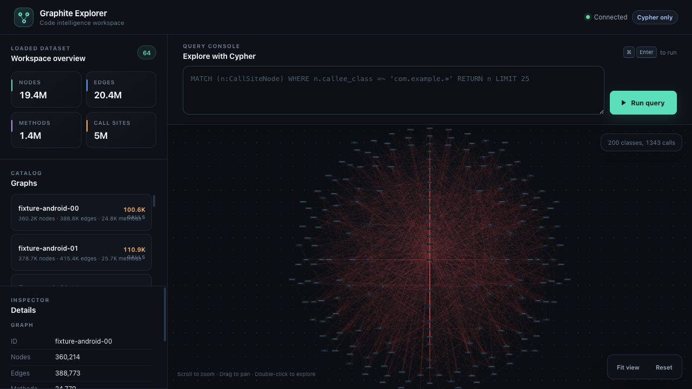

# Explore the public 64-graph corpus

The README screenshot was captured from Graphite 2.8.0 serving the repository's
public fixture64 corpus: **64 graphs, 19,431,891 nodes, 20,448,885 edges,
1,374,983 methods, and 5,046,935 call sites**.



The canvas shows the class overview of `fixture-android-00`: 200 classes and
1,343 call relationships. The sidebar totals describe all 64 loaded graphs;
the canvas is a navigable view into that corpus, not every node drawn at once.

The inputs are Android, Apache Tika, Apache Hive, and the Kotlin compiler,
partitioned into 16 distinct shards each. These are real bytecode and resource
shards, not 64 independent applications. This public demonstration is separate
from the production deployment described in the README's 100M+ scale figures.

## Reproduce

From a checkout with JDK 17 or newer and Graphite installed:

```bash
./gradlew :webgraph:jmhJar :webgraph:prepareBenchmarkFixtures --no-daemon
.github/scripts/prepare-fixture64-graphs.sh \
  frontend/jvm/webgraph/build/libs/webgraph-1.0.0-SNAPSHOT-jmh.jar \
  frontend/jvm/webgraph/build/benchmark-fixtures \
  /tmp/graphite-public-fixture64
```

The output directory must not already exist. The generator verifies saved graphs
against source identities and query/resource fingerprints, then writes
`graphs.tsv` and `fixture-provenance.tsv`. The screenshot corpus was generated
from commit `87d71683df0127a13eb4aaad3b88f5c00bb1671d`; all 64 query-semantic
fingerprints were distinct and the provenance node counts summed to 19,431,891.

Load the generated catalog with Bash:

```bash
args=()
while IFS=$'\t' read -r graph_id graph_path rest; do
  [[ -z "$graph_id" || "$graph_id" == \#* ]] && continue
  args+=(--graph "$graph_id:$graph_path")
done < /tmp/graphite-public-fixture64/graphs.tsv
graphite serve "${args[@]}" --port 8080
```

Open `http://localhost:8080` and double-click a graph on the canvas to inspect its
class relationships. The screenshot uses `fixture-android-00`. Workspace totals
remain visible while navigating individual graphs.

This capture validates the displayed corpus and navigation; it is not a latency
measurement. For the benchmark protocol and results, see the
[64-graph benchmark](rust-explorer-fixture64-p95.md).
