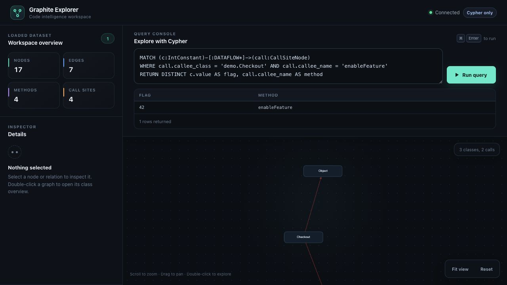

# Find a feature flag in compiled bytecode

Start with a tiny Java application and ask two questions about its compiled JAR:
**Which constant reaches `enableFeature`? Who calls it?**
No application server, database, Android SDK, or AI subscription is needed.

You need Bash, a JDK 17 or newer (`java`, `javac`, and `jar`), and Graphite with its
JVM frontend. On macOS with Homebrew:

```bash
brew tap johnsonlee/tap
brew install johnsonlee/tap/graphite
# Use the JDK installed with Graphite for the commands below.
export PATH="$(brew --prefix openjdk@17)/bin:$PATH"
graphite --version
javac -version
```

See the [installation notes](../README.md#what-the-formula-installs) for frontend
configuration outside Homebrew.

## Run the example

Clone the repository, then run the example:

```bash
git clone https://github.com/johnsonlee/graphite.git
cd graphite
bash examples/quickstart/run.sh
```

The script creates a fresh temporary directory and prints its path. It compiles
[this complete example](../examples/quickstart/Checkout.java), packages it as a
JAR, builds a saved graph, and runs both queries. It keeps the files so you can
explore them afterward.

The relevant Java code is:

```java
static void startCheckout() {
    enableFeature(42);
}

static void enableFeature(int flagId) {
    System.out.println(flagId);
}
```

Once compiled, Graphite reads `checkout.jar`; the query engine reads the saved
graph. Neither query needs the Java source file.

## Trace the constant

The script runs this query:

```cypher
MATCH (c:IntConstant)-[:DATAFLOW*]->(call:CallSiteNode)
WHERE call.callee_class = 'demo.Checkout' AND call.callee_name = 'enableFeature'
RETURN DISTINCT c.value AS flag, call.callee_name AS method
```

Expected JSON:

```json
{
  "columns": ["flag", "method"],
  "rows": [{"flag": 42, "method": "enableFeature"}],
  "rowCount": 1
}
```

`DATAFLOW*` follows one or more dataflow relationships from a constant to a call
site. Here, the result identifies `42` as reaching `enableFeature`.

## Find the caller

```cypher
MATCH (call:CallSiteNode)
WHERE call.callee_class = 'demo.Checkout' AND call.callee_name = 'enableFeature'
RETURN call.caller_signature AS caller
```

Expected JSON:

```json
{
  "columns": ["caller"],
  "rows": [{"caller": "demo.Checkout.startCheckout()"}],
  "rowCount": 1
}
```

The script prints a ready-to-run `graphite serve` command for the generated graph.
Run it and open [the local Explorer](http://localhost:8080) to inspect the graph.
Stop the server with Ctrl+C. You can delete the printed temporary directory when
finished.

In the Explorer, paste the constant query above into **Cypher query** and click
**Run query**. This screenshot shows that query running against the included
example on Graphite 2.8.0:



## Use your own JAR

Replace the input and package filter with those for your application:

```bash
graphite build app.jar -o app-graph --include com.example
graphite query --format json app-graph \
  "MATCH (call:CallSiteNode)
   RETURN call.caller_signature, call.callee_class, call.callee_name LIMIT 10"
```

Then target a class or method from those results.

## Give an agent the same context

Keep the demo files and use the absolute `checkout-graph` path printed by the
script. For Claude Code, run this in the project where you want to use the agent,
replacing `/absolute/path/to/checkout-graph` with that path:

```bash
claude mcp add --transport stdio --scope project graphite -- \
  graphite mcp --graph demo:/absolute/path/to/checkout-graph
```

Open Claude Code, approve the project MCP server when prompted, and check `/mcp`.
Then ask:

> Use Graphite to inspect the demo graph. Discover its schema, then find which
> constant reaches demo.Checkout.enableFeature and which method calls it. Show
> the queries and the returned evidence. Use the graph rather than reading the
> Java source, and distinguish what the graph shows from runtime assumptions.

The evidence should identify `42` and `demo.Checkout.startCheckout()`, as above.
The agent's wording and tool sequence can vary. For other clients and HTTP
transport, see [MCP setup](../README.md#mcp-integration).

The underlying stdio MCP path was independently checked on Graphite 2.8.0:
initialization succeeded, `tools/list` exposed `schema` and `cypher`, and calling
`cypher` with `graph_id: "demo"` and the constant query returned
`{"flag":42,"method":"enableFeature"}`. This verifies the tool response, not a
particular model's answer or token savings.

Static analysis covers the artifacts and patterns Graphite can resolve; reflection
and dynamically loaded code can leave relationships missing. This small example
checks behavior, not performance or completeness on another application.

## Verification and troubleshooting

The example script was run successfully with Graphite **2.8.0**, OpenJDK
**17.0.20.1**, and Bash on macOS. The JAR produced a 17-node graph, and both queries
returned the values shown above. Graphite was selected explicitly with:

```bash
GRAPHITE_BIN="$(brew --prefix)/bin/graphite" bash examples/quickstart/run.sh
```

Use that form if `type -a graphite` reveals an older installation before Homebrew
on your `PATH`. If `javac` is unavailable, add your JDK's `bin` directory to `PATH`.
If graph building reports a missing JVM frontend, follow the
[frontend installation instructions](../README.md#what-the-formula-installs).
