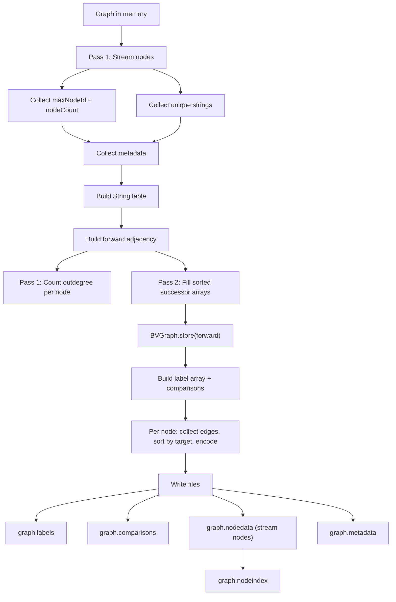
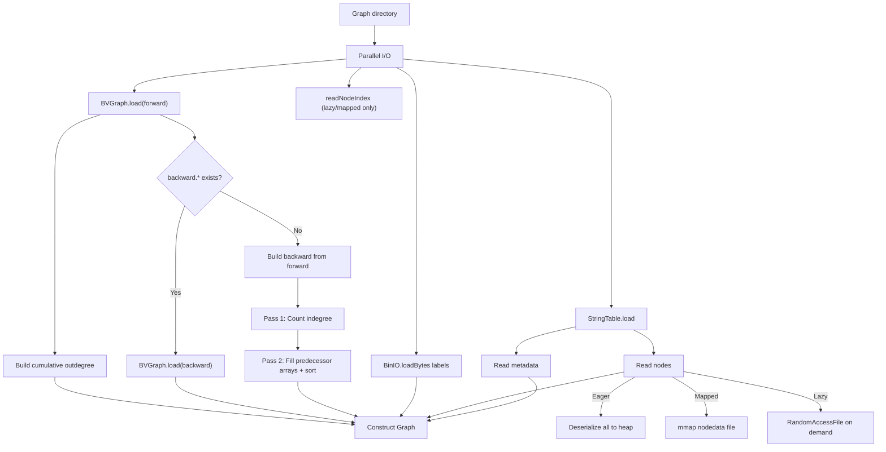

# WebGraph Storage Format

## File Layout

A saved graph directory contains the following files:

| File | Format | Owner | Description |
|------|--------|-------|-------------|
| `forward.*` | BVGraph | WebGraph | Compressed forward adjacency (successors) |
| `graph.strings` | FrontCodedStringList | WebGraph/fastutil | Deduplicated string dictionary |
| `graph.labels` | byte[] via BinIO | WebGraph | Edge type labels (1 byte per arc, BVGraph successor order) |
| `graph.metadata` | Custom binary | Graphite | Methods, type hierarchy, enums, annotations, branch scopes |
| `graph.nodedata` | Custom binary | Graphite | Sequential node records |
| `graph.nodeindex` | Custom binary | Graphite | Node ID → offset index for lazy/mapped loading |
| `graph.comparisons` | Custom binary | Graphite | BranchComparison data for ControlFlowEdges |
Backward adjacency is not stored on disk — it is rebuilt from `forward.*` at load time.

## Graphite Custom File Format (v1)

All 4 Graphite custom files share a 4-byte header: **3-byte magic prefix + 1-byte version**, packed as one `int`.

| File | Magic (hex) | Magic (ASCII) | v1 header |
|------|-------------|---------------|-----------|
| graph.metadata | `0x47524D00` | `GRM` | `0x47524D01` |
| graph.nodedata | `0x47524E00` | `GRN` | `0x47524E01` |
| graph.nodeindex | `0x47524900` | `GRI` | `0x47524901` |
| graph.comparisons | `0x47524300` | `GRC` | `0x47524301` |

**Reading:** The reader validates the 3-byte magic prefix. If it doesn't match, an error is thrown. The low byte is the format version.

### graph.metadata

```
[header: int = 0x47524D01]
[methodCount: int] [methods...]
[supertypeCount: int] [supertypes...]
[subtypeCount: int] [subtypes...]
[enumValueCount: int] [enumValues...]
[annotationCount: int] [annotations...]
[branchScopeCount: int] [branchScopes...]
```

All strings are stored as StringTable indices (`int`).

### graph.nodedata

```
[header: int = 0x47524E01]
[nodeCount: int]
[node1: nodeId(int) + tag(byte) + type-specific fields...]
[node2: ...]
...
```

Node type tags: 0=IntConstant, 1=StringConstant, ..., 12=CallSiteNode, 13=AnnotationNode.

### graph.nodeindex

```
[header: int = 0x47524901]
[entryCount: int]
[entry1: nodeId(int) + tag(byte) + offset(long)]
[entry2: ...]
...
```

Offset points into `graph.nodedata` for lazy/mapped node loading.

### graph.comparisons

```
[header: int = 0x47524301]
[count: int]
[entry1: edgeKey(long) + operator(int) + comparandNodeId(int)]
[entry2: ...]
...
```

Edge key format: `(fromNodeId << 32) | toNodeId`.

## Edge Label Encoding (8-bit)

```
bits 0-1: edge family (0=DataFlow, 1=Call, 2=Type, 3=ControlFlow)
bits 2-5: subkind ordinal
bits 6-7: extra flags (Call: bit6=isVirtual, bit7=isDynamic)
```

ControlFlowEdge comparisons are stored separately in `graph.comparisons`.

## Save Flow



Key properties:
- **No `allNodes` list** — nodes are streamed, never all in memory at once
- **No `edgeLabelMap` HashMap** — labels built directly in BVGraph successor order
- **Forward only** — backward BVGraph is not stored (rebuilt at load time)
- **BVGraph compression threads** — configurable (default 2, controls memory pressure)

## Load Flow



Loading modes:

| Mode | Nodes | Threshold | Heap usage |
|------|-------|-----------|------------|
| EAGER | All deserialized to heap | < 1M nodes | Highest |
| MAPPED | Memory-mapped via OS page cache | >= 1M nodes | Node data off-heap |
| LAZY | Read from disk on demand | Manual | Lowest heap |

## Memory Layout (Loaded Graph, MAPPED mode)

```
Heap:
  ├── forward BVGraph (compressed adjacency)     ~5 MB
  ├── backward flat arrays                       ~120 MB
  │     ├── IntArray[totalEdges] (targets)
  │     └── LongArray[numNodes+1] (offsets)
  ├── forwardLabels: ByteArray[totalEdges]       ~10 MB
  ├── cumulativeOutdeg: LongArray[numNodes+1]    ~80 MB
  ├── nodeOffsets: LongArray[maxNodeId+1]        ~80 MB
  ├── StringTable (FrontCodedStringList)         ~20 MB
  └── metadata (methods, types, annotations)     ~50 MB

Off-heap (mmap):
  └── graph.nodedata (OS page cache)             ~250 MB
```

## JMH Benchmark Results

All benchmarks on 10M nodes / 10M edges.

### Save — 4g vs 8g heap (SingleShot, thread sweep)

| Threads | 4g (ms) | 8g (ms) |
|---------|---------|---------|
| 1 | 84,862 | 85,203 |
| **2** | **83,828** | **84,018** |
| 3 | 84,018 | 83,758 |
| 4 | 83,703 | 82,555 |

Save time is CPU-bound (BVGraph compression), not memory-bound. 4g and 8g perform identically.

### Load — 4g vs 8g heap (SingleShot, thread sweep)

| Threads | 4g (ms) | 8g (ms) |
|---------|---------|---------|
| 1 | 2,800 | 2,717 |
| **2** | **2,787** | **2,432** |
| 3 | 2,661 | 2,433 |
| 4 | 2,661 | 2,442 |

Load is ~10% faster at 8g due to less GC pressure during backward-from-forward construction.

### Flat Array vs HashMap (10M scale)

**Allocation (SingleShot)**

| Structure | HashMap | Flat Array | Speedup |
|-----------|---------|------------|---------|
| edgeLabelMap (10M) | 226.1 ms | 14.3 ms | **16x** |
| nodeIndex (10M) | 140.3 ms | 9.2 ms | **15x** |

**Lookup throughput (ops/us, higher = better)**

| Structure | HashMap | Flat Array | Speedup |
|-----------|---------|------------|---------|
| edgeLabelMap (10M) | 0.032 | 0.054 | **1.7x** |
| nodeIndex (10M) | 0.034 | 0.119 | **3.5x** |
