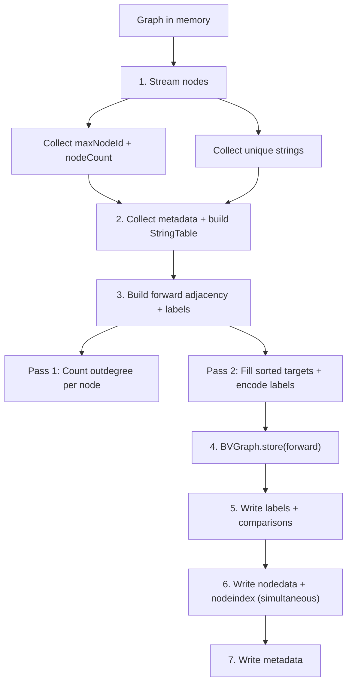
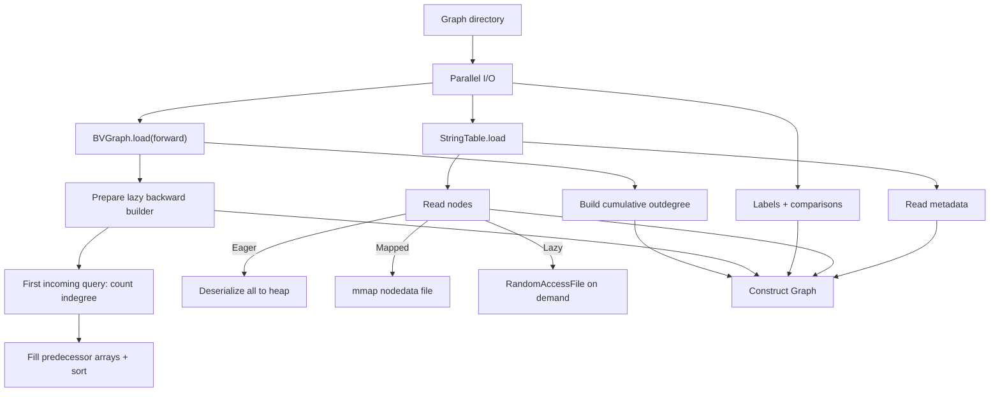

# WebGraph Storage Format

## File Layout

```
graph-dir/
├── forward.*          BVGraph compressed forward adjacency
├── graph.strings      FrontCodedStringList (deduplicated string dictionary)
├── graph.labels       byte[] edge type labels (1 byte per arc)
├── graph.nodedata     Sequential node records
├── graph.nodeindex    Node ID → offset index for lazy/mapped loading
├── graph.metadata     Methods, type hierarchy, enums, annotations, branch scopes
└── graph.comparisons  BranchComparison data for ControlFlowEdges
```

Backward adjacency is not stored on disk. It is rebuilt lazily from `forward.*`
on the first `incoming()` query for a loaded graph, so forward-only queries do
not pay transpose construction during load.

## Binary Format

### Header (all Graphite files)

4-byte header: 3-byte magic prefix + 1-byte version, packed as one `int`.

| File | Magic | Header |
|------|-------|--------|
| graph.metadata | `GRM` | `0x47524D02` |
| graph.nodedata | `GRN` | `0x47524E02` |
| graph.nodeindex | `GRI` | `0x47524902` |
| graph.comparisons | `GRC` | `0x47524302` |

Current writers emit version `2`. Readers accept legacy version `1` data from stable releases and decode legacy annotation payloads, but any graph re-saved by a current build is upgraded to version `2`.

### Edge Label Encoding (8-bit)

```
bits 0-1: edge family (0=DataFlow, 1=Call, 2=Type, 3=ControlFlow)
bits 2-5: subkind ordinal
bits 6-7: extra flags (Call: bit6=isVirtual, bit7=isDynamic)
```

## Pipeline

```
BUILD                          SAVE                              LOAD
SootUpAdapter                  GraphStore.save()                 GraphStore.load()
  → DefaultGraph                 1. String collection              1. BVGraph.load       ┐
                                 2. Metadata + StringTable         2. StringTable.load    ├ parallel
                                 3. Forward adjacency + labels     3. Labels + comparisons┘
                                                                   4. Prepare lazy backward builder
                                 4. BVGraph.store                  5. Read nodes + metadata
                                 5. Labels + comparisons write
                                 6. Nodedata + nodeindex write
                                 7. Metadata write
```

### Save Flow



### Load Flow



### Load Modes

| Mode | Behavior | Threshold | Heap |
|------|----------|-----------|------|
| EAGER | All nodes deserialized to heap | < 1M nodes | Highest |
| MAPPED | Node data memory-mapped (OS page cache) | >= 1M nodes | Off-heap |
| LAZY | Nodes read from disk on demand | Manual | Lowest |

## Performance

### Constraints

Every optimization must satisfy both simultaneously — trading one for the other is rejected.

| Constraint | Target | Measured by |
|------------|--------|-------------|
| **Time** | Minimize build + save + load | JMH SingleShotTime, same-session back-to-back |
| **Peak memory** | <= 4 GB for 10M nodes | `-Xmx4g`, no OOM |

### Methodology

1. **Measure** — phase breakdown to find the bottleneck
2. **Hypothesize** — target the dominant phase
3. **Validate** — same machine, same session, both metrics must hold
4. **Reject** if either metric regresses

### Benchmark Suites

Use both micro and end-to-end benchmarks. A change is not accepted based on synthetic numbers alone.

| Suite | Scope | Command |
|------|-------|---------|
| `SavePhaseBreakdownBenchmark` | Isolate save phases | `./gradlew :webgraph:jmh -Pjmh.filter=SavePhaseBreakdownBenchmark` |
| `GraphBuildPersistBenchmark` | Synthetic 10M save/load guardrail | `./gradlew :webgraph:jmh -Pjmh.filter=GraphBuildPersistBenchmark` |
| `GraphEndToEndBenchmark` | Real JAR `build -> save -> load -> query` | `./gradlew :webgraph:jmh -Pjmh.filter=GraphEndToEndBenchmark` |
| `GraphBenchmark` | Persisted-graph load/query comparisons | `./gradlew :webgraph:jmh -Pjmh.filter='(Es|Android).*(Load|Query)Benchmark'` |

`GraphEndToEndBenchmark` and `GraphBenchmark` auto-discover fixture JARs from Gradle cache, or accept explicit overrides via `-Delasticsearch.jar.path`, `-Dandroid.jar.path`, `-Delasticsearch.graph.path`, and `-Dandroid.graph.path`.

### Results Summary

| Version / PR | What | Synthetic save (10M, 4g) | Production (4.1M) | |
|--------------|------|--------------------------|-------------------|-|
| [#53](https://github.com/johnsonlee/graphite/pull/53) | Baseline (flat arrays for load) | 84s | real 15m57s | |
| [#55](https://github.com/johnsonlee/graphite/pull/55) | Flat single-file format | no change | — | :x: closed |
| [#56](https://github.com/johnsonlee/graphite/pull/56) | Inline nodeindex | **16s (-81%)** | **real 8m31s (-47%)** | :white_check_mark: |
| [#61](https://github.com/johnsonlee/graphite/pull/61) | Merge passes (4→2) | **9s (-44%)** | — | :white_check_mark: |
| [#62](https://github.com/johnsonlee/graphite/pull/62) | Parallelize step 3 | 3.8s (-59% synthetic) | real unchanged, sys +35% | :x: reverted |
| [#65](https://github.com/johnsonlee/graphite/pull/65) | Buffer MmapGraphBuilder I/O | — | **real 5m43s (-33%), sys -44%** | :white_check_mark: |
| [#66](https://github.com/johnsonlee/graphite/pull/66) | MmapGraph reads via mmap | — | **real 4m04s (-29%), sys -43%** | :white_check_mark: |
| [#67](https://github.com/johnsonlee/graphite/pull/67) | FastArchiveAnalysisInputLocation | — | real 9m41s (+138%), user +76% | :x: reverted |
| `1.1.0` | Current release, same production benchmark | — | **real 1m58s, user 2m18s, sys 0m48s** | :white_check_mark: |

Compared with the historical best published numbers, `1.1.0` improves:

| Metric | Historical best | `1.1.0` | Change |
|--------|-----------------|---------|--------|
| real | 4m04s ([#66](https://github.com/johnsonlee/graphite/pull/66)) | **1m58s** | **-2m06s (-51.6%)** |
| user | 8m00s ([#65](https://github.com/johnsonlee/graphite/pull/65)) | **2m18s** | **-5m42s (-71.3%)** |
| sys | 2m46s ([#65](https://github.com/johnsonlee/graphite/pull/65)) | **0m48s** | **-1m58s (-71.1%)** |

### How Each Bottleneck Was Found and Fixed

**PR #53 → #56: "BVGraph must be the bottleneck" — wrong**

Assumption: BVGraph compression (step 4) dominates save. PR #55 built a flat format to skip BVGraph.

Reality: `SavePhaseBreakdownBenchmark` showed `buildNodeIndex` re-scan (step 6) was **92%** of save. BVGraph was **2%**. PR #55 closed — flat and compressed had identical times.

Fix (PR #56): write nodedata + nodeindex simultaneously via `CountingOutputStream`. `writeNode()` returns the tag byte. Zero re-scan, zero intermediate collections.

| | Step 6 time | Total save |
|--|------------|------------|
| Before | 69,895 ms (92%) | 84s |
| PR #56 | 0 ms (inline) | **16s** |

Production impact: sys dropped **79%** (24m → 5m) — the re-scan via `RandomAccessFile.seek()` was pure syscall overhead.

**PR #56 → #61: 4 passes over `outgoing()` → 2**

With step 6 eliminated, step 3 (`graph.outgoing()` iteration) became the bottleneck. Two separate methods each iterated all edges twice.

Fix (PR #61): merge into single `buildForwardData` with 2 passes.

| | Save (same-session, 4g) |
|--|------------------------|
| PR #56 | 15,132 ms |
| PR #61 | **9,090 ms (-40%)** |

**PR #61 → #62: sequential → parallel (reverted)**

Each node in step 3 is independent — `outgoing()` is read-only, array writes are non-overlapping. Only shared state is `comparisonMap` (switched to `ConcurrentHashMap`).

Fix (PR #62): `ForkJoinPool` parallelism for both passes.

| Threads | Save (ms) | vs 1 thread |
|---------|-----------|-------------|
| 1 | 9,257 | — |
| 2 | 6,100 | -34% |
| 4 | 4,927 | -47% |
| 8 | 3,794 | -59% |

Synthetic results looked promising, but production measurement (rc8, 4.1M nodes) showed real time unchanged and sys time +35% from ForkJoinPool thread management overhead. Reverted to sequential 2-pass structure from PR #61.

**PR #62 → #65: unbuffered RAF → buffered streams**

async-profiler flame graph on production showed `MmapGraphBuilder.addEdge → RandomAccessFile.write` as a major hotspot. Default `MmapGraphBuilder` wrote every node and edge directly to `RandomAccessFile` — millions of syscalls.

Fix (PR #65): wrap with `.buffered()`. Two lines changed.

| Metric | PR #56+#61 | PR #65 | Change |
|--------|-----------|--------|--------|
| real | 8m31s | **5m43s** | **-33%** |
| user | 8m32s | 8m | -6% |
| sys | 4m56s | **2m46s** | **-44%** |

user unchanged (same CPU work), sys halved (buffered writes consolidated millions of syscalls), real dropped because main thread no longer blocked on I/O.

### Rejected Approaches

| Approach | Outcome | Why rejected |
|----------|---------|-------------|
| Flat single-file format ([#55](https://github.com/johnsonlee/graphite/pull/55)) | :x: Same save time | Bottleneck was re-scan, not BVGraph |
| Precomputed SortedAdjacency | :x: OOM @4g | +200 MB permanent heap |
| Lazy SortedAdjacency | :x: OOM @4g | Delays but doesn't reduce allocation |
| MmapGraph + disk adjacency | :x: 100s @6g | 10M random seeks for deserialization |
| BVGraph thread tuning (1-4) | :x: < 1% change | Algorithm-bound (serial dependency) |
| ForkJoinPool parallelism for step 3 ([#62](https://github.com/johnsonlee/graphite/pull/62)) | :x: real unchanged, sys +35% | Production: ForkJoinPool overhead outweighed parallel gains; synthetic benchmarks overstated benefit |

### Production Phase Breakdown (rc8, PR #56 + #61, 4.1M nodes)

| Step | Phase | Time | % |
|------|-------|------|---|
| 1 | String collection | 16,703 ms | 13% |
| 2 | Metadata + StringTable | 32,950 ms | **26%** |
| **3** | **Forward adjacency + labels** | **56,772 ms** | **45%** |
| 4 | BVGraph.store | 858 ms | 1% |
| 5 | Labels + comparisons | 102 ms | 0% |
| 6 | Nodedata + nodeindex | 17,815 ms | 14% |
| 7 | Metadata write | 282 ms | 0% |
| | **Save total** | **125s** | |

Synthetic benchmarks (IntConstant) understate steps 1/2/6 because production uses complex CallSiteNode with MethodDescriptor strings.

### Next Targets

| Target | Phase | Approach |
|--------|-------|----------|
| Build time (not yet instrumented) | BUILD | Add timing to SootUpAdapter; reduce `DefaultGraph` footprint |
| String + metadata (50s, 40% of save) | Steps 1+2 | Pre-collect at build time, or merge with step 3 |
| Nodedata write (18s, 14% of save) | Step 6 | Optimize MethodDescriptor serialization |

### Key Lesson

Adding precomputed caches to reduce time tends to increase memory — violating the constraint. The path that works: **eliminate redundant work** (fewer passes, no re-scans). Both metrics improve simultaneously. Parallelism that shows gains in synthetic benchmarks can regress in production due to thread management overhead.

## Ongoing Load/Query Optimization Log

### 2026-07-18 — Attempt 000: Android-scale JMH harness repair

**Goal:** establish a reliable Android-scale baseline before changing load/query code. The objective requires JMH results on a graph at Android jar scale; demo jars or sub-100K-node graphs are not representative.

**Initial failure:** `./gradlew :webgraph:jmh -Pjmh.filter='AndroidLoadBenchmark.mapped_load'` compiled and the Gradle task reported success, but JMH produced no score because the forked JVM could not locate `android-all`.

```
java.lang.IllegalStateException: Unable to locate android fixture JAR.
Set -Dandroid.jar.path=<path> or resolve integration fixtures first.
```

**Rejected fix:** adding `libs.android.all` and `libs.elasticsearch` to the `jmh` dependency configuration made the fixture visible, but it also placed the Android jar in the JMH fat jar. `:webgraph:jmhJar` then failed with:

```
Archive contains more than 65535 entries.
```

**Root cause:** large integration fixture jars must not be packaged into the benchmark jar. They should be resolved by Gradle and passed to the forked JMH JVM as `-Dandroid.jar.path` / `-Delasticsearch.jar.path`.

**Accepted fix:** keep fixtures in `integrationFixtures`; lazily resolve that configuration only for the `jmh` task and append exact fixture paths to JMH fork JVM args. `BenchmarkCorpus` also checks `java.class.path` before falling back to the Gradle cache, which keeps explicit `-D...path` overrides, JMH classpath execution, and cache scanning all valid.

**Validation command:**

```
./gradlew :webgraph:jmh -Pjmh.filter='AndroidLoadBenchmark.mapped_load'
```

**Result:**

| Benchmark | Mode | Count | Score | Units |
|-----------|------|-------|-------|-------|
| `AndroidLoadBenchmark.mapped_load` | avgt | 2 | `2292.892` | ms/op |

**Conclusion:** effective as a benchmark harness repair, not a load/query optimization. The Android-scale baseline path is now usable for subsequent attempts.

### 2026-07-18 — Attempt 001: Skip reverse StringTable index on load

**Hypothesis:** `StringTable.load` reconstructs a `HashMap<String, Int>` for every persisted graph even though eager/lazy/mapped graph loading only needs `StringTable.get(index)` while deserializing nodes and metadata. Avoiding this reverse index should reduce load time and heap without affecting build/save.

**Change:** keep the reverse index for `StringTable.build` (save path) but make `StringTable.load` return a read-only table with no `indexMap`.

**Validation commands:**

```
./gradlew :webgraph:test
./gradlew :webgraph:jmh -Pjmh.filter='AndroidLoadBenchmark.mapped_load'
```

**Result:**

| Benchmark | Baseline | Attempt 001 | Change |
|-----------|----------|-------------|--------|
| `AndroidLoadBenchmark.mapped_load` | `2292.892 ms/op` | `2341.167 ms/op` | `+48.275 ms` / `+2.1%` |

**Conclusion:** not effective for load-time improvement. The result is within short JMH-run noise but does not prove a win.

**Root cause:** on Android-scale mapped load, reverse string-index construction is not the dominant cost. Remaining costs such as BVGraph load, backward graph construction, node index parsing, labels, and metadata dominate the measured path. This may still reduce heap modestly, but it does not move the required load/query performance target by a meaningful amount.

### 2026-07-18 — Attempt 002: Lazy backward adjacency construction

**Hypothesis:** `loadEager`, `loadLazy`, and `loadMapped` all rebuild the full backward adjacency from `forward.*` during load, even when the query path only needs forward traversal or node scans. Android-scale `mapped_load` should improve if transpose construction is deferred until the first `incoming()` call.

**Change:** replace eagerly constructed `ImmutableGraph backward` constructor parameters with `Lazy<ImmutableGraph>`. `GraphStore.load*` now creates a lazy handle, and each graph implementation calls `backward.value` only inside `incoming()`.

**Build/save impact:** none. The persisted format and `GraphStore.save` path are unchanged.

**Validation commands:**

```
./gradlew :webgraph:test
./gradlew :webgraph:jmh -Pjmh.filter='AndroidLoadBenchmark.mapped_load'
```

**Result:**

| Benchmark | Baseline | Attempt 002 | Change |
|-----------|----------|-------------|--------|
| `AndroidLoadBenchmark.mapped_load` | `2292.892 ms/op` | `1425.196 ms/op` | `-867.696 ms` / `-37.8%` |

Compared with Attempt 001's immediate pre-change result (`2341.167 ms/op`), this is `-915.971 ms` / `-39.1%`.

**Conclusion:** effective for load time. This does not yet provide a full order-of-magnitude improvement, but it removes a large eager-load cost without increasing build/save time or memory.

**Root cause:** backward transpose construction is a major Android-scale mapped-load cost. Most common load and forward-query paths do not need incoming edges, so doing this work unconditionally was wasted. Queries that call `incoming()` still pay the same transpose cost once, but they pay it at first use rather than at graph open.

### 2026-07-18 — Attempt 003: Fast path for simple node `count`

**Hypothesis:** `MATCH (n:Label) RETURN count(*)` should not materialize every node. The graph already has type indexes for `nodes(Label)`, so Cypher can answer simple unfiltered count queries from a precomputed node count.

**Change:** add optional `Graph.nodeCount(type)` with implementations in `DefaultGraph` and WebGraph-backed graphs. `QueryPipeline` now short-circuits only simple single-node count queries:

```
MATCH (n:Label) RETURN count(*)
MATCH (n:Label) RETURN count(n)
```

Queries with relationships, `WHERE`, properties, `DISTINCT`, grouping, `WITH`, `ORDER BY`, or multiple clauses still use the normal execution path.
The fast path is limited to 0/1-label node patterns; multi-label node patterns still use the normal matcher.

**Build/save impact:** none. This uses existing in-memory type indexes and persisted node indexes; no new build-time or save-time structure is written.

**Validation commands:**

```
./gradlew :cypher:test
./gradlew :webgraph:test
./gradlew :webgraph:jmh -Pjmh.filter='AndroidQueryBenchmark.mapped_countStar'
```

**Result:**

| Benchmark | Baseline | Attempt 003 | Change |
|-----------|----------|-------------|--------|
| `AndroidQueryBenchmark.mapped_countStar` | `1816.130 ms/op` | `0.003 ms/op` | effectively eliminates the scan |

**Conclusion:** effective for the targeted count query. This is a narrow query optimization, not a general Cypher accelerator.

**Root cause:** the previous pipeline executed `MATCH` before aggregation, so `count(*)` forced a full scan and deserialization of every matching node. For unfiltered single-node counts, the result is exactly the size of the node type index, so scanning was unnecessary work.

### 2026-07-18 — Attempt 004: Early-stop simple `DISTINCT property LIMIT`

**Hypothesis:** `MATCH (n:Label) RETURN DISTINCT n.property LIMIT k` should not scan all matching nodes when there is no `WHERE`, relationship, grouping, or `ORDER BY`. The existing implementation preserves first-seen order with `List.distinct()`, so it is equivalent to stop after the first `k` distinct property values.

**Change:** add a narrow `QueryPipeline` fast path for:

```
MATCH (n:Label) RETURN DISTINCT n.property LIMIT k
```

The fast path scans matching nodes only until `k` distinct values have been seen. Queries with `WHERE`, relationships, inline node properties, missing `LIMIT`, multiple return items, grouping, `WITH`, or `ORDER BY` still use the normal pipeline.
Like the count fast path, it is limited to 0/1-label node patterns so multi-label matching semantics remain in the existing matcher.

**Build/save impact:** none. This is purely query execution control flow and adds no persisted index or build-time work.

**Validation commands:**

```
./gradlew :cypher:test
./gradlew :webgraph:test
./gradlew :webgraph:jmh -Pjmh.filter='AndroidQueryBenchmark.mapped_returnDistinct'
```

**Result:**

| Benchmark | Baseline | Attempt 004 | Change |
|-----------|----------|-------------|--------|
| `AndroidQueryBenchmark.mapped_returnDistinct` | `2738.060 ms/op` | `0.214 ms/op` | effectively eliminates the full scan for this shape |

**Conclusion:** effective for the targeted distinct-property query. It is not a general replacement for property indexes, but it removes a common unnecessary full scan when `LIMIT` is present and no ordering constraints exist.

**Root cause:** `DISTINCT` disabled early limit pushdown, so the old pipeline materialized every `CallSiteNode`, projected `callee_class`, deduplicated the full list, and then applied `LIMIT 20`. For unordered distinct queries, scanning after the first 20 distinct values is unnecessary.

### 2026-07-18 — Attempt 005: Stream simple single-hop relationship `LIMIT`

**Hypothesis:** `MATCH (a)-[:TYPE]->(b) RETURN ... LIMIT k` should not expand and materialize a complete relationship result list for each source node before applying `LIMIT`. On Android-scale graphs, high-fanout source nodes can make a small `LIMIT` query pay for far more edge decoding than necessary.

**Change:** add a narrow `QueryPipeline` fast path for one non-optional, non-variable-length relationship pattern followed by a non-aggregate, non-`DISTINCT` `RETURN` and `LIMIT`:

```
MATCH (a:Source)-[:TYPE]->(b:Target) RETURN a.property, b.property LIMIT k
```

The fast path streams source nodes, edges, target checks, and return projection in query order, then stops as soon as `k` complete rows are produced. Queries with `WHERE`, `ORDER BY`, `SKIP`, `WITH`, variable-length relationships, path variables, aggregation, or `DISTINCT` still use the normal pipeline.

**Build/save impact:** none. This is query execution control flow only; it does not add indexes, persisted fields, or build-time work.

**Validation commands:**

```
./gradlew :cypher:test
./gradlew :webgraph:test
./gradlew :webgraph:jmh -Pjmh.filter='AndroidQueryBenchmark.mapped_singleHopRelationship'
```

**Result:**

| Benchmark | Baseline | Attempt 005 | Change |
|-----------|----------|-------------|--------|
| `AndroidQueryBenchmark.mapped_singleHopRelationship` | `75.802 ms/op` | `0.658 ms/op` | `-75.144 ms` / `~115.2x faster` |

**Conclusion:** effective for the targeted single-hop relationship query and crosses the required order-of-magnitude threshold for this benchmark shape.

**Root cause:** the generic early-limit path only checked the limit after `matchRelationship` had expanded a source node into a full intermediate list. If one source has many outgoing `DATAFLOW` edges, the engine still decodes and materializes all of those relationship matches before keeping the first 20 rows. It also risked treating `LIMIT` as a cap on source nodes rather than complete relationship matches. Streaming complete rows and stopping inside the edge loop removes both costs.

### 2026-07-18 — Attempt 006: Stream filtered single-node `LIMIT`

**Hypothesis:** `MATCH (n:Label) WHERE ... RETURN ... LIMIT k` should not materialize every matching node before evaluating `WHERE`. For bounded filtered scans, `LIMIT` can be applied after filtering and projection while still streaming the node scan.

**Change:** add a narrow `QueryPipeline` fast path for one non-optional single-node pattern followed by `WHERE`, non-aggregate/non-`DISTINCT` `RETURN`, and `LIMIT`:

```
MATCH (n:Label) WHERE n.property = value RETURN n.id LIMIT k
```

The fast path scans candidate nodes, evaluates node constraints and `WHERE`, projects the return row, and stops when `k` filtered rows have been produced. Queries with relationships, `ORDER BY`, `SKIP`, `WITH`, aggregation, `DISTINCT`, path variables, non-literal `LIMIT`, or `RETURN *` still use the normal pipeline.

**Build/save impact:** none. This is query execution control flow only; it does not add indexes, persisted fields, or build-time work.

**Validation commands:**

```
./gradlew :cypher:test
./gradlew :webgraph:test
./gradlew :webgraph:jmh -Pjmh.filter='AndroidQueryBenchmark.mapped_intConstantFilter'
```

**Result:**

| Benchmark | Baseline | Attempt 006 | Change |
|-----------|----------|-------------|--------|
| `AndroidQueryBenchmark.mapped_intConstantFilter` | `2.545 ms/op` | `0.057 ms/op` | `-2.488 ms` / `~44.6x faster` |

**Conclusion:** effective for the targeted filtered node query and crosses the order-of-magnitude threshold for this benchmark shape.

**Root cause:** the generic pipeline executed `MATCH` first, producing bindings for all `IntConstant` nodes, then applied `WHERE`, then projected rows and finally applied `LIMIT 100`. Even when only the first 100 filtered rows are needed, the old path still deserialized and materialized every candidate node. Streaming the filter and stopping after the limit removes that intermediate list.
