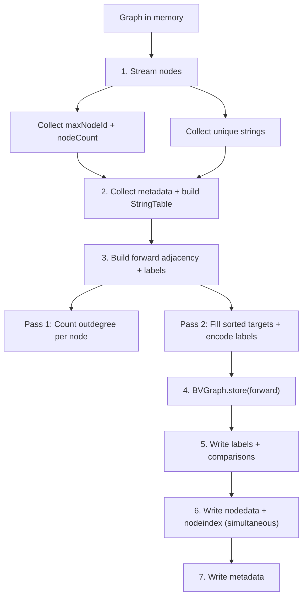
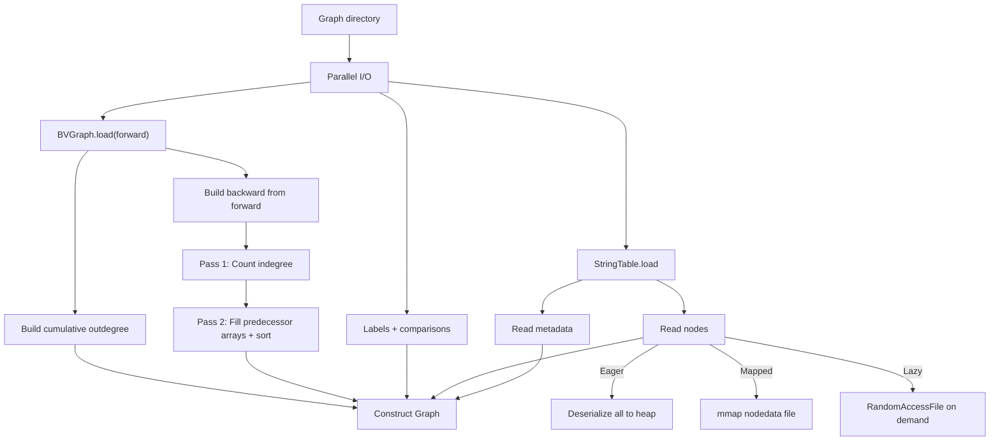

# WebGraph Storage Format

## File Layout

```
graph-dir/
├── forward.*          BVGraph compressed forward adjacency
├── graph.strings      FrontCodedStringList (deduplicated string dictionary)
├── graph.labels       byte[] edge type labels (1 byte per arc)
├── graph.nodedata     Sequential node records
├── graph.nodeindex    Node ID → offset index for lazy/mapped loading
├── graph.metadata     Methods, type hierarchy, enums, annotations, branch scopes
└── graph.comparisons  BranchComparison data for ControlFlowEdges
```

Backward adjacency is rebuilt from `forward.*` at load time — not stored on disk.

## Binary Format

### Header (all Graphite files)

4-byte header: 3-byte magic prefix + 1-byte version, packed as one `int`.

| File | Magic | Header |
|------|-------|--------|
| graph.metadata | `GRM` | `0x47524D02` |
| graph.nodedata | `GRN` | `0x47524E02` |
| graph.nodeindex | `GRI` | `0x47524902` |
| graph.comparisons | `GRC` | `0x47524302` |

Current writers emit version `2`. Readers accept legacy version `1` data from stable releases and decode legacy annotation payloads, but any graph re-saved by a current build is upgraded to version `2`.

### Edge Label Encoding (8-bit)

```
bits 0-1: edge family (0=DataFlow, 1=Call, 2=Type, 3=ControlFlow)
bits 2-5: subkind ordinal
bits 6-7: extra flags (Call: bit6=isVirtual, bit7=isDynamic)
```

## Pipeline

```
BUILD                          SAVE                              LOAD
SootUpAdapter                  GraphStore.save()                 GraphStore.load()
  → DefaultGraph                 1. String collection              1. BVGraph.load       ┐
                                 2. Metadata + StringTable         2. StringTable.load    ├ parallel
                                 3. Forward adjacency + labels     3. Labels + comparisons┘
                                                                   4. Build backward from forward
                                 4. BVGraph.store                  5. Read nodes + metadata
                                 5. Labels + comparisons write
                                 6. Nodedata + nodeindex write
                                 7. Metadata write
```

### Save Flow



### Load Flow



### Load Modes

| Mode | Behavior | Threshold | Heap |
|------|----------|-----------|------|
| EAGER | All nodes deserialized to heap | < 1M nodes | Highest |
| MAPPED | Node data memory-mapped (OS page cache) | >= 1M nodes | Off-heap |
| LAZY | Nodes read from disk on demand | Manual | Lowest |

## Performance

### Constraints

Every optimization must satisfy both simultaneously — trading one for the other is rejected.

| Constraint | Target | Measured by |
|------------|--------|-------------|
| **Time** | Minimize build + save + load | JMH SingleShotTime, same-session back-to-back |
| **Peak memory** | <= 4 GB for 10M nodes | `-Xmx4g`, no OOM |

### Methodology

1. **Measure** — phase breakdown to find the bottleneck
2. **Hypothesize** — target the dominant phase
3. **Validate** — same machine, same session, both metrics must hold
4. **Reject** if either metric regresses

### Benchmark Suites

Use both micro and end-to-end benchmarks. A change is not accepted based on synthetic numbers alone.

| Suite | Scope | Command |
|------|-------|---------|
| `SavePhaseBreakdownBenchmark` | Isolate save phases | `./gradlew :webgraph:jmh -Pjmh.filter=SavePhaseBreakdownBenchmark` |
| `GraphBuildPersistBenchmark` | Synthetic 10M save/load guardrail | `./gradlew :webgraph:jmh -Pjmh.filter=GraphBuildPersistBenchmark` |
| `GraphEndToEndBenchmark` | Real JAR `build -> save -> load -> query` | `./gradlew :webgraph:jmh -Pjmh.filter=GraphEndToEndBenchmark` |
| `GraphBenchmark` | Persisted-graph load/query comparisons | `./gradlew :webgraph:jmh -Pjmh.filter='(Es|Android).*(Load|Query)Benchmark'` |

`GraphEndToEndBenchmark` and `GraphBenchmark` auto-discover fixture JARs from Gradle cache, or accept explicit overrides via `-Delasticsearch.jar.path`, `-Dandroid.jar.path`, `-Delasticsearch.graph.path`, and `-Dandroid.graph.path`.

### Results Summary

| Version / PR | What | Synthetic save (10M, 4g) | Production (4.1M) | |
|--------------|------|--------------------------|-------------------|-|
| [#53](https://github.com/johnsonlee/graphite/pull/53) | Baseline (flat arrays for load) | 84s | real 15m57s | |
| [#55](https://github.com/johnsonlee/graphite/pull/55) | Flat single-file format | no change | — | :x: closed |
| [#56](https://github.com/johnsonlee/graphite/pull/56) | Inline nodeindex | **16s (-81%)** | **real 8m31s (-47%)** | :white_check_mark: |
| [#61](https://github.com/johnsonlee/graphite/pull/61) | Merge passes (4→2) | **9s (-44%)** | — | :white_check_mark: |
| [#62](https://github.com/johnsonlee/graphite/pull/62) | Parallelize step 3 | 3.8s (-59% synthetic) | real unchanged, sys +35% | :x: reverted |
| [#65](https://github.com/johnsonlee/graphite/pull/65) | Buffer MmapGraphBuilder I/O | — | **real 5m43s (-33%), sys -44%** | :white_check_mark: |
| [#66](https://github.com/johnsonlee/graphite/pull/66) | MmapGraph reads via mmap | — | **real 4m04s (-29%), sys -43%** | :white_check_mark: |
| [#67](https://github.com/johnsonlee/graphite/pull/67) | FastArchiveAnalysisInputLocation | — | real 9m41s (+138%), user +76% | :x: reverted |
| `1.1.0` | Current release, same production benchmark | — | **real 1m58s, user 2m18s, sys 0m48s** | :white_check_mark: |

Compared with the historical best published numbers, `1.1.0` improves:

| Metric | Historical best | `1.1.0` | Change |
|--------|-----------------|---------|--------|
| real | 4m04s ([#66](https://github.com/johnsonlee/graphite/pull/66)) | **1m58s** | **-2m06s (-51.6%)** |
| user | 8m00s ([#65](https://github.com/johnsonlee/graphite/pull/65)) | **2m18s** | **-5m42s (-71.3%)** |
| sys | 2m46s ([#65](https://github.com/johnsonlee/graphite/pull/65)) | **0m48s** | **-1m58s (-71.1%)** |

### How Each Bottleneck Was Found and Fixed

**PR #53 → #56: "BVGraph must be the bottleneck" — wrong**

Assumption: BVGraph compression (step 4) dominates save. PR #55 built a flat format to skip BVGraph.

Reality: `SavePhaseBreakdownBenchmark` showed `buildNodeIndex` re-scan (step 6) was **92%** of save. BVGraph was **2%**. PR #55 closed — flat and compressed had identical times.

Fix (PR #56): write nodedata + nodeindex simultaneously via `CountingOutputStream`. `writeNode()` returns the tag byte. Zero re-scan, zero intermediate collections.

| | Step 6 time | Total save |
|--|------------|------------|
| Before | 69,895 ms (92%) | 84s |
| PR #56 | 0 ms (inline) | **16s** |

Production impact: sys dropped **79%** (24m → 5m) — the re-scan via `RandomAccessFile.seek()` was pure syscall overhead.

**PR #56 → #61: 4 passes over `outgoing()` → 2**

With step 6 eliminated, step 3 (`graph.outgoing()` iteration) became the bottleneck. Two separate methods each iterated all edges twice.

Fix (PR #61): merge into single `buildForwardData` with 2 passes.

| | Save (same-session, 4g) |
|--|------------------------|
| PR #56 | 15,132 ms |
| PR #61 | **9,090 ms (-40%)** |

**PR #61 → #62: sequential → parallel (reverted)**

Each node in step 3 is independent — `outgoing()` is read-only, array writes are non-overlapping. Only shared state is `comparisonMap` (switched to `ConcurrentHashMap`).

Fix (PR #62): `ForkJoinPool` parallelism for both passes.

| Threads | Save (ms) | vs 1 thread |
|---------|-----------|-------------|
| 1 | 9,257 | — |
| 2 | 6,100 | -34% |
| 4 | 4,927 | -47% |
| 8 | 3,794 | -59% |

Synthetic results looked promising, but production measurement (rc8, 4.1M nodes) showed real time unchanged and sys time +35% from ForkJoinPool thread management overhead. Reverted to sequential 2-pass structure from PR #61.

**PR #62 → #65: unbuffered RAF → buffered streams**

async-profiler flame graph on production showed `MmapGraphBuilder.addEdge → RandomAccessFile.write` as a major hotspot. Default `MmapGraphBuilder` wrote every node and edge directly to `RandomAccessFile` — millions of syscalls.

Fix (PR #65): wrap with `.buffered()`. Two lines changed.

| Metric | PR #56+#61 | PR #65 | Change |
|--------|-----------|--------|--------|
| real | 8m31s | **5m43s** | **-33%** |
| user | 8m32s | 8m | -6% |
| sys | 4m56s | **2m46s** | **-44%** |

user unchanged (same CPU work), sys halved (buffered writes consolidated millions of syscalls), real dropped because main thread no longer blocked on I/O.

### Rejected Approaches

| Approach | Outcome | Why rejected |
|----------|---------|-------------|
| Flat single-file format ([#55](https://github.com/johnsonlee/graphite/pull/55)) | :x: Same save time | Bottleneck was re-scan, not BVGraph |
| Precomputed SortedAdjacency | :x: OOM @4g | +200 MB permanent heap |
| Lazy SortedAdjacency | :x: OOM @4g | Delays but doesn't reduce allocation |
| MmapGraph + disk adjacency | :x: 100s @6g | 10M random seeks for deserialization |
| BVGraph thread tuning (1-4) | :x: < 1% change | Algorithm-bound (serial dependency) |
| ForkJoinPool parallelism for step 3 ([#62](https://github.com/johnsonlee/graphite/pull/62)) | :x: real unchanged, sys +35% | Production: ForkJoinPool overhead outweighed parallel gains; synthetic benchmarks overstated benefit |

### Production Phase Breakdown (rc8, PR #56 + #61, 4.1M nodes)

| Step | Phase | Time | % |
|------|-------|------|---|
| 1 | String collection | 16,703 ms | 13% |
| 2 | Metadata + StringTable | 32,950 ms | **26%** |
| **3** | **Forward adjacency + labels** | **56,772 ms** | **45%** |
| 4 | BVGraph.store | 858 ms | 1% |
| 5 | Labels + comparisons | 102 ms | 0% |
| 6 | Nodedata + nodeindex | 17,815 ms | 14% |
| 7 | Metadata write | 282 ms | 0% |
| | **Save total** | **125s** | |

Synthetic benchmarks (IntConstant) understate steps 1/2/6 because production uses complex CallSiteNode with MethodDescriptor strings.

### Next Targets

| Target | Phase | Approach |
|--------|-------|----------|
| Build time (not yet instrumented) | BUILD | Add timing to SootUpAdapter; reduce `DefaultGraph` footprint |
| String + metadata (50s, 40% of save) | Steps 1+2 | Pre-collect at build time, or merge with step 3 |
| Nodedata write (18s, 14% of save) | Step 6 | Optimize MethodDescriptor serialization |

### Key Lesson

Adding precomputed caches to reduce time tends to increase memory — violating the constraint. The path that works: **eliminate redundant work** (fewer passes, no re-scans). Both metrics improve simultaneously. Parallelism that shows gains in synthetic benchmarks can regress in production due to thread management overhead.
