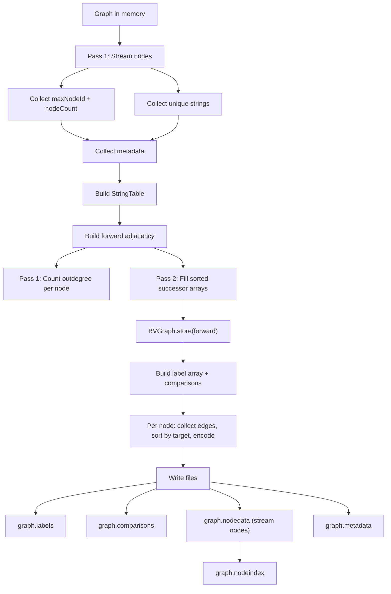
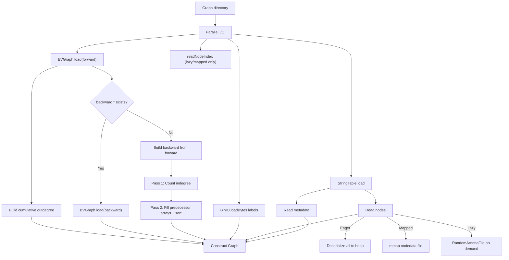

# WebGraph Storage Format

## File Layout

A saved graph directory contains the following files:

| File | Format | Owner | Description |
|------|--------|-------|-------------|
| `forward.*` | BVGraph | WebGraph | Compressed forward adjacency (successors) |
| `graph.strings` | FrontCodedStringList | WebGraph/fastutil | Deduplicated string dictionary |
| `graph.labels` | byte[] via BinIO | WebGraph | Edge type labels (1 byte per arc, BVGraph successor order) |
| `graph.metadata` | Custom binary | Graphite | Methods, type hierarchy, enums, annotations, branch scopes |
| `graph.nodedata` | Custom binary | Graphite | Sequential node records |
| `graph.nodeindex` | Custom binary | Graphite | Node ID → offset index for lazy/mapped loading |
| `graph.comparisons` | Custom binary | Graphite | BranchComparison data for ControlFlowEdges |
Backward adjacency is not stored on disk — it is rebuilt from `forward.*` at load time.

## Graphite Custom File Format (v1)

All 4 Graphite custom files share a 4-byte header: **3-byte magic prefix + 1-byte version**, packed as one `int`.

| File | Magic (hex) | Magic (ASCII) | v1 header |
|------|-------------|---------------|-----------|
| graph.metadata | `0x47524D00` | `GRM` | `0x47524D01` |
| graph.nodedata | `0x47524E00` | `GRN` | `0x47524E01` |
| graph.nodeindex | `0x47524900` | `GRI` | `0x47524901` |
| graph.comparisons | `0x47524300` | `GRC` | `0x47524301` |

**Reading:** The reader validates the 3-byte magic prefix. If it doesn't match, an error is thrown. The low byte is the format version.

### graph.metadata

```
[header: int = 0x47524D01]
[methodCount: int] [methods...]
[supertypeCount: int] [supertypes...]
[subtypeCount: int] [subtypes...]
[enumValueCount: int] [enumValues...]
[annotationCount: int] [annotations...]
[branchScopeCount: int] [branchScopes...]
```

All strings are stored as StringTable indices (`int`).

### graph.nodedata

```
[header: int = 0x47524E01]
[nodeCount: int]
[node1: nodeId(int) + tag(byte) + type-specific fields...]
[node2: ...]
...
```

Node type tags: 0=IntConstant, 1=StringConstant, ..., 12=CallSiteNode, 13=AnnotationNode.

### graph.nodeindex

```
[header: int = 0x47524901]
[entryCount: int]
[entry1: nodeId(int) + tag(byte) + offset(long)]
[entry2: ...]
...
```

Offset points into `graph.nodedata` for lazy/mapped node loading.

### graph.comparisons

```
[header: int = 0x47524301]
[count: int]
[entry1: edgeKey(long) + operator(int) + comparandNodeId(int)]
[entry2: ...]
...
```

Edge key format: `(fromNodeId << 32) | toNodeId`.

## Edge Label Encoding (8-bit)

```
bits 0-1: edge family (0=DataFlow, 1=Call, 2=Type, 3=ControlFlow)
bits 2-5: subkind ordinal
bits 6-7: extra flags (Call: bit6=isVirtual, bit7=isDynamic)
```

ControlFlowEdge comparisons are stored separately in `graph.comparisons`.

## Save Flow



Key properties:
- **No `allNodes` list** — nodes are streamed, never all in memory at once
- **No `edgeLabelMap` HashMap** — labels built directly in BVGraph successor order
- **Forward only** — backward BVGraph is not stored (rebuilt at load time)
- **BVGraph compression threads** — configurable (default 2, controls memory pressure)

## Load Flow



Loading modes:

| Mode | Nodes | Threshold | Heap usage |
|------|-------|-----------|------------|
| EAGER | All deserialized to heap | < 1M nodes | Highest |
| MAPPED | Memory-mapped via OS page cache | >= 1M nodes | Node data off-heap |
| LAZY | Read from disk on demand | Manual | Lowest heap |

## Memory Layout (Loaded Graph, MAPPED mode)

```
Heap:
  ├── forward BVGraph (compressed adjacency)     ~5 MB
  ├── backward flat arrays                       ~120 MB
  │     ├── IntArray[totalEdges] (targets)
  │     └── LongArray[numNodes+1] (offsets)
  ├── forwardLabels: ByteArray[totalEdges]       ~10 MB
  ├── cumulativeOutdeg: LongArray[numNodes+1]    ~80 MB
  ├── nodeOffsets: LongArray[maxNodeId+1]        ~80 MB
  ├── StringTable (FrontCodedStringList)         ~20 MB
  └── metadata (methods, types, annotations)     ~50 MB

Off-heap (mmap):
  └── graph.nodedata (OS page cache)             ~250 MB
```

## Performance

### Constraints

Every change must satisfy both constraints simultaneously. Trading one for the other is not acceptable.

| Constraint | Target | How measured |
|------------|--------|-------------|
| **Time** | Minimize save + load | JMH SingleShotTime, back-to-back same session |
| **Peak memory** | <= 4 GB for 10M nodes | `-Xmx4g`, no OOM |

### Methodology

1. **Measure** — `SavePhaseBreakdownBenchmark` isolates each save phase to pinpoint the bottleneck
2. **Hypothesize** — propose an optimization targeting the bottleneck
3. **Validate** — JMH before/after on same machine, same session, same heap. Both metrics must hold
4. **Reject** if either metric regresses

Production timing is built into `GraphStore.save()` via `System.err` output per phase.

### Pipeline Overview

```
BUILD                          SAVE                              LOAD
SootUpAdapter                  GraphStore.save()                 GraphStore.load()
  → DefaultGraph                 1. String collection              1. BVGraph.load (parallel)
  (or MmapGraph)                 2. Metadata + StringTable         2. StringTable.load (parallel)
                                 3. Forward adjacency + labels     3. Labels + comparisons (parallel)
                                 4. BVGraph.store                  4. Build backward from forward
                                 5. Labels + comparisons write     5. Read nodes + metadata
                                 6. Nodedata + nodeindex write
                                 7. Metadata write
```

### Current Results

**Synthetic (10M nodes / 10M edges, -Xmx4g, same-session back-to-back):**

| Stage | Time | Heap peak |
|-------|------|-----------|
| save | **9,090 ms** | < 4 GB (no OOM) |
| load | **2,241 ms** | < 4 GB (no OOM) |

**Production (4.1M nodes, 4.43M edges, 310 MB bootJar):**

| Stage | Metric | Before | After | Change |
|-------|--------|--------|-------|--------|
| build + save | real | 15m57s | 11m24s | -28% |
| build + save | sys | 24m11s | 5m50s | **-76%** |
| build + save | heap peak | > 7 GB | > 7 GB | GC smoothed, peak unchanged |

### Per-Stage Analysis

#### BUILD (SootUpAdapter → Graph)

| Metric | DefaultGraph | MmapGraph |
|--------|-------------|-----------|
| Heap | ~1.4 GB (10M nodes) | ~175 MB (indexes only, data on disk) |
| Speed | Fast (in-memory) | 2-3x slower (disk I/O per node/edge) |

BUILD currently uses `DefaultGraph` which holds all nodes + edges in heap. This is why peak memory exceeds 7 GB in production — the graph itself is the dominant consumer. MmapGraph reduces heap but makes subsequent save slower due to disk-backed edge reads.

**Optimization direction:** reduce `DefaultGraph` in-heap footprint (e.g., intern `MethodDescriptor`, compress edge storage) without requiring MmapGraph.

#### SAVE (GraphStore.save)

Phase breakdown (`SavePhaseBreakdownBenchmark`, 10M nodes):

| Step | Phase | Time | % | Bottleneck? |
|------|-------|------|---|-------------|
| 1 | String collection | 329 ms | 3% | |
| 2 | Metadata + StringTable | 1,057 ms | 10% | |
| **3** | **Forward adjacency + labels** | **9,000 ms** | **~85%** | **Yes — `graph.outgoing()` iteration** |
| 4 | BVGraph.store | 1,793 ms | ~2% | |
| 5 | Labels + comparisons write | 12 ms | 0% | |
| 6 | Nodedata + nodeindex | 490 ms | 5% | |
| 7 | Metadata write | 2 ms | 0% | |

**What was optimized:**
- Step 6 was 70s (92% of original 84s) due to `buildNodeIndex` re-scanning nodedata via `RandomAccessFile.seek()`. Fixed by inline write — dropped to 490ms.
- Step 3 was 4 passes over `graph.outgoing()`. Merged to 2 passes — halved from ~16s to ~9s.

**What didn't work and why:**
- Flat single-file format (PR #55): identical time to BVGraph because the real bottleneck was step 6 (re-scan), not step 4 (BVGraph compression)
- Precomputed SortedAdjacency: reduced step 3 to ~1s but added 200 MB permanent heap → OOM @4g
- BVGraph thread tuning (1-4): < 1% difference — reference coding has serial data dependency

**Optimization direction:** step 3 (`outgoing()` iteration) dominates. Options: expose raw edge map from DefaultGraph, or pre-sort edges at build time.

#### LOAD (GraphStore.load)

| Component | Technique | Effect |
|-----------|-----------|--------|
| Edge labels | `Long2IntOpenHashMap` → `ByteArray` + `LongArray` | 60% less memory, 1.7x faster lookup |
| Node index | `Int2LongOpenHashMap` → flat `LongArray` | 69% less memory, 3.5x faster lookup |
| I/O | `CompletableFuture` parallel load | BVGraph, StringTable, labels concurrently |
| Backward adjacency | Rebuilt from forward BVGraph at load time | No backward files on disk; 50% less disk |

**Optimization direction:** load is already fast (2.2s). Dominated by backward adjacency rebuild from BVGraph. Further gains possible by storing backward on disk (trading disk for time) but unlikely to be worth the complexity.

### Key Lesson

Optimizations that **add precomputed data** to reduce time tend to **increase memory** (violated constraint). The successful path was **eliminating redundant work** (fewer passes, no re-scans) — which improves both metrics simultaneously.
