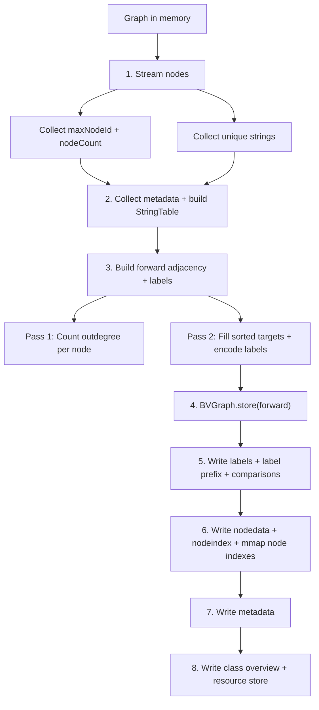
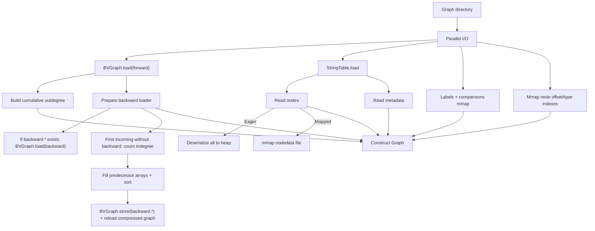

# WebGraph Storage Format

## File Layout

```
graph-dir/
├── forward.*          BVGraph compressed forward adjacency
├── backward.*         Optional BVGraph compressed backward adjacency
├── graph.strings      FrontCodedStringList (deduplicated string dictionary)
├── graph.strings.identity SHA-256 semantic identity of the ordered string dictionary
├── graph.labels       byte[] edge type labels (1 byte per arc)
├── graph.labelprefix  int[] cumulative outdegree values for label lookup
├── graph.nodedata     Sequential node records
├── graph.nodeindex    Legacy/compat Node ID -> offset index
├── graph.nodeoffsets  Mmap Node ID -> offset lookup
├── graph.typeindex    Mmap node type -> Node ID ranges lookup
├── graph.metadata     Methods, type hierarchy, enums, annotations, branch scopes
├── graph.classoverview Persisted explorer overview summary
├── graph.resources    Persisted text resources, including an explicit empty store
├── graph.callsite-string-index Optional CallSite CSR/trigram query index
├── graph.callsite-string-content.identity SHA-256 identity binding CallSite fields to node offsets
└── graph.comparisons  BranchComparison data for ControlFlowEdges
```

The production `graphite build` command prepares `graph.callsite-string-index` while saving the
graph. A mapped load restores its primitive arrays lazily under the shared CallSite-index heap
budget, so unrelated Method queries retain no CallSite-index heap and the first broad CallSite
string query does not rebuild or rescan it. The two identity files are generated from the core
graph while saving, so restoring the optional index compares its complete graph identity without
moving that scan onto the first online query. Direct library callers can request the same build artifact with
`GraphStore.save(..., prepareCallSiteStringIndex = true)`; the default library save omits this
optional query cache to preserve the existing save and storage contract.

For legacy graphs, or when the sidecar is missing or invalid, a relevant query builds the index in
memory and atomically persists it when that complete index is released or the mapped graph closes.
Budget denial, cancellation, or an unwritable directory preserves the raw-scan correctness
fallback. Set `-Dgraphite.webgraph.prepareCallSiteStringIndexOnLoad=true` to prepare a missing index
before `loadMapped()` returns, or `false` to disable persisted restore and best-effort persistence.

`GraphStore.save()` writes only `forward.*`. Backward adjacency is loaded from
`backward.*` when those files already exist; otherwise the first `incoming()`
query builds the transpose from `forward.*`, tries to store it as compressed
`backward.*`, reloads a compressed graph, and lets the temporary uncompressed
transpose be collected. If the graph directory is not writable, the current
process still uses a transient compressed graph; it just cannot reuse
`backward.*` across later processes. Forward-only queries still do not pay
transpose construction during load.

## Binary Format

### Header (all Graphite files)

4-byte header: 3-byte magic prefix + 1-byte version, packed as one `int`.

| File | Magic | Header |
|------|-------|--------|
| graph.metadata | `GRM` | `0x47524D03` |
| graph.nodedata | `GRN` | `0x47524E03` |
| graph.nodeindex | `GRI` | `0x47524903` |
| graph.nodeoffsets | `GRL` | `0x47524C03` |
| graph.typeindex | `GRT` | `0x47525403` |
| graph.classoverview | `GRO` | `0x47524F03` |
| graph.comparisons | `GRC` | `0x47524303` |
| graph.resources | `GRR` | `0x47525201` |
| graph.callsite-string-index | `GRCS` | `0x47524353` |

Current node and metadata writers emit version `3`. Their readers accept legacy version `1` and transitional
version `2` data from stable releases and decode legacy annotation payloads, but any graph re-saved by a current
build is upgraded to version `3`. The independent `graph.resources` format remains at version `1`.

Current builds always write `graph.resources`, including a valid zero-entry store when no supported text resources
exist. Its absence therefore identifies a graph produced without resource persistence (for example by a legacy CLI),
not an empty resource set. Other graph APIs remain available, while resource HTTP endpoints return `409` with an
instruction to rebuild the graph using the current CLI.

### Edge Label Encoding (8-bit)

```
bits 0-2: edge family (0=DataFlow, 1=Call, 2=Type, 3=ControlFlow, 4=Resource)
bits 3-6: subkind ordinal or call flags
bit 7: reserved
```

## Pipeline

```
BUILD                          SAVE                              LOAD
SootUpAdapter                  GraphStore.save()                 GraphStore.load()
  → DefaultGraph                 1. String collection              1. BVGraph.load       ┐
                                 2. Metadata + StringTable         2. StringTable.load    ├ parallel
                                 3. Forward adjacency + labels     3. Labels + comparisons mmap
                                                                   4. Mapped node indexes + nodedata
                                                                   5. Prepare/load backward on demand
                                 4. BVGraph.store                  5. Read nodes + metadata
                                 5. Labels + label prefix + comparisons write
                                 6. Nodedata + node indexes write
                                 7. Metadata write
                                 8. Class overview + resource store write
```

### Save Flow


```mermaid
graph TD
    A[Graph in memory] --> B[1. Stream nodes]
    B --> B1[Collect maxNodeId + nodeCount]
    B --> B2[Collect unique strings]
    B1 & B2 --> C[2. Collect metadata + build StringTable]
    C --> D["3. Build forward adjacency + labels"]
    D --> D1["Pass 1: Count outdegree per node"]
    D --> D2["Pass 2: Fill sorted targets + encode labels"]
    D2 --> E["4. BVGraph.store(forward)"]
    E --> F[5. Write labels + label prefix + comparisons]
    F --> G["6. Write nodedata + nodeindex + mmap node indexes"]
    G --> H[7. Write metadata]
    H --> I[8. Write class overview + resource store]
```

### Load Flow


```mermaid
graph TD
    A[Graph directory] --> B[Parallel I/O]
    B --> B1["BVGraph.load(forward)"]
    B --> B2[StringTable.load]
    B --> B3[Labels + comparisons mmap]
    B --> B4[Mmap node offset/type indexes]
    B1 --> C[Build cumulative outdegree]
    B1 --> D[Prepare backward loader]
    D --> D1["If backward.* exists: BVGraph.load(backward)"]
    D --> D2[First incoming without backward: count indegree]
    D2 --> D3[Fill predecessor arrays + sort]
    D3 --> D4["BVGraph.store(backward.*) + reload compressed graph"]
    B2 --> E[Read nodes]
    E -->|Eager| E1[Deserialize all to heap]
    E -->|Mapped| E2[mmap nodedata file]
    B2 --> F[Read metadata]
C & D & B3 & B4 & E & F --> G[Construct Graph]
```

### Load Modes

| Mode | Behavior | Threshold | Heap |
|------|----------|-----------|------|
| EAGER | All nodes deserialized to heap | < 1M nodes | Highest |
| MAPPED | Node data and mapped node indexes memory-mapped (OS page cache) | >= 1M nodes | Off-heap for node records, node offset lookup, and node type lookup |

## Performance

### Constraints

Every optimization must satisfy both simultaneously — trading one for the other is rejected.

| Constraint | Target | Measured by |
|------------|--------|-------------|
| **Time** | Minimize build + save + load | JMH SingleShotTime, same-session back-to-back |
| **Peak memory** | <= 4 GB for 10M nodes | `-Xmx4g`, no OOM |

### Methodology

1. **Measure** — phase breakdown to find the bottleneck
2. **Hypothesize** — target the dominant phase
3. **Validate** — same machine, same session, both metrics must hold
4. **Reject** if either metric regresses

### Benchmark Suites

Use both micro and end-to-end benchmarks. A change is not accepted based on synthetic numbers alone.

| Suite | Scope | Command |
|------|-------|---------|
| `SavePhaseBreakdownBenchmark` | Isolate save phases | `./gradlew :webgraph:jmh -Pjmh.filter=SavePhaseBreakdownBenchmark` |
| `GraphBuildPersistBenchmark` | Synthetic 10M save/load guardrail | `./gradlew :webgraph:jmh -Pjmh.filter=GraphBuildPersistBenchmark` |
| `GraphEndToEndBenchmark` | Real JAR `build -> save -> load -> query` | `./gradlew :webgraph:jmh -Pjmh.filter=GraphEndToEndBenchmark` |
| `GraphBenchmark` | Persisted-graph load/query comparisons | `./gradlew :webgraph:jmh -Pjmh.filter='(Android|LargeCorpus).*(Load|Query)Benchmark'` |

`GraphEndToEndBenchmark` and the load/query benchmarks auto-discover fixture JARs from the Gradle
cache. Explicit `-Dandroid.jar.path`, `-Dtika.jar.path`, `-Dhive.jar.path`, and
`-Dkotlin.compiler.jar.path` values take precedence over auto-discovery; persisted graph overrides
use the corresponding `.graph.path` properties and are forwarded to the forked JMH process. A
persisted override must have the exact node count of its named corpus, preventing mislabeled runs.
Gradle validates all configured graph overrides before starting any JMH fork, so an invalid override
fails the documented command instead of producing a partial result table.

The committed fixture fingerprints, 4 GiB performance gates, and initial measurements are documented in [large-corpus-performance-baseline.md](large-corpus-performance-baseline.md).

### Results Summary

| Version / PR | What | Synthetic save (10M, 4g) | Production (4.1M) | |
|--------------|------|--------------------------|-------------------|-|
| [#53](https://github.com/johnsonlee/graphite/pull/53) | Baseline (flat arrays for load) | 84s | real 15m57s | |
| [#55](https://github.com/johnsonlee/graphite/pull/55) | Flat single-file format | no change | — | :x: closed |
| [#56](https://github.com/johnsonlee/graphite/pull/56) | Inline nodeindex | **16s (-81%)** | **real 8m31s (-47%)** | :white_check_mark: |
| [#61](https://github.com/johnsonlee/graphite/pull/61) | Merge passes (4→2) | **9s (-44%)** | — | :white_check_mark: |
| [#62](https://github.com/johnsonlee/graphite/pull/62) | Parallelize step 3 | 3.8s (-59% synthetic) | real unchanged, sys +35% | :x: reverted |
| [#65](https://github.com/johnsonlee/graphite/pull/65) | Buffer MmapGraphBuilder I/O | — | **real 5m43s (-33%), sys -44%** | :white_check_mark: |
| [#66](https://github.com/johnsonlee/graphite/pull/66) | MmapGraph reads via mmap | — | **real 4m04s (-29%), sys -43%** | :white_check_mark: |
| [#67](https://github.com/johnsonlee/graphite/pull/67) | FastArchiveAnalysisInputLocation | — | real 9m41s (+138%), user +76% | :x: reverted |
| `1.1.0` | Current release, same production benchmark | — | **real 1m58s, user 2m18s, sys 0m48s** | :white_check_mark: |

Compared with the historical best published numbers, `1.1.0` improves:

| Metric | Historical best | `1.1.0` | Change |
|--------|-----------------|---------|--------|
| real | 4m04s ([#66](https://github.com/johnsonlee/graphite/pull/66)) | **1m58s** | **-2m06s (-51.6%)** |
| user | 8m00s ([#65](https://github.com/johnsonlee/graphite/pull/65)) | **2m18s** | **-5m42s (-71.3%)** |
| sys | 2m46s ([#65](https://github.com/johnsonlee/graphite/pull/65)) | **0m48s** | **-1m58s (-71.1%)** |

### How Each Bottleneck Was Found and Fixed

**PR #53 → #56: "BVGraph must be the bottleneck" — wrong**

Assumption: BVGraph compression (step 4) dominates save. PR #55 built a flat format to skip BVGraph.

Reality: `SavePhaseBreakdownBenchmark` showed `buildNodeIndex` re-scan (step 6) was **92%** of save. BVGraph was **2%**. PR #55 closed — flat and compressed had identical times.

Fix (PR #56): write nodedata + nodeindex simultaneously via `CountingOutputStream`. `writeNode()` returns the tag byte. Zero re-scan, zero intermediate collections.

| | Step 6 time | Total save |
|--|------------|------------|
| Before | 69,895 ms (92%) | 84s |
| PR #56 | 0 ms (inline) | **16s** |

Production impact: sys dropped **79%** (24m → 5m) — the re-scan via `RandomAccessFile.seek()` was pure syscall overhead.

**PR #56 → #61: 4 passes over `outgoing()` → 2**

With step 6 eliminated, step 3 (`graph.outgoing()` iteration) became the bottleneck. Two separate methods each iterated all edges twice.

Fix (PR #61): merge into single `buildForwardData` with 2 passes.

| | Save (same-session, 4g) |
|--|------------------------|
| PR #56 | 15,132 ms |
| PR #61 | **9,090 ms (-40%)** |

**PR #61 → #62: sequential → parallel (reverted)**

Each node in step 3 is independent — `outgoing()` is read-only, array writes are non-overlapping. Only shared state is `comparisonMap` (switched to `ConcurrentHashMap`).

Fix (PR #62): `ForkJoinPool` parallelism for both passes.

| Threads | Save (ms) | vs 1 thread |
|---------|-----------|-------------|
| 1 | 9,257 | — |
| 2 | 6,100 | -34% |
| 4 | 4,927 | -47% |
| 8 | 3,794 | -59% |

Synthetic results looked promising, but production measurement (rc8, 4.1M nodes) showed real time unchanged and sys time +35% from ForkJoinPool thread management overhead. Reverted to sequential 2-pass structure from PR #61.

**PR #62 → #65: unbuffered RAF → buffered streams**

async-profiler flame graph on production showed `MmapGraphBuilder.addEdge → RandomAccessFile.write` as a major hotspot. Default `MmapGraphBuilder` wrote every node and edge directly to `RandomAccessFile` — millions of syscalls.

Fix (PR #65): wrap with `.buffered()`. Two lines changed.

| Metric | PR #56+#61 | PR #65 | Change |
|--------|-----------|--------|--------|
| real | 8m31s | **5m43s** | **-33%** |
| user | 8m32s | 8m | -6% |
| sys | 4m56s | **2m46s** | **-44%** |

user unchanged (same CPU work), sys halved (buffered writes consolidated millions of syscalls), real dropped because main thread no longer blocked on I/O.

### Rejected Approaches

| Approach | Outcome | Why rejected |
|----------|---------|-------------|
| Flat single-file format ([#55](https://github.com/johnsonlee/graphite/pull/55)) | :x: Same save time | Bottleneck was re-scan, not BVGraph |
| Precomputed SortedAdjacency | :x: OOM @4g | +200 MB permanent heap |
| Lazy SortedAdjacency | :x: OOM @4g | Delays but doesn't reduce allocation |
| MmapGraph + disk adjacency | :x: 100s @6g | 10M random seeks for deserialization |
| BVGraph thread tuning (1-4) | :x: < 1% change | Algorithm-bound (serial dependency) |
| ForkJoinPool parallelism for step 3 ([#62](https://github.com/johnsonlee/graphite/pull/62)) | :x: real unchanged, sys +35% | Production: ForkJoinPool overhead outweighed parallel gains; synthetic benchmarks overstated benefit |

### Production Phase Breakdown (rc8, PR #56 + #61, 4.1M nodes)

| Step | Phase | Time | % |
|------|-------|------|---|
| 1 | String collection | 16,703 ms | 13% |
| 2 | Metadata + StringTable | 32,950 ms | **26%** |
| **3** | **Forward adjacency + labels** | **56,772 ms** | **45%** |
| 4 | BVGraph.store | 858 ms | 1% |
| 5 | Labels + comparisons | 102 ms | 0% |
| 6 | Nodedata + nodeindex | 17,815 ms | 14% |
| 7 | Metadata write | 282 ms | 0% |
| | **Save total** | **125s** | |

Synthetic benchmarks (IntConstant) understate steps 1/2/6 because production uses complex CallSiteNode with MethodDescriptor strings.

### Next Targets

| Target | Phase | Approach |
|--------|-------|----------|
| Build time | BUILD | Reduce SootUp body-walk overhead, or bypass it with an ASM-first persisted builder for the subset of graph semantics that can be emitted directly |
| String + metadata (50s, 40% of save) | Steps 1+2 | Pre-collect at build time, or merge with step 3 |
| Nodedata write (18s, 14% of save) | Step 6 | Optimize MethodDescriptor serialization |

### Key Lesson

Adding precomputed caches to reduce time tends to increase memory — violating the constraint. The path that works: **eliminate redundant work** (fewer passes, no re-scans). Both metrics improve simultaneously. Parallelism that shows gains in synthetic benchmarks can regress in production due to thread management overhead.

## Optimization Attempt Log

The chronological record of each WebGraph optimization attempt now lives in [webgraph-optimization-attempts.md](webgraph-optimization-attempts.md).
