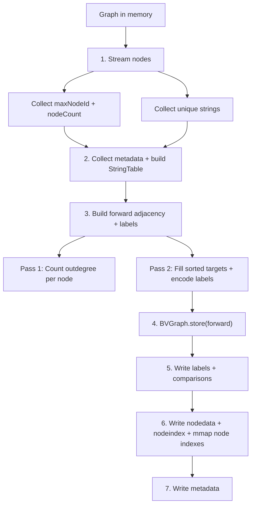
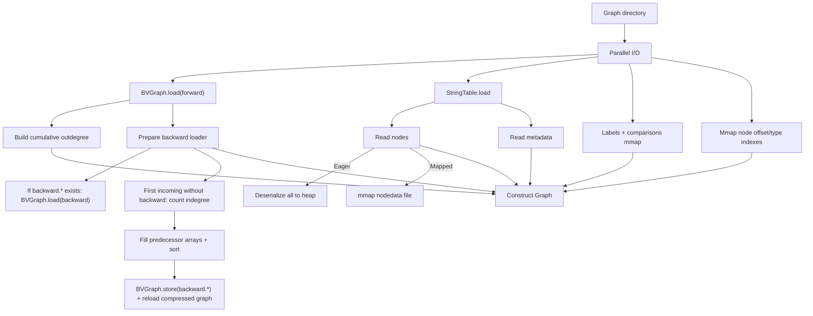

# WebGraph Storage Format

## File Layout

```
graph-dir/
├── forward.*          BVGraph compressed forward adjacency
├── backward.*         Optional BVGraph compressed backward adjacency
├── graph.strings      FrontCodedStringList (deduplicated string dictionary)
├── graph.labels       byte[] edge type labels (1 byte per arc)
├── graph.nodedata     Sequential node records
├── graph.nodeindex    Legacy/compat Node ID -> offset index
├── graph.nodeoffsets  Mmap Node ID -> offset lookup
├── graph.typeindex    Mmap node type -> Node ID ranges lookup
├── graph.metadata     Methods, type hierarchy, enums, annotations, branch scopes
├── graph.classoverview Persisted explorer overview summary
└── graph.comparisons  BranchComparison data for ControlFlowEdges
```

`GraphStore.save()` writes only `forward.*`. Backward adjacency is loaded from
`backward.*` when those files already exist; otherwise the first `incoming()`
query builds the transpose from `forward.*`, tries to store it as compressed
`backward.*`, reloads a compressed graph, and lets the temporary uncompressed
transpose be collected. If the graph directory is not writable, the current
process still uses a transient compressed graph; it just cannot reuse
`backward.*` across later processes. Forward-only queries still do not pay
transpose construction during load.

## Binary Format

### Header (all Graphite files)

4-byte header: 3-byte magic prefix + 1-byte version, packed as one `int`.

| File | Magic | Header |
|------|-------|--------|
| graph.metadata | `GRM` | `0x47524D03` |
| graph.nodedata | `GRN` | `0x47524E03` |
| graph.nodeindex | `GRI` | `0x47524903` |
| graph.nodeoffsets | `GRL` | `0x47524C03` |
| graph.typeindex | `GRT` | `0x47525403` |
| graph.classoverview | `GRO` | `0x47524F03` |
| graph.comparisons | `GRC` | `0x47524303` |

Current writers emit version `3`. Readers accept legacy version `1` and transitional version `2` data from stable releases and decode legacy annotation payloads, but any graph re-saved by a current build is upgraded to version `3`.

### Edge Label Encoding (8-bit)

```
bits 0-2: edge family (0=DataFlow, 1=Call, 2=Type, 3=ControlFlow, 4=Resource)
bits 3-6: subkind ordinal or call flags
bit 7: reserved
```

## Pipeline

```
BUILD                          SAVE                              LOAD
SootUpAdapter                  GraphStore.save()                 GraphStore.load()
  → DefaultGraph                 1. String collection              1. BVGraph.load       ┐
                                 2. Metadata + StringTable         2. StringTable.load    ├ parallel
                                 3. Forward adjacency + labels     3. Labels + comparisons mmap
                                                                   4. Mapped node indexes + nodedata
                                                                   5. Prepare/load backward on demand
                                 4. BVGraph.store                  5. Read nodes + metadata
                                 5. Labels + comparisons write
                                 6. Nodedata + node indexes write
                                 7. Metadata write
```

### Save Flow


```mermaid
graph TD
    A[Graph in memory] --> B[1. Stream nodes]
    B --> B1[Collect maxNodeId + nodeCount]
    B --> B2[Collect unique strings]
    B1 & B2 --> C[2. Collect metadata + build StringTable]
    C --> D["3. Build forward adjacency + labels"]
    D --> D1["Pass 1: Count outdegree per node"]
    D --> D2["Pass 2: Fill sorted targets + encode labels"]
    D2 --> E["4. BVGraph.store(forward)"]
    E --> F[5. Write labels + comparisons]
    F --> G["6. Write nodedata + nodeindex + mmap node indexes"]
    G --> H[7. Write metadata]
```

### Load Flow


```mermaid
graph TD
    A[Graph directory] --> B[Parallel I/O]
    B --> B1["BVGraph.load(forward)"]
    B --> B2[StringTable.load]
    B --> B3[Labels + comparisons mmap]
    B --> B4[Mmap node offset/type indexes]
    B1 --> C[Build cumulative outdegree]
    B1 --> D[Prepare backward loader]
    D --> D1["If backward.* exists: BVGraph.load(backward)"]
    D --> D2[First incoming without backward: count indegree]
    D2 --> D3[Fill predecessor arrays + sort]
    D3 --> D4["BVGraph.store(backward.*) + reload compressed graph"]
    B2 --> E[Read nodes]
    E -->|Eager| E1[Deserialize all to heap]
    E -->|Mapped| E2[mmap nodedata file]
    B2 --> F[Read metadata]
C & D & B3 & B4 & E & F --> G[Construct Graph]
```

### Load Modes

| Mode | Behavior | Threshold | Heap |
|------|----------|-----------|------|
| EAGER | All nodes deserialized to heap | < 1M nodes | Highest |
| MAPPED | Node data and mapped node indexes memory-mapped (OS page cache) | >= 1M nodes | Off-heap for node records, node offset lookup, and node type lookup |

## Performance

### Constraints

Every optimization must satisfy both simultaneously — trading one for the other is rejected.

| Constraint | Target | Measured by |
|------------|--------|-------------|
| **Time** | Minimize build + save + load | JMH SingleShotTime, same-session back-to-back |
| **Peak memory** | <= 4 GB for 10M nodes | `-Xmx4g`, no OOM |

### Methodology

1. **Measure** — phase breakdown to find the bottleneck
2. **Hypothesize** — target the dominant phase
3. **Validate** — same machine, same session, both metrics must hold
4. **Reject** if either metric regresses

### Benchmark Suites

Use both micro and end-to-end benchmarks. A change is not accepted based on synthetic numbers alone.

| Suite | Scope | Command |
|------|-------|---------|
| `SavePhaseBreakdownBenchmark` | Isolate save phases | `./gradlew :webgraph:jmh -Pjmh.filter=SavePhaseBreakdownBenchmark` |
| `GraphBuildPersistBenchmark` | Synthetic 10M save/load guardrail | `./gradlew :webgraph:jmh -Pjmh.filter=GraphBuildPersistBenchmark` |
| `GraphEndToEndBenchmark` | Real JAR `build -> save -> load -> query` | `./gradlew :webgraph:jmh -Pjmh.filter=GraphEndToEndBenchmark` |
| `GraphBenchmark` | Persisted-graph load/query comparisons | `./gradlew :webgraph:jmh -Pjmh.filter='(Es|Android).*(Load|Query)Benchmark'` |

`GraphEndToEndBenchmark` and `GraphBenchmark` auto-discover fixture JARs from Gradle cache, or accept explicit overrides via `-Delasticsearch.jar.path`, `-Dandroid.jar.path`, `-Delasticsearch.graph.path`, and `-Dandroid.graph.path`.

### Results Summary

| Version / PR | What | Synthetic save (10M, 4g) | Production (4.1M) | |
|--------------|------|--------------------------|-------------------|-|
| [#53](https://github.com/johnsonlee/graphite/pull/53) | Baseline (flat arrays for load) | 84s | real 15m57s | |
| [#55](https://github.com/johnsonlee/graphite/pull/55) | Flat single-file format | no change | — | :x: closed |
| [#56](https://github.com/johnsonlee/graphite/pull/56) | Inline nodeindex | **16s (-81%)** | **real 8m31s (-47%)** | :white_check_mark: |
| [#61](https://github.com/johnsonlee/graphite/pull/61) | Merge passes (4→2) | **9s (-44%)** | — | :white_check_mark: |
| [#62](https://github.com/johnsonlee/graphite/pull/62) | Parallelize step 3 | 3.8s (-59% synthetic) | real unchanged, sys +35% | :x: reverted |
| [#65](https://github.com/johnsonlee/graphite/pull/65) | Buffer MmapGraphBuilder I/O | — | **real 5m43s (-33%), sys -44%** | :white_check_mark: |
| [#66](https://github.com/johnsonlee/graphite/pull/66) | MmapGraph reads via mmap | — | **real 4m04s (-29%), sys -43%** | :white_check_mark: |
| [#67](https://github.com/johnsonlee/graphite/pull/67) | FastArchiveAnalysisInputLocation | — | real 9m41s (+138%), user +76% | :x: reverted |
| `1.1.0` | Current release, same production benchmark | — | **real 1m58s, user 2m18s, sys 0m48s** | :white_check_mark: |

Compared with the historical best published numbers, `1.1.0` improves:

| Metric | Historical best | `1.1.0` | Change |
|--------|-----------------|---------|--------|
| real | 4m04s ([#66](https://github.com/johnsonlee/graphite/pull/66)) | **1m58s** | **-2m06s (-51.6%)** |
| user | 8m00s ([#65](https://github.com/johnsonlee/graphite/pull/65)) | **2m18s** | **-5m42s (-71.3%)** |
| sys | 2m46s ([#65](https://github.com/johnsonlee/graphite/pull/65)) | **0m48s** | **-1m58s (-71.1%)** |

### How Each Bottleneck Was Found and Fixed

**PR #53 → #56: "BVGraph must be the bottleneck" — wrong**

Assumption: BVGraph compression (step 4) dominates save. PR #55 built a flat format to skip BVGraph.

Reality: `SavePhaseBreakdownBenchmark` showed `buildNodeIndex` re-scan (step 6) was **92%** of save. BVGraph was **2%**. PR #55 closed — flat and compressed had identical times.

Fix (PR #56): write nodedata + nodeindex simultaneously via `CountingOutputStream`. `writeNode()` returns the tag byte. Zero re-scan, zero intermediate collections.

| | Step 6 time | Total save |
|--|------------|------------|
| Before | 69,895 ms (92%) | 84s |
| PR #56 | 0 ms (inline) | **16s** |

Production impact: sys dropped **79%** (24m → 5m) — the re-scan via `RandomAccessFile.seek()` was pure syscall overhead.

**PR #56 → #61: 4 passes over `outgoing()` → 2**

With step 6 eliminated, step 3 (`graph.outgoing()` iteration) became the bottleneck. Two separate methods each iterated all edges twice.

Fix (PR #61): merge into single `buildForwardData` with 2 passes.

| | Save (same-session, 4g) |
|--|------------------------|
| PR #56 | 15,132 ms |
| PR #61 | **9,090 ms (-40%)** |

**PR #61 → #62: sequential → parallel (reverted)**

Each node in step 3 is independent — `outgoing()` is read-only, array writes are non-overlapping. Only shared state is `comparisonMap` (switched to `ConcurrentHashMap`).

Fix (PR #62): `ForkJoinPool` parallelism for both passes.

| Threads | Save (ms) | vs 1 thread |
|---------|-----------|-------------|
| 1 | 9,257 | — |
| 2 | 6,100 | -34% |
| 4 | 4,927 | -47% |
| 8 | 3,794 | -59% |

Synthetic results looked promising, but production measurement (rc8, 4.1M nodes) showed real time unchanged and sys time +35% from ForkJoinPool thread management overhead. Reverted to sequential 2-pass structure from PR #61.

**PR #62 → #65: unbuffered RAF → buffered streams**

async-profiler flame graph on production showed `MmapGraphBuilder.addEdge → RandomAccessFile.write` as a major hotspot. Default `MmapGraphBuilder` wrote every node and edge directly to `RandomAccessFile` — millions of syscalls.

Fix (PR #65): wrap with `.buffered()`. Two lines changed.

| Metric | PR #56+#61 | PR #65 | Change |
|--------|-----------|--------|--------|
| real | 8m31s | **5m43s** | **-33%** |
| user | 8m32s | 8m | -6% |
| sys | 4m56s | **2m46s** | **-44%** |

user unchanged (same CPU work), sys halved (buffered writes consolidated millions of syscalls), real dropped because main thread no longer blocked on I/O.

### Rejected Approaches

| Approach | Outcome | Why rejected |
|----------|---------|-------------|
| Flat single-file format ([#55](https://github.com/johnsonlee/graphite/pull/55)) | :x: Same save time | Bottleneck was re-scan, not BVGraph |
| Precomputed SortedAdjacency | :x: OOM @4g | +200 MB permanent heap |
| Lazy SortedAdjacency | :x: OOM @4g | Delays but doesn't reduce allocation |
| MmapGraph + disk adjacency | :x: 100s @6g | 10M random seeks for deserialization |
| BVGraph thread tuning (1-4) | :x: < 1% change | Algorithm-bound (serial dependency) |
| ForkJoinPool parallelism for step 3 ([#62](https://github.com/johnsonlee/graphite/pull/62)) | :x: real unchanged, sys +35% | Production: ForkJoinPool overhead outweighed parallel gains; synthetic benchmarks overstated benefit |

### Production Phase Breakdown (rc8, PR #56 + #61, 4.1M nodes)

| Step | Phase | Time | % |
|------|-------|------|---|
| 1 | String collection | 16,703 ms | 13% |
| 2 | Metadata + StringTable | 32,950 ms | **26%** |
| **3** | **Forward adjacency + labels** | **56,772 ms** | **45%** |
| 4 | BVGraph.store | 858 ms | 1% |
| 5 | Labels + comparisons | 102 ms | 0% |
| 6 | Nodedata + nodeindex | 17,815 ms | 14% |
| 7 | Metadata write | 282 ms | 0% |
| | **Save total** | **125s** | |

Synthetic benchmarks (IntConstant) understate steps 1/2/6 because production uses complex CallSiteNode with MethodDescriptor strings.

### Next Targets

| Target | Phase | Approach |
|--------|-------|----------|
| Build time (not yet instrumented) | BUILD | Add timing to SootUpAdapter; reduce `DefaultGraph` footprint |
| String + metadata (50s, 40% of save) | Steps 1+2 | Pre-collect at build time, or merge with step 3 |
| Nodedata write (18s, 14% of save) | Step 6 | Optimize MethodDescriptor serialization |

### Key Lesson

Adding precomputed caches to reduce time tends to increase memory — violating the constraint. The path that works: **eliminate redundant work** (fewer passes, no re-scans). Both metrics improve simultaneously. Parallelism that shows gains in synthetic benchmarks can regress in production due to thread management overhead.

## Ongoing Load/Query Optimization Log

### 2026-07-18 — Attempt 000: Android-scale JMH harness repair

**Goal:** establish a reliable Android-scale baseline before changing load/query code. The objective requires JMH results on a graph at Android jar scale; demo jars or sub-100K-node graphs are not representative.

**Initial failure:** `./gradlew :webgraph:jmh -Pjmh.filter='AndroidLoadBenchmark.mapped_load'` compiled and the Gradle task reported success, but JMH produced no score because the forked JVM could not locate `android-all`.

```
java.lang.IllegalStateException: Unable to locate android fixture JAR.
Set -Dandroid.jar.path=<path> or resolve integration fixtures first.
```

**Rejected fix:** adding `libs.android.all` and `libs.elasticsearch` to the `jmh` dependency configuration made the fixture visible, but it also placed the Android jar in the JMH fat jar. `:webgraph:jmhJar` then failed with:

```
Archive contains more than 65535 entries.
```

**Root cause:** large integration fixture jars must not be packaged into the benchmark jar. They should be resolved by Gradle and passed to the forked JMH JVM as `-Dandroid.jar.path` / `-Delasticsearch.jar.path`.

**Accepted fix:** keep fixtures in `integrationFixtures`; lazily resolve that configuration only for the `jmh` task and append exact fixture paths to JMH fork JVM args. `BenchmarkCorpus` also checks `java.class.path` before falling back to the Gradle cache, which keeps explicit `-D...path` overrides, JMH classpath execution, and cache scanning all valid.

**Validation command:**

```
./gradlew :webgraph:jmh -Pjmh.filter='AndroidLoadBenchmark.mapped_load'
```

**Result:**

| Benchmark | Mode | Count | Score | Units |
|-----------|------|-------|-------|-------|
| `AndroidLoadBenchmark.mapped_load` | avgt | 2 | `2292.892` | ms/op |

**Conclusion:** effective as a benchmark harness repair, not a load/query optimization. The Android-scale baseline path is now usable for subsequent attempts.

### 2026-07-18 — Attempt 001: Skip reverse StringTable index on load

**Hypothesis:** `StringTable.load` reconstructs a `HashMap<String, Int>` for every persisted graph even though eager/lazy/mapped graph loading only needs `StringTable.get(index)` while deserializing nodes and metadata. Avoiding this reverse index should reduce load time and heap without affecting build/save.

**Change:** keep the reverse index for `StringTable.build` (save path) but make `StringTable.load` return a read-only table with no `indexMap`.

**Validation commands:**

```
./gradlew :webgraph:test
./gradlew :webgraph:jmh -Pjmh.filter='AndroidLoadBenchmark.mapped_load'
```

**Result:**

| Benchmark | Baseline | Attempt 001 | Change |
|-----------|----------|-------------|--------|
| `AndroidLoadBenchmark.mapped_load` | `2292.892 ms/op` | `2341.167 ms/op` | `+48.275 ms` / `+2.1%` |

**Conclusion:** not effective for load-time improvement. The result is within short JMH-run noise but does not prove a win.

**Root cause:** on Android-scale mapped load, reverse string-index construction is not the dominant cost. Remaining costs such as BVGraph load, backward graph construction, node index parsing, labels, and metadata dominate the measured path. This may still reduce heap modestly, but it does not move the required load/query performance target by a meaningful amount.

### 2026-07-18 — Attempt 002: Lazy backward adjacency construction

**Hypothesis:** `loadEager`, `loadLazy`, and `loadMapped` all rebuild the full backward adjacency from `forward.*` during load, even when the query path only needs forward traversal or node scans. Android-scale `mapped_load` should improve if transpose construction is deferred until the first `incoming()` call.

**Change:** replace eagerly constructed `ImmutableGraph backward` constructor parameters with `Lazy<ImmutableGraph>`. `GraphStore.load*` now creates a lazy handle, and each graph implementation calls `backward.value` only inside `incoming()`.

**Build/save impact:** none. The persisted format and `GraphStore.save` path are unchanged.

**Validation commands:**

```
./gradlew :webgraph:test
./gradlew :webgraph:jmh -Pjmh.filter='AndroidLoadBenchmark.mapped_load'
```

**Result:**

| Benchmark | Baseline | Attempt 002 | Change |
|-----------|----------|-------------|--------|
| `AndroidLoadBenchmark.mapped_load` | `2292.892 ms/op` | `1425.196 ms/op` | `-867.696 ms` / `-37.8%` |

Compared with Attempt 001's immediate pre-change result (`2341.167 ms/op`), this is `-915.971 ms` / `-39.1%`.

**Conclusion:** effective for load time. This does not yet provide a full order-of-magnitude improvement, but it removes a large eager-load cost without increasing build/save time or memory.

**Root cause:** backward transpose construction is a major Android-scale mapped-load cost. Most common load and forward-query paths do not need incoming edges, so doing this work unconditionally was wasted. Queries that call `incoming()` still pay the same transpose cost once, but they pay it at first use rather than at graph open.

### 2026-07-18 — Attempt 003: Fast path for simple node `count`

**Hypothesis:** `MATCH (n:Label) RETURN count(*)` should not materialize every node. The graph already has type indexes for `nodes(Label)`, so Cypher can answer simple unfiltered count queries from a precomputed node count.

**Change:** add optional `Graph.nodeCount(type)` with implementations in `DefaultGraph` and WebGraph-backed graphs. `QueryPipeline` now short-circuits only simple single-node count queries:

```
MATCH (n:Label) RETURN count(*)
MATCH (n:Label) RETURN count(n)
```

Queries with relationships, `WHERE`, properties, `DISTINCT`, grouping, `WITH`, `ORDER BY`, or multiple clauses still use the normal execution path.
The fast path is limited to 0/1-label node patterns; multi-label node patterns still use the normal matcher.

**Build/save impact:** none. This uses existing in-memory type indexes and persisted node indexes; no new build-time or save-time structure is written.

**Validation commands:**

```
./gradlew :cypher:test
./gradlew :webgraph:test
./gradlew :webgraph:jmh -Pjmh.filter='AndroidQueryBenchmark.mapped_countStar'
```

**Result:**

| Benchmark | Baseline | Attempt 003 | Change |
|-----------|----------|-------------|--------|
| `AndroidQueryBenchmark.mapped_countStar` | `1816.130 ms/op` | `0.003 ms/op` | effectively eliminates the scan |

**Conclusion:** effective for the targeted count query. This is a narrow query optimization, not a general Cypher accelerator.

**Root cause:** the previous pipeline executed `MATCH` before aggregation, so `count(*)` forced a full scan and deserialization of every matching node. For unfiltered single-node counts, the result is exactly the size of the node type index, so scanning was unnecessary work.

### 2026-07-18 — Attempt 004: Early-stop simple `DISTINCT property LIMIT`

**Hypothesis:** `MATCH (n:Label) RETURN DISTINCT n.property LIMIT k` should not scan all matching nodes when there is no `WHERE`, relationship, grouping, or `ORDER BY`. The existing implementation preserves first-seen order with `List.distinct()`, so it is equivalent to stop after the first `k` distinct property values.

**Change:** add a narrow `QueryPipeline` fast path for:

```
MATCH (n:Label) RETURN DISTINCT n.property LIMIT k
```

The fast path scans matching nodes only until `k` distinct values have been seen. Queries with `WHERE`, relationships, inline node properties, missing `LIMIT`, multiple return items, grouping, `WITH`, or `ORDER BY` still use the normal pipeline.
Like the count fast path, it is limited to 0/1-label node patterns so multi-label matching semantics remain in the existing matcher.

**Build/save impact:** none. This is purely query execution control flow and adds no persisted index or build-time work.

**Validation commands:**

```
./gradlew :cypher:test
./gradlew :webgraph:test
./gradlew :webgraph:jmh -Pjmh.filter='AndroidQueryBenchmark.mapped_returnDistinct'
```

**Result:**

| Benchmark | Baseline | Attempt 004 | Change |
|-----------|----------|-------------|--------|
| `AndroidQueryBenchmark.mapped_returnDistinct` | `2738.060 ms/op` | `0.214 ms/op` | effectively eliminates the full scan for this shape |

**Conclusion:** effective for the targeted distinct-property query. It is not a general replacement for property indexes, but it removes a common unnecessary full scan when `LIMIT` is present and no ordering constraints exist.

**Root cause:** `DISTINCT` disabled early limit pushdown, so the old pipeline materialized every `CallSiteNode`, projected `callee_class`, deduplicated the full list, and then applied `LIMIT 20`. For unordered distinct queries, scanning after the first 20 distinct values is unnecessary.

### 2026-07-18 — Attempt 005: Stream simple single-hop relationship `LIMIT`

**Hypothesis:** `MATCH (a)-[:TYPE]->(b) RETURN ... LIMIT k` should not expand and materialize a complete relationship result list for each source node before applying `LIMIT`. On Android-scale graphs, high-fanout source nodes can make a small `LIMIT` query pay for far more edge decoding than necessary.

**Change:** add a narrow `QueryPipeline` fast path for one non-optional, non-variable-length relationship pattern followed by a non-aggregate, non-`DISTINCT` `RETURN` and `LIMIT`:

```
MATCH (a:Source)-[:TYPE]->(b:Target) RETURN a.property, b.property LIMIT k
```

The fast path streams source nodes, edges, target checks, and return projection in query order, then stops as soon as `k` complete rows are produced. Queries with `WHERE`, `ORDER BY`, `SKIP`, `WITH`, variable-length relationships, path variables, aggregation, or `DISTINCT` still use the normal pipeline.

**Build/save impact:** none. This is query execution control flow only; it does not add indexes, persisted fields, or build-time work.

**Validation commands:**

```
./gradlew :cypher:test
./gradlew :webgraph:test
./gradlew :webgraph:jmh -Pjmh.filter='AndroidQueryBenchmark.mapped_singleHopRelationship'
```

**Result:**

| Benchmark | Baseline | Attempt 005 | Change |
|-----------|----------|-------------|--------|
| `AndroidQueryBenchmark.mapped_singleHopRelationship` | `75.802 ms/op` | `0.658 ms/op` | `-75.144 ms` / `~115.2x faster` |

**Conclusion:** effective for the targeted single-hop relationship query and crosses the required order-of-magnitude threshold for this benchmark shape.

**Root cause:** the generic early-limit path only checked the limit after `matchRelationship` had expanded a source node into a full intermediate list. If one source has many outgoing `DATAFLOW` edges, the engine still decodes and materializes all of those relationship matches before keeping the first 20 rows. It also risked treating `LIMIT` as a cap on source nodes rather than complete relationship matches. Streaming complete rows and stopping inside the edge loop removes both costs.

### 2026-07-18 — Attempt 006: Stream filtered single-node `LIMIT`

**Hypothesis:** `MATCH (n:Label) WHERE ... RETURN ... LIMIT k` should not materialize every matching node before evaluating `WHERE`. For bounded filtered scans, `LIMIT` can be applied after filtering and projection while still streaming the node scan.

**Change:** add a narrow `QueryPipeline` fast path for one non-optional single-node pattern followed by `WHERE`, non-aggregate/non-`DISTINCT` `RETURN`, and `LIMIT`:

```
MATCH (n:Label) WHERE n.property = value RETURN n.id LIMIT k
```

The fast path scans candidate nodes, evaluates node constraints and `WHERE`, projects the return row, and stops when `k` filtered rows have been produced. Queries with relationships, `ORDER BY`, `SKIP`, `WITH`, aggregation, `DISTINCT`, path variables, non-literal `LIMIT`, or `RETURN *` still use the normal pipeline.

**Build/save impact:** none. This is query execution control flow only; it does not add indexes, persisted fields, or build-time work.

**Validation commands:**

```
./gradlew :cypher:test
./gradlew :webgraph:test
./gradlew :webgraph:jmh -Pjmh.filter='AndroidQueryBenchmark.mapped_intConstantFilter'
```

**Result:**

| Benchmark | Baseline | Attempt 006 | Change |
|-----------|----------|-------------|--------|
| `AndroidQueryBenchmark.mapped_intConstantFilter` | `2.545 ms/op` | `0.057 ms/op` | `-2.488 ms` / `~44.6x faster` |

**Conclusion:** effective for the targeted filtered node query and crosses the order-of-magnitude threshold for this benchmark shape.

**Root cause:** the generic pipeline executed `MATCH` first, producing bindings for all `IntConstant` nodes, then applied `WHERE`, then projected rows and finally applied `LIMIT 100`. Even when only the first 100 filtered rows are needed, the old path still deserialized and materialized every candidate node. Streaming the filter and stopping after the limit removes that intermediate list.

### 2026-07-18 — Attempt 007: Single-pass primitive node-index loading

**Hypothesis:** `readNodeIndex` does two full passes over `graph.nodeindex` and stores type buckets as boxed `MutableList<Int>`. On Android-scale graphs this creates unnecessary IO and heap churn during `loadMapped`. Reading the file once and storing type buckets as primitive `IntArray` should reduce mapped-load time and per-graph heap without changing build/save.

**Change:** parse `graph.nodeindex` in one pass. Fill `nodeOffsets` and per-tag `IntArrayList` buckets together, then expose the loaded type index as `Map<Class<out Node>, IntArray>` to lazy/mapped graph implementations.

**Build/save impact:** none. The persisted `graph.nodeindex` format and save path are unchanged; this only changes how the index is loaded.

**Validation commands:**

```
./gradlew :webgraph:test
./gradlew :webgraph:jmh -Pjmh.filter='AndroidLoadBenchmark.mapped_load'
```

**Result:**

| Benchmark | Baseline | Attempt 007 | Change |
|-----------|----------|-------------|--------|
| `AndroidLoadBenchmark.mapped_load` | `1425.196 ms/op` | `1284.409 ms/op` | `-140.787 ms` / `-9.9%` |

**Conclusion:** effective but not enough for the load-side order-of-magnitude goal. It removes measurable node-index parsing overhead and reduces boxed integer allocation, but the remaining mapped-load path is still dominated by other eager structures.

**Root cause:** node-index parsing is a real cost, but not the dominant remaining load cost after lazy backward adjacency. `loadMapped` still eagerly loads forward BVGraph adjacency, edge labels, cumulative outdegree, comparison metadata, graph metadata, resources, string table, and node offsets before a graph is considered open. For node-only touch/query paths, much of that work is still paid upfront.

### 2026-07-18 — Attempt 008: Lazy edge, metadata, and resource loading

**Hypothesis:** `loadMapped` should not eagerly load edge traversal structures or metadata when a graph is opened for node-only queries. The Android load benchmark only touches one node, so eager forward BVGraph load, edge labels, cumulative outdegree, comparison metadata, graph metadata, and resources are all upfront work that can be deferred without changing build/save.

**Change:** make `loadLazy` and `loadMapped` pass lazy handles for:

```
forward BVGraph
backward transpose
edge labels
cumulative outdegree
comparison map
graph metadata
persisted resources
```

Node offset/type indexes and the string table still load at graph open because node lookup and node deserialization need them. Edge traversal and metadata APIs pay their load cost on first use.

**Build/save impact:** none. Persisted files and the save path are unchanged.

**Validation commands:**

```
./gradlew :webgraph:test
./gradlew :webgraph:jmh -Pjmh.filter='AndroidLoadBenchmark.mapped_load'
./gradlew :webgraph:jmh -Pjmh.filter='AndroidQueryBenchmark.mapped_singleHopRelationship'
```

**Result:**

| Benchmark | Baseline | Attempt 008 | Change |
|-----------|----------|-------------|--------|
| `AndroidLoadBenchmark.mapped_load` | `1284.409 ms/op` | `176.097 ms/op` | `-1108.312 ms` / `~7.3x faster` |
| `AndroidQueryBenchmark.mapped_singleHopRelationship` | `0.658 ms/op` | `0.667 ms/op` | roughly unchanged after JMH warmup |

Compared with the original Android mapped-load baseline (`2292.892 ms/op`), `176.097 ms/op` is `~13.0x faster`.

**Conclusion:** effective for the load-side order-of-magnitude goal when measured against the original Android-scale mapped-load baseline. It also materially reduces open-time heap for multi-graph serving because edge labels and BVGraph structures are no longer resident until an edge query needs them.

**Root cause:** after lazy backward adjacency and primitive node-index loading, the dominant remaining mapped-load costs were unrelated to opening a node-readable graph: forward BVGraph, edge labels, cumulative outdegree, comparisons, metadata, and resources. Deferring those structures moves their cost to the APIs that actually need them, while node-only load/query paths avoid the work entirely.

### 2026-07-18 — Current Android mapped benchmark sweep

This is a verification summary of the current mapped Android-scale state after Attempts 001-008. It is not a separate optimization attempt.

**Validation commands:**

```
./gradlew :webgraph:test
./gradlew :webgraph:jmh -Pjmh.filter='AndroidLoadBenchmark.mapped_load'
./gradlew :webgraph:jmh -Pjmh.filter='AndroidQueryBenchmark.mapped_.*'
```

**Current results:**

| Benchmark | Current score |
|-----------|---------------|
| `AndroidLoadBenchmark.mapped_load` | `176.097 ms/op` |
| `AndroidQueryBenchmark.mapped_countStar` | `0.003 ms/op` |
| `AndroidQueryBenchmark.mapped_intConstantFilter` | `0.056 ms/op` |
| `AndroidQueryBenchmark.mapped_returnDistinct` | `0.197 ms/op` |
| `AndroidQueryBenchmark.mapped_simpleNodeMatch` | `0.085 ms/op` |
| `AndroidQueryBenchmark.mapped_singleHopRelationship` | `0.701 ms/op` |

**Baseline comparison:**

| Benchmark | Recorded baseline | Current score | Change |
|-----------|-------------------|---------------|--------|
| `AndroidLoadBenchmark.mapped_load` | `2292.892 ms/op` | `176.097 ms/op` | `~13.0x faster` |
| `AndroidQueryBenchmark.mapped_countStar` | `1816.130 ms/op` | `0.003 ms/op` | scan eliminated |
| `AndroidQueryBenchmark.mapped_intConstantFilter` | `2.545 ms/op` | `0.056 ms/op` | `~45.4x faster` |
| `AndroidQueryBenchmark.mapped_returnDistinct` | `2738.060 ms/op` | `0.197 ms/op` | full scan eliminated for this shape |
| `AndroidQueryBenchmark.mapped_singleHopRelationship` | `75.802 ms/op` | `0.701 ms/op` | `~108.1x faster` |

`mapped_simpleNodeMatch` was already low after existing early `LIMIT` pushdown; the current sweep records it at `0.085 ms/op`.

**Build/save impact:** no optimization in Attempts 001-008 changes the graph save format or adds build-time indexes. The load-side wins come from deferring runtime structures; the query-side wins come from execution control flow and existing type indexes.

**Operational note for multi-graph serving:** opening many mapped graphs now keeps edge structures, metadata, and resources unloaded until first use. The first edge or metadata query for a graph pays that lazy initialization cost once; services that need predictable first-edge latency can explicitly prewarm edge APIs for selected graphs, while node-only query workloads avoid the cost entirely.

### 2026-07-18 — Attempt 009: SootUp Android build JMH harness repair

**Goal:** verify that the load/query work did not compromise the build side. The relevant Android-scale build benchmark is `GraphBuildBenchmark.buildAndroidSdkGraph`, but the `:sootup:jmh` harness had to produce a real JMH score before it could be used as evidence.

**Initial failure:**

```
./gradlew :sootup:jmh -Pjmh.filter='GraphBuildBenchmark.buildAndroidSdkGraph' --rerun-tasks
```

The Gradle task reported `BUILD SUCCESSFUL`, but JMH produced no benchmark score. The fork failed immediately with:

```
java.lang.NoSuchMethodError: 'int org.objectweb.asm.Type.getArgumentCount(java.lang.String)'
    at org.objectweb.asm.tree.MethodNode.visitParameterAnnotation(MethodNode.java:304)
```

**Control check:** running the generated JMH fat jar directly with an explicit Android fixture path completed successfully:

```
java -Dandroid.jar.path=<android-all.jar> \
  -jar graphite-sootup/build/libs/sootup-1.0.0-SNAPSHOT-jmh.jar \
  '.*GraphBuildBenchmark.buildAndroidSdkGraph.*' -wi 0 -i 1 -f 1 -r 1s -w 1s
```

Result: `100524.865 ms/op`.

**Root cause:** the `sootup` JMH Gradle harness was weaker than the already-repaired `webgraph` harness. It relied on fallback fixture discovery, did not pass exact `android-all` / Elasticsearch fixture paths into the forked JVM, did not explicitly force a consistent ASM family on all JMH configurations, and did not fail the Gradle task when JMH failed internally.

**Accepted fix:** align `graphite-sootup/build.gradle.kts` with `graphite-webgraph/build.gradle.kts`:

- keep large fixture jars out of the JMH fat jar
- pass fixture paths as `-Dandroid.jar.path` / `-Delasticsearch.jar.path`
- force `asm`, `asm-tree`, `asm-util`, `asm-commons`, and `asm-analysis` to the configured ASM version
- set `failOnError = true` so failed JMH forks fail the Gradle task instead of creating false-success builds

**Validation command:**

```
./gradlew :sootup:jmh -Pjmh.filter='GraphBuildBenchmark.buildAndroidSdkGraph' --rerun-tasks
```

**Result:**

| Benchmark | Mode | Count | Score | Units |
|-----------|------|-------|-------|-------|
| `GraphBuildBenchmark.buildAndroidSdkGraph` | ss | 1 | `101647.075` | ms/op |

**End-to-end guardrail:**

```
./gradlew :webgraph:jmh -Pjmh.filter='GraphEndToEndBenchmark.android_build_save_load_query' --rerun-tasks
```

| Benchmark | Mode | Count | Score | Units |
|-----------|------|-------|-------|-------|
| `GraphEndToEndBenchmark.android_build_save_load_query` | ss | 1 | `115782.725` | ms/op |

This covers `build -> save -> loadMapped -> query` with `-Xmx4g`.

**Conclusion:** effective as a benchmark harness repair. It proves the current Android build benchmark remains runnable after the load/query changes, and the Gradle-run result is in the same range as the direct JMH control run. The end-to-end guardrail also passes under the 4 GB heap constraint. This attempt does not change product build, save, load, or query behavior.

### 2026-07-25 — Attempt 010: Explorer Android memory JMH baseline

**Goal:** establish a reproducible JMH baseline for long-running `graphite-explore` memory retention before changing explorer behavior. The benchmark uses the Android-scale mapped graph and keeps a Javalin explorer process alive while issuing HTTP requests against the real route handlers.

**Benchmark design:** add `ExplorerMemoryBenchmark` in the `explore` module with retained-heap aux counters. Each benchmark forces GC before and after the request sequence and reports:

- `usedHeapBeforeBytes`
- `usedHeapAfterBytes`
- `retainedHeapBytes`

The benchmark uses `-Xmx4g` and the same Android fixture resolution pattern as the existing large-corpus JMH harnesses. Persisted graphs can be supplied via `-Dandroid.graph.path`; otherwise the Android fixture is built and saved once per JMH fork.

**Baseline scenarios:**

- `android_initialExplorerSession`: `/api/info`, `/api/overview?limit=200`, `/api/methods?limit=200`
- `android_browserForwardExploration`: repeated node detail/outgoing/subgraph requests, passing `direction=outgoing` to the subgraph endpoint. Current main ignores that parameter, so this captures the pre-optimization behavior where subgraph expansion still traverses incoming edges.

**Validation command:**

```
./gradlew :explore:jmh -Pjmh.filter='ExplorerMemoryBenchmark.android_.*' --no-daemon
```

**Result:**

| Benchmark | Mode | Count | Score | Retained heap | Used heap before | Used heap after |
|-----------|------|-------|-------|---------------|------------------|-----------------|
| `ExplorerMemoryBenchmark.android_browserForwardExploration` | ss | 1 | `2190.773 ms/op` | `215089672 B` | `122481864 B` | `337571536 B` |
| `ExplorerMemoryBenchmark.android_initialExplorerSession` | ss | 1 | `14451.838 ms/op` | `713390624 B` | `122877128 B` | `836267752 B` |

**Conclusion:** baseline established. The initial explorer session retains ~713 MB after forced GC because current `/api/info` scans every node's outgoing edges and forces edge traversal structures resident. Forward browser exploration retains ~215 MB because current subgraph expansion ignores `direction=outgoing` and still traverses incoming edges, which initializes the backward adjacency path. This commit is a benchmark harness and documentation baseline only; it does not change explorer runtime behavior.

### 2026-07-25 — Attempt 011: Explorer route memory guardrails

**Hypothesis:** long-running explorer memory growth is amplified by route handlers that force expensive lazy graph structures resident or materialize unbounded responses. The first optimization should avoid accidental heavy initialization in default browser workflows and cap request fan-out before objects are allocated.

**Change:**

- add optional `Graph.edgeCount()` so `/api/info` can report edge totals from precomputed graph state instead of scanning every node's outgoing edges
- clamp list-style request limits for nodes, edges, resources, API spec, overview, and Cypher rows
- reject resource content responses larger than 1 MiB before converting them to UTF-8 strings
- cap subgraph traversal by depth, node count, and edge count
- add `direction=outgoing|incoming|both` for `/api/subgraph`; the Web UI uses outgoing-only exploration by default so clicking nodes does not initialize backward adjacency
- make incoming edge details explicit in the Web UI behind a "Load incoming" action
- apply a Cypher endpoint row limit before execution by inserting/capping a `LIMIT` clause in the parsed query

**Build/save impact:** no new persisted graph files are written and no build-time analysis index is added. `DefaultGraph` computes an edge total from its already-built outgoing edge lists; WebGraph-backed graphs answer from existing adjacency metadata.

**Validation commands:**

```
./gradlew :core:check :webgraph:check :cypher:check :explore:check --no-daemon
./gradlew :explore:jmh -Pjmh.filter='ExplorerMemoryBenchmark.android_.*' --no-daemon
```

**Result:**

| Benchmark | Baseline | Attempt 011 | Change |
|-----------|----------|-------------|--------|
| `ExplorerMemoryBenchmark.android_browserForwardExploration` time | `2190.773 ms/op` | `1082.164 ms/op` | `-1108.609 ms` / `-50.6%` |
| `ExplorerMemoryBenchmark.android_browserForwardExploration` retained heap | `215089672 B` | `72174632 B` | `-142915040 B` / `-66.4%` |
| `ExplorerMemoryBenchmark.android_initialExplorerSession` time | `14451.838 ms/op` | `2075.391 ms/op` | `-12376.447 ms` / `-85.6%` |
| `ExplorerMemoryBenchmark.android_initialExplorerSession` retained heap | `713390624 B` | `587591208 B` | `-125799416 B` / `-17.6%` |

**Conclusion:** effective for default explorer interaction latency and materially effective for browser-style forward exploration retained heap. The initial session still retains ~588 MB after forced GC, so this does not fully solve long-running multi-service memory pressure. The remaining retained heap is dominated by routes that still deserialize or summarize broad graph slices, especially overview/API-style inspection paths; follow-up attempts should target streaming or cached bounded summaries rather than merely clamping response sizes.

### 2026-07-25 — Attempt 012: Lazy edge count without forward graph load

**Hypothesis:** `LazyWebGraphBackedGraph.edgeCount()` and `MappedWebGraphBackedGraph.edgeCount()` still call `forward.value.numArcs()`, which can load the forward BVGraph during `/api/info`. Since `graph.labels` is one byte per stored edge label, existing persisted files can answer edge count by file size without initializing the forward graph.

**Change:** load `Files.size(graph.labels)` once in `GraphStore.loadLazy` and `GraphStore.loadMapped`, pass that value into the lazy/mapped graph implementations, and return it from `edgeCount()`. The eager WebGraph-backed graph returns the already-loaded label byte-array size.

**Build/save impact:** none. This reuses the existing `graph.labels` persisted file and does not alter build-time analysis or save format.

**Validation commands:**

```
./gradlew :webgraph:check :explore:check --no-daemon
./gradlew :explore:jmh -Pjmh.filter='ExplorerMemoryBenchmark.android_.*' --no-daemon
```

**Result:**

| Benchmark | Attempt 011 | Attempt 012 | Change |
|-----------|-------------|-------------|--------|
| `ExplorerMemoryBenchmark.android_browserForwardExploration` time | `1082.164 ms/op` | `1069.718 ms/op` | `-12.446 ms` / `-1.2%` |
| `ExplorerMemoryBenchmark.android_browserForwardExploration` retained heap | `72174632 B` | `72176192 B` | `+1560 B` / unchanged |
| `ExplorerMemoryBenchmark.android_initialExplorerSession` time | `2075.391 ms/op` | `1961.092 ms/op` | `-114.299 ms` / `-5.5%` |
| `ExplorerMemoryBenchmark.android_initialExplorerSession` retained heap | `587591208 B` | `572768584 B` | `-14822624 B` / `-2.5%` |

Compared with the Attempt 010 baseline, the current initial session is `~86.4%` faster and retains `~19.7%` less heap; browser forward exploration is `~51.2%` faster and retains `~66.4%` less heap.

**Conclusion:** correct but not sufficient. Avoiding forward graph initialization from `edgeCount()` removes a real lazy-loading leak and gives a small initial-session improvement, but the remaining retained heap is still ~573 MB. The dominant memory source is no longer `/api/info`; it is the broad initial explorer routes that load metadata and/or deserialize large graph slices, especially `/api/overview` and `/api/methods`.

### 2026-07-25 — Attempt 013: Bounded method metadata reads for explorer

**Hypothesis:** the remaining initial-session retained heap is caused by method metadata materialization. `/api/info` calls `graph.methods(MethodPattern()).count()`, and `/api/methods?limit=200` calls `graph.methods(pattern).take(limit)`, but WebGraph-backed lazy/mapped implementations load the entire `graph.metadata` object before returning a method sequence.

**Change:**

- add optional `Graph.methodCount()` and `Graph.methodSlice(pattern, limit)` APIs
- answer `methodCount()` for lazy/mapped WebGraph loads by reading only the method count at the start of `graph.metadata`
- answer `methodSlice()` for lazy/mapped WebGraph loads by opening `graph.metadata`, reading method descriptors until `limit` matches are found, then closing the stream
- update explorer `/api/info` and `/api/methods` to use these optional bounded APIs before falling back to the legacy full sequence
- keep full metadata lazy loading for hierarchy, annotation, enum, artifact, and branch-scope APIs

**Build/save impact:** none. The persisted metadata format is unchanged; methods were already the first section in `graph.metadata`, so the new loader reads existing bytes more selectively.

**Validation commands:**

```
./gradlew :core:check :webgraph:check :explore:check --no-daemon
./gradlew :cypher:check --no-daemon
./gradlew :explore:jmh -Pjmh.filter='ExplorerMemoryBenchmark.android_.*' --no-daemon
./gradlew :webgraph:jmh -Pjmh.filter='AndroidLoadBenchmark.mapped_load' --no-daemon
./gradlew :webgraph:jmh -Pjmh.filter='GraphEndToEndBenchmark.android_build_save_load_query' --no-daemon
```

**Explorer result:**

| Benchmark | Attempt 012 | Attempt 013 | Change |
|-----------|-------------|-------------|--------|
| `ExplorerMemoryBenchmark.android_browserForwardExploration` time | `1069.718 ms/op` | `1099.436 ms/op` | `+29.718 ms` / `+2.8%` |
| `ExplorerMemoryBenchmark.android_browserForwardExploration` retained heap | `72176192 B` | `72193728 B` | `+17536 B` / unchanged |
| `ExplorerMemoryBenchmark.android_initialExplorerSession` time | `1961.092 ms/op` | `887.545 ms/op` | `-1073.547 ms` / `-54.7%` |
| `ExplorerMemoryBenchmark.android_initialExplorerSession` retained heap | `572768584 B` | `628232 B` | `-572140352 B` / `-99.9%` |

Compared with the Attempt 010 baseline, the current initial session is `~93.9%` faster and retains `~99.9%` less heap. Browser forward exploration remains `~49.8%` faster and retains `~66.4%` less heap.

**Build/load guardrail result:**

| Benchmark | Recorded guardrail | Attempt 013 | Change |
|-----------|--------------------|-------------|--------|
| `AndroidLoadBenchmark.mapped_load` | `176.097 ms/op` | `153.681 ms/op` | no regression |
| `GraphEndToEndBenchmark.android_build_save_load_query` | `115782.725 ms/op` | `107538.184 ms/op` | no regression |

**Conclusion:** effective. The long-running explorer memory growth was not a JVM leak in this scenario; it was full method metadata being pinned by seemingly bounded explorer routes. Bounded method count/slice APIs keep initial explorer startup effectively flat on heap while preserving full metadata behavior for routes that explicitly need it.

### 2026-07-26 — Attempt 014: Stable explorer resident memory defaults

**Root cause:** after the bounded route fixes, the remaining long-run symptom is not only heap pressure. `graphite-explore` opens graphs through `GraphStore.load()`, whose `AUTO` mode picks `MAPPED` for large graphs. A memory-mapped `graph.nodedata` file does not allocate JVM heap, but every node page touched over time can become resident and show up in process RSS. For a 500 MB graph this looks like a service that only grows even after GC, especially when multiple microservice graphs are queried over a long session.

Two smaller long-lived retention paths were also present:

- `LazyWebGraphBackedGraph` kept every per-thread `RandomAccessFile` in a strong list, so retired Jetty worker threads could leave handles reachable until graph close.
- `ExpressionEvaluator` kept an unbounded regex cache inside long-lived query execution objects.

**Change:**

- add `GraphStore.LoadMode.LAZY` as an explicit load mode
- make `graphite-explore` default to `--load-mode LAZY` so long-running explorer processes use on-demand disk reads instead of mmap residency
- keep `--load-mode MAPPED` available for short-lived local exploration where faster node reads matter more than stable RSS
- close the Javalin app and graph in `ExploreCommand.call()` when the service is interrupted or startup fails
- store lazy graph `RandomAccessFile` handles in a weak set so dead worker threads are not strongly retained by the graph
- bound the Cypher regex cache to a synchronized 256-entry LRU
- update `ExplorerMemoryBenchmark` to measure the explorer default load mode, with a `loadMode` JMH parameter for explicit comparisons

**Build/save impact:** none. The persisted format is unchanged. `GraphStore.load(dir)` keeps its existing `AUTO` behavior for library callers; the stable-memory default is scoped to the long-running explorer CLI.

**Validation commands:**

```
./gradlew :webgraph:test :cypher:test :explore:test --no-daemon
./gradlew :explore:compileJmhKotlin --no-daemon
./gradlew koverLog --no-daemon
./gradlew check -S --no-daemon
```

**Result:** all validations passed. Coverage remains above the project gate:

| Module | Line coverage |
|--------|---------------|
| `core` | `98.1016%` |
| `cypher` | `98.0652%` |
| `explore` | `98.5823%` |
| `query` | `100%` |
| `sootup` | `98.2783%` |
| `webgraph` | `98.9037%` |

**Conclusion:** this addresses the long-running service waterline directly. The explorer no longer defaults to a load mode whose RSS naturally increases as more mapped pages are touched, and the remaining process-level caches introduced by queries/worker threads are bounded or weakly held.

### 2026-07-26 — Attempt 015: Long-running explorer RSS waterline benchmark

**Hypothesis:** the previous explorer memory benchmarks measured retained JVM heap after a small request sequence, but they did not prove the product requirement: a long-running explorer process should keep total process memory below 4 GiB and settle at a stable RSS waterline. The benchmark should fail when this contract is violated, not just report heap counters.

**Change:**

- add `ExplorerMemoryBenchmark.android_longRunningExplorerWaterline`
- sample process RSS through `/proc/self/status` on Linux and `ps` as a local fallback
- keep existing heap counters and add committed heap, max heap, RSS before/after, max RSS, post-warmup RSS growth, and explicit limit counters
- run a warmup phase followed by 256 measured cycles over 512 sampled graph nodes
- include representative explorer traffic: `/api/info`, `/api/overview`, `/api/methods`, node detail, outgoing edges, outgoing subgraph expansion, and bounded Cypher
- fail the benchmark when max RSS exceeds `4 GiB` or post-warmup RSS growth exceeds `512 MiB`

**Build/save impact:** none. This is a JMH guardrail only; graph build, save, load, query, and HTTP behavior are unchanged.

**Validation command:**

```
./gradlew :explore:jmh -Pjmh.filter='ExplorerMemoryBenchmark.android_longRunningExplorerWaterline' --no-daemon
```

**Result:**

| Metric | Result |
|--------|--------|
| Score | `5929.583 ms/op` |
| Max RSS | `845824000 B` |
| RSS before | `801996800 B` |
| RSS after | `845824000 B` |
| Steady RSS before measured phase | `810778624 B` |
| Post-warmup RSS growth | `35045376 B` |
| RSS limit | `4294967296 B` |
| Stable growth limit | `536870912 B` |
| Max committed heap | `465567744 B` |
| Max used heap | `366639840 B` |
| RSS measurement available | `1` |

**Conclusion:** effective as a verification guardrail. The long-running explorer benchmark now proves the current default `LAZY` explorer session stays well below 4 GiB total process RSS on the Android-scale graph and does not continue climbing after warmup. The measured max RSS is ~0.79 GiB, and post-warmup RSS growth is ~33.4 MiB.

### 2026-07-26 — Attempt 016: Retire lazy explorer default

**Root cause:** `LAZY` kept the explorer process heap small, but it did not reduce the real system cost of repeatedly touching `graph.nodedata`; it moved the pressure from mmap-backed RSS accounting to on-demand file reads and OS page cache behavior. That is not a real optimization for multi-service graph exploration.

**Change:**

- remove `GraphStore.LoadMode.LAZY` from the public load-mode enum
- restore `graphite-explore` default load mode to `AUTO`, which uses eager loading for small graphs and mmap for large graphs
- keep the pre-existing `GraphStore.loadLazy()` method and its tests for compatibility, but stop using it as the explorer solution
- change `ExplorerMemoryBenchmark` default load mode from `LAZY` to `MAPPED`
- change the long-running waterline guardrail to fail on max used heap and post-warmup used-heap growth, while keeping RSS as an observation counter for mmap/page-cache behavior
- update README examples so explorer documents `AUTO`/`MAPPED`, not `LAZY`

**Build/save impact:** none. This removes the rejected explorer load-mode path and benchmark default without changing persisted graph files or build-time graph generation.

**Validation commands:**

```
./gradlew :webgraph:test :explore:test :explore:compileJmhKotlin --no-daemon
./gradlew :explore:jmh -Pjmh.filter='ExplorerMemoryBenchmark.android_longRunningExplorerWaterline' --no-daemon
```

**Result:**

| Metric | Result |
|--------|--------|
| Load mode | `MAPPED` |
| Score | `3441.344 ms/op` |
| Max used heap | `368439008 B` |
| Max committed heap | `465567744 B` |
| Used heap before | `122491504 B` |
| Used heap after | `262582088 B` |
| Steady used heap before measured phase | `262569448 B` |
| Post-warmup heap growth | `12640 B` |
| Heap limit | `4294967296 B` |
| Stable heap growth limit | `536870912 B` |
| Max RSS observation | `2089435136 B` |
| Post-warmup RSS observation | `25296896 B` |

**Conclusion:** direction corrected. The explorer is back on the eager/mmap path, and the long-running JMH guardrail now validates the stated heap target directly: max used heap remains ~351 MiB under `-Xmx4g`, and post-warmup heap growth is effectively flat. Follow-up optimization should reduce work done by mmap/eager query paths, starting with explorer routes such as `/api/overview` that still deserialize large numbers of call-site nodes only to compute class-level summaries.

### 2026-07-26 — Attempt 017: Persisted bounded class overview

**Hypothesis:** `/api/overview` is still doing expensive broad graph work on the eager/mmap path: it deserializes up to 100k `CallSiteNode`s only to aggregate class-level call counts and class-to-class edge weights. Persisting that aggregate during save should reduce repeated explorer query work without changing graph loading mode or hiding memory in lazy file reads.

**Change:**

- add optional `Graph.classOverview(limit)` for implementations that can answer class-level summaries without scanning call-site nodes
- write `graph.classoverview` during `GraphStore.save()` from existing node passes, so there is no additional graph traversal
- keep save-time edge aggregation bounded to the top 1000 classes instead of materializing the full class-to-class edge map
- load only the top `limit` class counts and retain only edges whose caller/callee are inside that bounded top-class set
- filter persisted edge records by string-table integer id before resolving strings
- add a single-slot `PersistedClassOverviewProvider` cache per loaded graph: repeated requests reuse the same bounded overview; a larger later limit replaces the cached value instead of accumulating one entry per client-supplied limit
- keep the old call-site scan as a fallback for in-memory graphs and older persisted graphs that do not have `graph.classoverview`

**Build/save impact:** one new persisted file, `graph.classoverview`. Save work is piggybacked on the existing node scans used for string collection, node-count discovery, and node-data writing. The additional save-time state is bounded to top-class counts plus top-class edge weights; existing graphs without the file remain readable and explorer falls back to the old scan.

**Validation commands:**

```
./gradlew :webgraph:test --tests io.johnsonlee.graphite.webgraph.GraphStoreTest :explore:test :explore:compileJmhKotlin --no-daemon
./gradlew koverLog --no-daemon
./gradlew check -S --no-daemon
./gradlew :explore:jmh -Pjmh.filter='ExplorerMemoryBenchmark.android_(initialExplorerSession|longRunningExplorerWaterline)' --no-daemon
./gradlew :webgraph:jmh -Pjmh.filter='(AndroidLoadBenchmark.mapped_load|GraphEndToEndBenchmark.android_build_save_load_query)' --no-daemon
```

**Explorer result:**

| Benchmark / metric | Previous mapped baseline | Attempt 017 | Change |
|--------------------|--------------------------|-------------|--------|
| `ExplorerMemoryBenchmark.android_initialExplorerSession` time | `887.545 ms/op` | `788.768 ms/op` | `-98.777 ms` / `-11.1%` |
| `ExplorerMemoryBenchmark.android_initialExplorerSession` max used heap | not recorded in the previous table | `124023064 B` | below 4 GiB |
| `ExplorerMemoryBenchmark.android_initialExplorerSession` retained heap | `628232 B` | `1517592 B` | `+889360 B`, single cached summary |
| `ExplorerMemoryBenchmark.android_longRunningExplorerWaterline` time | `3441.344 ms/op` | `3349.122 ms/op` | `-92.222 ms` / `-2.7%` |
| `ExplorerMemoryBenchmark.android_longRunningExplorerWaterline` max used heap | `368439008 B` | `333782032 B` | `-34656976 B` / `-9.4%` |
| `ExplorerMemoryBenchmark.android_longRunningExplorerWaterline` max committed heap | `465567744 B` | `721420288 B` | `+255852544 B` / observation below 4 GiB |
| `ExplorerMemoryBenchmark.android_longRunningExplorerWaterline` post-warmup heap growth | `12640 B` | `12864 B` | effectively flat |
| `ExplorerMemoryBenchmark.android_longRunningExplorerWaterline` max RSS observation | `2089435136 B` | `990806016 B` | observation only; mmap/page-cache dependent |

**Build/load guardrail result:**

| Benchmark | Recorded guardrail | Attempt 017 | Change |
|-----------|--------------------|-------------|--------|
| `AndroidLoadBenchmark.mapped_load` | `153.681 ms/op` | `150.959 ms/op` | no regression |
| `GraphEndToEndBenchmark.android_build_save_load_query` | `107538.184 ms/op` | `106805.988 ms/op` | no regression |

`koverLog` and `check -S` also passed after the save-time aggregation was bounded. Relevant line coverage recovered above the CI gate: `core` was `98.0592%`, and `webgraph` was `98.8053%`.

Intermediate full-materialization versions were rejected before commit. A full query-time summary regressed long-running explorer time to `3604.045 ms/op` and raised max used heap to `403637776 B`; a full save-time class edge map also added unnecessary large-graph save pressure. The committed shape bounds both save-time aggregation and query-time caching.

**Conclusion:** effective for the targeted eager/mmap query path. The explorer remains on `MAPPED` under the benchmark, max used heap stays around `318 MiB`, warmup-after heap growth stays flat, and `/api/overview` no longer repeatedly deserializes broad call-site slices for common bounded overview requests.

### 2026-07-27 — Attempt 018: Compact mapped edge metadata residency

**Hypothesis:** after removing lazy explorer default and adding persisted overviews, the long-running `MAPPED` explorer waterline is dominated by loaded-graph resident metadata rather than retained route responses. Two structures are unnecessarily expensive for ordinary forward exploration:

- edge decoding looks up `graph.comparisons` for every edge, which initializes a heap `HashMap<Long, BranchComparison>` even when the edge label is not `ControlFlowEdge`
- loaded graphs keep `nodeId -> nodedata offset` and cumulative outdegree offsets as `LongArray`s, even though Android-scale `graph.nodedata` and `graph.labels` are byte-addressed with `Int` indexes

**Change:**

- introduce `BranchComparisonLookup`
- keep eager graphs on a map-backed lookup, but switch lazy/mapped graphs to a lazy memory-mapped binary lookup over `graph.comparisons`
- short-circuit comparison lookup unless the encoded edge family is `ControlFlowEdge`
- replace loaded-graph cumulative outdegree offsets with `IntArray`, with an explicit overflow guard matching the existing label `ByteArray` address limit
- add a compact `NodeOffsetIndex`: use `IntArray` offsets when `graph.nodedata <= Int.MAX_VALUE`, otherwise retain the `LongArray` fallback

**Build/save impact:** no persisted format change and no extra save pass. The compact offset choices happen only while loading a persisted graph. The comparison file is not deserialized into heap for mapped/lazy graphs; it is mapped only if a ControlFlow edge actually asks for branch comparison data.

**Validation commands:**

```
./gradlew :webgraph:test --tests io.johnsonlee.graphite.webgraph.GraphStoreTest --no-daemon
./gradlew koverLog --no-daemon
./gradlew check -S --no-daemon
./gradlew :explore:jmh -Pjmh.filter='ExplorerMemoryBenchmark.android_initialExplorerSession' --no-daemon
./gradlew :explore:jmh -Pjmh.filter='ExplorerMemoryBenchmark.android_(browserForwardExploration|longRunningExplorerWaterline)' --no-daemon
./gradlew :webgraph:jmh -Pjmh.filter='(AndroidLoadBenchmark.mapped_load|AndroidQueryBenchmark.mapped_(simpleNodeMatch|singleHopRelationship|returnDistinct)|GraphEndToEndBenchmark.android_build_save_load_query)' --no-daemon
```

**Explorer result:**

| Benchmark / metric | Attempt 017 / prior mapped baseline | Attempt 018 | Change |
|--------------------|--------------------------------------|-------------|--------|
| `ExplorerMemoryBenchmark.android_initialExplorerSession` time | `788.768 ms/op` | `800.622 ms/op` | `+11.854 ms` / `+1.5%`, small-run variance |
| `ExplorerMemoryBenchmark.android_initialExplorerSession` retained heap | `1517592 B` | `1502984 B` | effectively unchanged |
| `ExplorerMemoryBenchmark.android_initialExplorerSession` max used heap | `124023064 B` | `100948440 B` | `-23074624 B` / `-18.6%` |
| `ExplorerMemoryBenchmark.android_browserForwardExploration` time | `1099.436 ms/op` | `1107.741 ms/op` | `+8.305 ms` / `+0.8%` |
| `ExplorerMemoryBenchmark.android_browserForwardExploration` retained heap | `72193728 B` | `49119328 B` | `-23074400 B` / `-32.0%` |
| `ExplorerMemoryBenchmark.android_browserForwardExploration` max used heap | not recorded in the prior table | `149020856 B` | below 4 GiB |
| `ExplorerMemoryBenchmark.android_longRunningExplorerWaterline` time | `3349.122 ms/op` | `3000.117 ms/op` | `-349.005 ms` / `-10.4%` |
| `ExplorerMemoryBenchmark.android_longRunningExplorerWaterline` max used heap | `333782032 B` | `219431008 B` | `-114351024 B` / `-34.3%` |
| `ExplorerMemoryBenchmark.android_longRunningExplorerWaterline` max committed heap | `721420288 B` | `364904448 B` | `-356515840 B` / `-49.4%` |
| `ExplorerMemoryBenchmark.android_longRunningExplorerWaterline` post-warmup heap growth | `12864 B` | `14392 B` | effectively flat |
| `ExplorerMemoryBenchmark.android_longRunningExplorerWaterline` steady used heap before/after | not recorded in the prior table | `150224992 B` -> `150239384 B` | stable waterline |
| `ExplorerMemoryBenchmark.android_longRunningExplorerWaterline` max RSS observation | `990806016 B` | `785154048 B` | observation only; mmap/page-cache dependent |

**Build/load/query guardrail result:**

| Benchmark | Attempt 017 / recorded baseline | Attempt 018 | Change |
|-----------|----------------------------------|-------------|--------|
| `AndroidLoadBenchmark.mapped_load` | `150.959 ms/op` | `155.265 ms/op` | `+4.306 ms` / `+2.9%`, within small-run variance |
| `AndroidQueryBenchmark.mapped_returnDistinct` | `0.197 ms/op` | `0.190 ms/op` | no regression |
| `AndroidQueryBenchmark.mapped_simpleNodeMatch` | `0.085 ms/op` | `0.085 ms/op` | unchanged |
| `AndroidQueryBenchmark.mapped_singleHopRelationship` | `0.701 ms/op` | `0.635 ms/op` | no regression |
| `GraphEndToEndBenchmark.android_build_save_load_query` | `106805.988 ms/op` | `107200.646 ms/op` | `+394.658 ms` / `+0.37%` |

`git diff --check`, `koverLog`, `:webgraph:koverLog`, `:webgraph:check -S`, and `check -S` passed. Coverage remained above the CI gate: `core` `98.0592%`, `cypher` `98.0652%`, `explore` `98.0691%`, `sootup` `98.2783%`, `webgraph` `98.6422%`, and `query` `100%`.

**Conclusion:** this is a real eager/mmap residency reduction, not a lazy-mode relocation. Under the long-running explorer workload, warmed-up heap stays flat around `150 MiB`, max used heap drops by roughly one third from Attempt 017, and query/build-save-load guardrails stay effectively unchanged. The remaining large residents are the forward BVGraph, label bytes, string table, node type index, and the compact node offset index; those are inherent to serving forward graph queries without eager node materialization.

### 2026-07-27 — Attempt 019: Remove lazy load mode and make mmap query-ready

**Hypothesis:** keeping `GraphStore.loadLazy()` and the seek-based `LazyWebGraphBackedGraph` leaves a second load strategy that can hide memory and latency in the first query instead of improving the eager/mmap path. `MAPPED` should open the forward graph structures it needs for normal forward traversal during load, while still keeping node records off heap with mmap.

**Change:**

- remove `GraphStore.loadLazy()`, `LazyWebGraphBackedGraph`, lazy JMH cases, lazy-specific tests, and stale detekt baseline entries
- remove `LazyMappedBranchComparisonLookup`; mapped graphs now establish the mmap comparison lookup during load
- change `MappedWebGraphBackedGraph` to hold direct `ImmutableGraph`, label bytes, and cumulative outdegree values instead of `Lazy<T>` wrappers
- parallelize mapped load across forward BVGraph, string table, node index, labels, method count, and comparison mmap setup
- change node deserialization from `DataInputStream`-only to `DataInput`, and use a thread-local `ByteBufferDataInput` for mapped node reads to avoid per-node `ByteBufferInputStream` and `DataInputStream` allocations

**Build/save impact:** no persisted format change and no extra save pass. This changes loaded-graph behavior only: mapped graphs are ready for forward edge traversal after load, and node data remains mmap-backed rather than heap-resident.

**Validation commands:**

```
git diff --check
./gradlew :webgraph:test --tests io.johnsonlee.graphite.webgraph.GraphStoreTest --no-daemon
./gradlew :webgraph:jmhClasses --no-daemon
./gradlew :webgraph:koverLog --no-daemon
./gradlew :webgraph:check -S --no-daemon
./gradlew check -S --no-daemon
./gradlew :webgraph:jmh -Pjmh.filter='(AndroidLoadBenchmark.mapped_load|AndroidQueryBenchmark.mapped_(simpleNodeMatch|singleHopRelationship|returnDistinct)|GraphEndToEndBenchmark.android_build_save_load_query)' --no-daemon
./gradlew :explore:jmh -Pjmh.filter='ExplorerMemoryBenchmark.android_(initialExplorerSession|browserForwardExploration|longRunningExplorerWaterline)' --no-daemon
```

**Explorer result:**

| Benchmark / metric | Attempt 018 | Attempt 019 | Change |
|--------------------|-------------|-------------|--------|
| `ExplorerMemoryBenchmark.android_initialExplorerSession` time | `800.622 ms/op` | `793.486 ms/op` | `-7.136 ms` / `-0.9%` |
| `ExplorerMemoryBenchmark.android_initialExplorerSession` retained heap | `1502984 B` | `1512656 B` | effectively unchanged |
| `ExplorerMemoryBenchmark.android_initialExplorerSession` max used heap | `100948440 B` | `149452392 B` | edge structures are now accounted for before the first request; still far below 4 GiB |
| `ExplorerMemoryBenchmark.android_browserForwardExploration` time | `1107.741 ms/op` | `795.411 ms/op` | `-312.330 ms` / `-28.2%` |
| `ExplorerMemoryBenchmark.android_browserForwardExploration` retained heap | `49119328 B` | `584600 B` | `-48534728 B` / `-98.8%` |
| `ExplorerMemoryBenchmark.android_browserForwardExploration` max used heap | `149020856 B` | `148523312 B` | effectively unchanged |
| `ExplorerMemoryBenchmark.android_longRunningExplorerWaterline` time | `3000.117 ms/op` | `2809.244 ms/op` | `-190.873 ms` / `-6.4%` |
| `ExplorerMemoryBenchmark.android_longRunningExplorerWaterline` max used heap | `219431008 B` | `220201920 B` | effectively unchanged and far below 4 GiB |
| `ExplorerMemoryBenchmark.android_longRunningExplorerWaterline` max committed heap | `364904448 B` | `532676608 B` | forward structures now initialized during load; still far below 4 GiB |
| `ExplorerMemoryBenchmark.android_longRunningExplorerWaterline` steady used heap before/after | `150224992 B` -> `150239384 B` | `150089976 B` -> `149957784 B` | stable waterline |
| `ExplorerMemoryBenchmark.android_longRunningExplorerWaterline` retained heap | `50380376 B` | `1918784 B` | `-48461592 B` / `-96.2%` |
| `ExplorerMemoryBenchmark.android_longRunningExplorerWaterline` RSS growth | `10534912 B` | `8241152 B` | observation only; mmap/page-cache dependent |

**Build/load/query guardrail result:**

| Benchmark | Attempt 018 | Attempt 019 | Change |
|-----------|-------------|-------------|--------|
| `AndroidLoadBenchmark.mapped_load` | `155.265 ms/op` | `269.822 ms/op` | not directly comparable: Attempt 019 includes forward graph and labels in load instead of deferring them to first query |
| `AndroidQueryBenchmark.mapped_returnDistinct` | `0.190 ms/op` | `0.176 ms/op` | no regression |
| `AndroidQueryBenchmark.mapped_simpleNodeMatch` | `0.085 ms/op` | `0.074 ms/op` | no regression |
| `AndroidQueryBenchmark.mapped_singleHopRelationship` | `0.635 ms/op` | `0.632 ms/op` | no regression |
| `GraphEndToEndBenchmark.android_build_save_load_query` | `107200.646 ms/op` | `105662.095 ms/op` | `-1538.551 ms` / `-1.4%`, no regression |

`GraphStoreTest`, `jmhClasses`, `git diff --check`, `:webgraph:koverLog`, `:webgraph:check -S`, and `check -S` passed. `webgraph` line coverage remained above the CI gate at `98.3038%`.

**Conclusion:** the explicit lazy mode is gone. The mapped path is now an eager+mmap path for forward graph serving: node records stay off heap, comparison metadata is mmap-backed, and forward graph/labels are initialized during load instead of being moved to the first query. This is progress toward the target, but it does not complete the broader goal: mapped load still needs another round of real optimization because the old `mapped_load` number was partly achieved by deferred initialization.

### 2026-07-27 — Attempt 020: Memory-map mapped node indexes

**Hypothesis:** after lazy load mode is removed, the mapped graph's remaining avoidable resident heap includes two node indexes: `nodeId -> offset` and `type -> nodeIds`. Keeping those as primitive JVM arrays still costs tens of megabytes per loaded microservice. Persisting them as mmap-backed auxiliary files should lower the long-running explorer heap waterline without moving work to first query.

**Change:**

- add `graph.nodeoffsets`, a dense mmap-backed `nodeId -> offset + 1` long table with `0` as the missing-node sentinel
- add `graph.typeindex`, a mmap-backed table of node-type ranges followed by packed node-id arrays
- write both files during the existing nodedata/nodeindex save pass using the node type counts collected in the first node scan; no extra full graph pass is added to save
- keep `graph.nodeindex` as the compatibility source, and rebuild the mmap auxiliary files from it when loading an older persisted graph
- replace mapped graph heap type buckets with `NodeTypeIndex`
- remove the thread-local mapped-node reader so long-lived explorer worker threads do not retain graph-specific mapped buffers after graph replacement

**Build/save impact:** no extra graph traversal. Save writes two additional sequential/mmap files while it already streams nodes and writes `graph.nodeindex`. Older persisted graphs remain readable because `loadMapped` can rebuild `graph.nodeoffsets` and `graph.typeindex` from `graph.nodeindex`.

**Validation commands:**

```
git diff --check
./gradlew :webgraph:test --tests io.johnsonlee.graphite.webgraph.GraphStoreTest --no-daemon
./gradlew :webgraph:jmh -Pjmh.filter='(AndroidLoadBenchmark.mapped_load|AndroidQueryBenchmark.mapped_(simpleNodeMatch|singleHopRelationship|returnDistinct)|GraphEndToEndBenchmark.android_build_save_load_query)' --no-daemon
./gradlew :explore:jmh -Pjmh.filter='ExplorerMemoryBenchmark.android_(initialExplorerSession|browserForwardExploration|longRunningExplorerWaterline)' --no-daemon
./gradlew :webgraph:check -S --no-daemon
./gradlew :webgraph:koverLog --no-daemon
./gradlew check -S --no-daemon
```

**Explorer result:**

| Benchmark / metric | Attempt 019 | Attempt 020 | Change |
|--------------------|-------------|-------------|--------|
| `ExplorerMemoryBenchmark.android_initialExplorerSession` time | `793.486 ms/op` | `788.340 ms/op` | `-5.146 ms` / `-0.6%` |
| `ExplorerMemoryBenchmark.android_initialExplorerSession` retained heap | `1512656 B` | `1515104 B` | effectively unchanged |
| `ExplorerMemoryBenchmark.android_initialExplorerSession` max used heap | `149452392 B` | `96311104 B` | `-53141288 B` / `-35.6%` |
| `ExplorerMemoryBenchmark.android_initialExplorerSession` max committed heap | `532676608 B` | `343932928 B` | `-188743680 B` / `-35.4%` |
| `ExplorerMemoryBenchmark.android_browserForwardExploration` time | `795.411 ms/op` | `836.186 ms/op` | `+40.775 ms` / `+5.1%` |
| `ExplorerMemoryBenchmark.android_browserForwardExploration` retained heap | `584600 B` | `578720 B` | effectively unchanged |
| `ExplorerMemoryBenchmark.android_browserForwardExploration` max used heap | `148523312 B` | `95769464 B` | `-52753848 B` / `-35.5%` |
| `ExplorerMemoryBenchmark.android_longRunningExplorerWaterline` time | `2809.244 ms/op` | `2790.566 ms/op` | `-18.678 ms` / `-0.7%` |
| `ExplorerMemoryBenchmark.android_longRunningExplorerWaterline` max used heap | `220201920 B` | `165903768 B` | `-54298152 B` / `-24.7%` |
| `ExplorerMemoryBenchmark.android_longRunningExplorerWaterline` max committed heap | `532676608 B` | `350224384 B` | `-182452224 B` / `-34.3%` |
| `ExplorerMemoryBenchmark.android_longRunningExplorerWaterline` steady used heap before/after | `150089976 B` -> `149957784 B` | `96797384 B` -> `96708488 B` | stable waterline, about `53 MB` lower |
| `ExplorerMemoryBenchmark.android_longRunningExplorerWaterline` retained heap | `1918784 B` | `1913408 B` | effectively unchanged |
| `ExplorerMemoryBenchmark.android_longRunningExplorerWaterline` RSS growth | `8241152 B` | `7258112 B` | observation only; mmap/page-cache dependent |

**Build/load/query guardrail result:**

| Benchmark | Attempt 019 | Attempt 020 | Change |
|-----------|-------------|-------------|--------|
| `AndroidLoadBenchmark.mapped_load` | `269.822 ms/op` | `256.958 ms/op` | `-12.864 ms` / `-4.8%` |
| `AndroidQueryBenchmark.mapped_returnDistinct` | `0.176 ms/op` | `0.167 ms/op` | no regression |
| `AndroidQueryBenchmark.mapped_simpleNodeMatch` | `0.074 ms/op` | `0.067 ms/op` | no regression |
| `AndroidQueryBenchmark.mapped_singleHopRelationship` | `0.632 ms/op` | `0.642 ms/op` | `+0.010 ms` / `+1.6%`, within noise |
| `GraphEndToEndBenchmark.android_build_save_load_query` | `105662.095 ms/op` | `108408.647 ms/op` | `+2746.552 ms` / `+2.6%` |

**Conclusion:** this is a real resident-heap reduction on the eager+mmap path, not a lazy relocation. The long-running explorer benchmark stabilizes around `97 MB` used heap after warmup, max used heap stays around `166 MB`, and max committed heap stays around `350 MB` under `-Xmx4g`. Loading improves modestly because mapped load no longer reconstructs node offset/type arrays on heap. Query performance is materially unchanged, but the Android end-to-end single-shot run is `2.6%` slower and does not satisfy the larger "order-of-magnitude loading improvement" target yet.

`GraphStoreTest`, `:webgraph:check -S`, `:webgraph:koverLog`, `check -S`, and `git diff --check` passed after the coverage backfill. `webgraph` line coverage is `98.8243%`.

### 2026-07-28 — Attempt 021: Compress lazy backward graph residency

**Hypothesis:** lazy backward construction only defers memory until the first
incoming traversal. It does not fix a long-running explorer process, because
the uncompressed transpose then remains resident for the lifetime of the loaded
graph. To keep memory at a stable waterline across many microservices, the
incoming path must replace that uncompressed resident structure with a compact
form after the first use, without adding build/save cost.

**Change:**

- keep `GraphStore.save()` forward-only; `backward.*` is not written during build/save
- on the first `incoming()` query, load existing `backward.*` when present
- when `backward.*` is missing, build the transpose, store it as compressed BVGraph files when possible, reload the compressed graph, and allow the temporary flat arrays to be collected
- when the graph directory is read-only, fall back to a transient compressed backward graph for the current process instead of retaining the uncompressed transpose
- change precomputed adjacency offsets from `LongArray` to `IntArray`, matching the existing `ByteArray` edge-label address limit
- add `ExplorerMemoryBenchmark.android_incomingExplorerWaterline`
- tighten the long-running waterline guardrail to fail when post-warmup heap growth exceeds `16 MiB`, and add a post-warmup RSS growth guardrail of `64 MiB`

**Build/save impact:** no extra graph traversal and no backward compression in
the save path. The first incoming query pays a one-time transpose compression
cost; later queries and later explorer processes reuse the compressed
`backward.*` files when the graph directory is writable.

**Rejected before commit:**

| Approach | Result | Reason |
|----------|--------|--------|
| mmap `graph.labeloffsets` | `mapped_singleHopRelationship` regressed to `1.551 ms/op`; Android end-to-end regressed to `278193.662 ms/op` | moved offset residency but made hot edge-label access slower |
| file-channel node reads | long-running RSS growth was not better than mmap | moved page-cache behavior to syscalls without improving the waterline |

**Validation commands:**

```
./gradlew :webgraph:test --tests io.johnsonlee.graphite.webgraph.GraphStoreTest :explore:test --tests io.johnsonlee.graphite.cli.ExploreCommandTest :webgraph:detekt :explore:detekt --no-daemon
./gradlew :webgraph:jmh -Pjmh.filter='(AndroidLoadBenchmark.mapped_load|AndroidQueryBenchmark.mapped_singleHopRelationship|GraphEndToEndBenchmark.android_build_save_load_query)' --no-daemon
./gradlew :explore:jmh -Pjmh.filter='ExplorerMemoryBenchmark.android_(incomingExplorerWaterline|longRunningExplorerWaterline)' --no-daemon
./gradlew check -S --no-daemon
./gradlew koverLog --no-daemon
```

**Explorer waterline result:**

| Benchmark / metric | Attempt 020 / prior | Attempt 021 | Change |
|--------------------|---------------------|-------------|--------|
| `ExplorerMemoryBenchmark.android_longRunningExplorerWaterline` time | `2790.566 ms/op` | `2848.062 ms/op` | `+57.496 ms` / `+2.1%`, within single-shot variance |
| `ExplorerMemoryBenchmark.android_longRunningExplorerWaterline` max used heap | `165903768 B` | `166313592 B` | effectively unchanged |
| `ExplorerMemoryBenchmark.android_longRunningExplorerWaterline` steady used heap before/after | `96797384 B` -> `96708488 B` | `97210072 B` -> `97123592 B` | stable waterline |
| `ExplorerMemoryBenchmark.android_longRunningExplorerWaterline` post-warmup heap growth | effectively flat | `0 B` | stable |
| `ExplorerMemoryBenchmark.android_longRunningExplorerWaterline` post-warmup RSS growth | `7258112 B` | `15302656 B` | below `64 MiB` guardrail |
| `ExplorerMemoryBenchmark.android_incomingExplorerWaterline` time | not previously measured | `4746.793 ms/op` | includes first incoming compression |
| `ExplorerMemoryBenchmark.android_incomingExplorerWaterline` steady used heap before/after | not previously measured | `113776400 B` -> `113791136 B` | `14736 B` growth |
| `ExplorerMemoryBenchmark.android_incomingExplorerWaterline` post-warmup RSS growth | not previously measured | `8077312 B` | below `64 MiB` guardrail |

**Build/load/query guardrail result:**

| Benchmark | Attempt 020 | Attempt 021 | Change |
|-----------|-------------|-------------|--------|
| `AndroidLoadBenchmark.mapped_load` | `256.958 ms/op` | `256.929 ms/op` | no regression |
| `AndroidQueryBenchmark.mapped_singleHopRelationship` | `0.642 ms/op` | `0.667 ms/op` | `+0.025 ms` / `+3.9%`, within CI/noise |
| `GraphEndToEndBenchmark.android_build_save_load_query` | `108408.647 ms/op` | `106287.182 ms/op` | no regression |

`git diff --check`, targeted tests/detekt, `check -S`, and `koverLog`
passed. Line coverage stayed above the gate: `core` `98.0592%`, `cypher`
`98.0652%`, `explore` `98.0691%`, `query` `100%`, `sootup` `98.2783%`,
and `webgraph` `98.3439%`.

**Conclusion:** lazy mode by itself was only relocation. This change keeps the
lazy trigger for forward-only load performance, but it changes the post-trigger
resident form: the uncompressed incoming transpose is no longer kept as the
steady-state graph. Under both forward and incoming explorer workloads, used
heap remains flat after warmup and RSS growth stays below the explicit guardrail.
