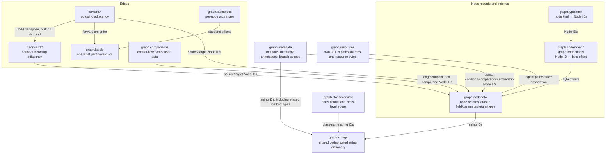
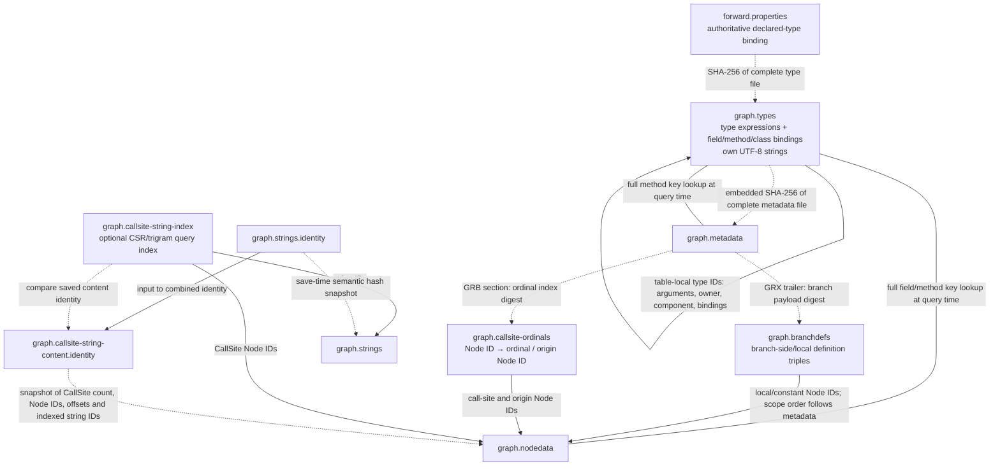
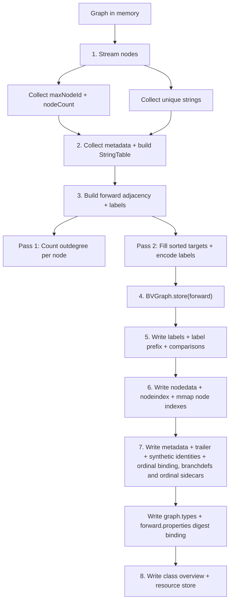
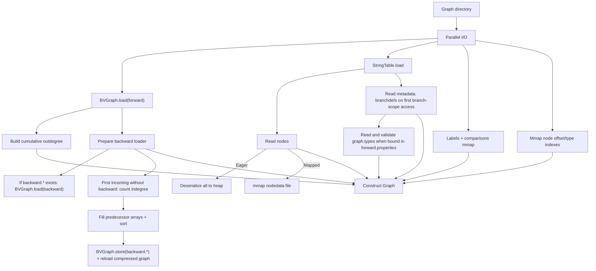

# WebGraph Storage Format

## File Layout

```
graph-dir/
├── forward.*          BVGraph compressed forward adjacency
├── backward.*         Optional BVGraph compressed backward adjacency
├── graph.strings      FrontCodedStringList (deduplicated string dictionary)
├── graph.strings.identity SHA-256 semantic identity of the ordered string dictionary
├── graph.labels       byte[] edge type labels (1 byte per arc)
├── graph.labelprefix  int[] cumulative outdegree values for label lookup
├── graph.nodedata     Sequential node records
├── graph.nodeindex    Legacy/compat Node ID -> offset index
├── graph.nodeoffsets  Mmap Node ID -> offset lookup
├── graph.typeindex    Mmap node type -> Node ID ranges lookup
├── graph.metadata     Methods, type hierarchy, enums, annotations, branch scopes
├── graph.types        Optional deduplicated declared types + member bindings (own UTF-8 strings)
├── graph.classoverview Persisted explorer overview summary
├── graph.resources    Persisted text resources, including an explicit empty store
├── graph.callsite-string-index Optional CallSite CSR/trigram query index
├── graph.callsite-string-content.identity SHA-256 identity binding CallSite fields to node offsets
├── graph.branchdefs   Optional branch-side local definitions, bound to graph.metadata by its trailer
├── graph.callsite-ordinals Optional call-site ordinals/origins, bound to graph.metadata
└── graph.comparisons  BranchComparison data for ControlFlowEdges
```

The following query-index and backward-adjacency behavior describes the JVM reader.
The Rust reader builds forward/backward CSR in memory, does not use `backward.*` or
`graph.labelprefix`, and rejects an incompatible present CallSite query index.

The production `graphite build` command prepares `graph.callsite-string-index` while saving the
graph. A mapped load restores its primitive arrays lazily under the shared CallSite-index heap
budget, so unrelated Method queries retain no CallSite-index heap and the first broad CallSite
string query does not rebuild or rescan it. The two identity files are generated from the core
graph while saving, so restoring the optional index compares its complete graph identity without
moving that scan onto the first online query. Direct library callers can request the same build artifact with
`GraphStore.save(..., prepareCallSiteStringIndex = true)`; the default library save omits this
optional query cache to preserve the existing save and storage contract.

Wide split queries restore and validate the existing `graph.callsite-string-index` under its shared
heap budget, then reuse its exact trigram candidates and property membership for segmented raw
CallSite scans. No additional persisted lookup format is required. A missing, incompatible,
corrupt, or budget-denied index still fails open to the raw-scan correctness path.

For legacy graphs, or when the sidecar is missing or invalid, a relevant query builds the index in
memory and atomically persists it when that complete index is released or the mapped graph closes.
Budget denial, cancellation, or an unwritable directory preserves the raw-scan correctness
fallback. Set `-Dgraphite.webgraph.prepareCallSiteStringIndexOnLoad=true` to prepare a missing index
before `loadMapped()` returns, or `false` to disable persisted restore and best-effort persistence.

`GraphStore.save()` writes only `forward.*`. Backward adjacency is loaded from
`backward.*` when those files already exist; otherwise the first `incoming()`
query builds the transpose from `forward.*`, tries to store it as compressed
`backward.*`, reloads a compressed graph, and lets the temporary uncompressed
transpose be collected. If the graph directory is not writable, the current
process still uses a transient compressed graph; it just cannot reuse
`backward.*` across later processes. Forward-only queries still do not pay
transpose construction during load.

## File Relationships

The diagrams describe the current on-disk layout. Solid arrows show references or reader
lookups; dashed arrows show digest/identity bindings. An arrow does not mean a filename is
stored in the referring record. `Node ID`, `string ID`, and declared `type ID` are separate
index spaces. `graph.typeindex` indexes **node kinds**, not declared JVM types.

### Core records and lookups


```mermaid
flowchart TB
    subgraph NodeRecords["Node records and indexes"]
        TI["graph.typeindex<br/>node kind → Node IDs"]
        NI["graph.nodeindex / graph.nodeoffsets<br/>Node ID → byte offset"]
        ND["graph.nodedata<br/>node records, erased field/parameter/return types"]
        TI -->|"Node IDs"| NI
        NI -->|"byte offsets"| ND
    end

    subgraph Edges["Edges"]
        F["forward.*<br/>outgoing adjacency"]
        B["backward.*<br/>optional incoming adjacency"]
        LP["graph.labelprefix<br/>per-node arc ranges"]
        L["graph.labels<br/>one label per forward arc"]
        C["graph.comparisons<br/>control-flow comparison data"]
        F -->|"JVM transpose, built on demand"| B
        F -->|"forward arc order"| L
        LP -->|"start/end offsets"| L
    end

    M["graph.metadata<br/>methods, hierarchy, annotations, branch scopes"]
    O["graph.classoverview<br/>class counts and class-level edges"]
    R["graph.resources<br/>own UTF-8 paths/sources and resource bytes"]
    S["graph.strings<br/>shared deduplicated string dictionary"]

    F -->|"source/target Node IDs"| ND
    B -->|"source/target Node IDs"| ND
    C -->|"edge endpoint and comparand Node IDs"| ND
    M -->|"branch condition/comparand/membership Node IDs"| ND
    ND -->|"string IDs"| S
    M -->|"string IDs, including erased method types"| S
    O -->|"class-name string IDs"| S
    R ---|"logical path/source association"| ND
```

`graph.labelprefix` can be reconstructed from forward outdegrees. The backward graph uses
the forward edge labels; it has no separate label file. `graph.resources` stores its own
text and bytes and does not reference `graph.strings` or store Node IDs.

### Declaration types, sidecars and integrity bindings


```mermaid
flowchart TB
    P["forward.properties<br/>authoritative declared-type binding"]
    T["graph.types<br/>type expressions + field/method/class bindings<br/>own UTF-8 strings"]
    M["graph.metadata"]
    N["graph.nodedata"]
    D["graph.branchdefs<br/>branch-side/local definition triples"]
    Q["graph.callsite-ordinals<br/>Node ID → ordinal / origin Node ID"]
    S["graph.strings"]
    SI["graph.strings.identity"]
    CI["graph.callsite-string-content.identity"]
    I["graph.callsite-string-index<br/>optional CSR/trigram query index"]

    P -.->|"SHA-256 of complete type file"| T
    T -.->|"embedded SHA-256 of complete metadata file"| M
    T -->|"table-local type IDs: arguments, owner, component, bindings"| T
    T ---|"full field/method key lookup at query time"| N
    T ---|"full method key lookup at query time"| M
    M -.->|"GRX trailer: branch payload digest"| D
    M -.->|"GRB section: ordinal index digest"| Q
    D -->|"local/constant Node IDs; scope order follows metadata"| N
    Q -->|"call-site and origin Node IDs"| N
    I -->|"string IDs"| S
    I -->|"CallSite Node IDs"| N
    SI -->|"input to combined identity"| CI
    SI -.->|"save-time semantic hash snapshot"| S
    I -.->|"compare saved content identity"| CI
    CI -.->|"snapshot of CallSite count, Node IDs, offsets and indexed string IDs"| N
```

A full member key is the declaring class, member name and **complete JVM descriptor**,
including the return type for methods. The current `graph.types` v1 stores these keys and
its type names/scopes as its own UTF-8 strings; it contains neither `graph.strings` IDs nor
Node IDs. Its integer type references point only to its own deduplicated expression rows.
Fields, parameters and returns resolve that binding using their erased declaration key.
A formatted value such as `List<User>` is rendered on demand rather than stored as a string.

The `graph.types` binding is authoritative in `forward.properties`: no binding means a
legacy graph and any orphan type file is ignored; a binding with a missing or mismatched
file is a load error. The embedded metadata digest prevents attaching the table to another
metadata file. JVM loading validates the complete table and retains mapped rows/indexes;
Rust loading currently decodes the table into memory. See [Declared JVM types](declared-types.md)
for the complete wire format and query properties.

The CallSite identity files are snapshots generated while saving the graph.
Normal index restore compares the saved combined identity; it does not recompute these
identities by hashing the core files. When snapshots are absent, the JVM computes the required
identity from core data. The combined identity includes the ordered-string
identity, CallSite count, and each CallSite's Node ID, byte offset and four indexed string IDs.

The other sidecars have their own policies described below. On the JVM, an unusable query
index falls back to raw scanning and unusable branch definitions fall back to empty lists.
Rust rejects an incompatible present query index and ignores branch-definition semantics.
Unavailable call-site ordinals read as null. The ordinal index also contains hashes for its
entry blocks; the diagram shows the file-level binding rather than those internal blocks.

## Binary Format

### Header (all Graphite files)

4-byte header: 3-byte magic prefix + 1-byte version, packed as one `int`.

| File | Magic | Header |
|------|-------|--------|
| graph.types | `GTY` | `0x47545901` (independent version 1) |
| graph.metadata | `GRM` | `0x47524D03` (trailer `GRX` `0x47525801`, synthetic identities `GRS` `0x47525301`, ordinal binding `GRB` `0x47524202`, last) |
| graph.nodedata | `GRN` | `0x47524E03` |
| graph.nodeindex | `GRI` | `0x47524903` |
| graph.nodeoffsets | `GRL` | `0x47524C03` |
| graph.typeindex | `GRT` | `0x47525403` |
| graph.classoverview | `GRO` | `0x47524F03` |
| graph.comparisons | `GRC` | `0x47524303` |
| graph.resources | `GRR` | `0x47525201` |
| graph.callsite-string-index | `GRCS` | `0x47524353` |
| graph.branchdefs | `GRD` | `0x47524401` |
| graph.callsite-ordinals | `GRQ` | `0x47525104` |

Current node and metadata writers emit version `3`. Their readers accept legacy version `1` and transitional
version `2` data from stable releases and decode legacy annotation payloads, but any graph re-saved by a current
build is upgraded to version `3`. The independent `graph.resources` format remains at version `1`.

`graph.callsite-ordinals` is an independent version `4` sidecar: `int32 header`, a copy of the 32-byte binding
digest, then the index the binding is the SHA-256 of (`int32 count`, `int32 originCount`, the node id heading
each block of 256 ordinal entries, and the SHA-256 of each 2048-byte block of the entries), then the entries:
per call site `int32 nodeId, int32 ordinal`, ascending by node id, then per derived call site resolved from
another `int32 nodeId, int32 origin`, ascending by node id. The origins sit apart so that decoding a call site,
which reads its ordinal, searches no more than before. The ordinal is
the rank of the call among the invokes of the same callee in the same calling method's bytecode, in statement
order from `0`, every invoke, including the boxing and unboxing calls the graph shows as dataflow rather than
as call sites, so `(caller_signature, caller_descriptor, callee_signature, callee_descriptor, ordinal)` names one call site and keeps naming it
while the method's other statements change; a call the frontend derived rather than read from the bytecode (a function value's dispatch resolved
to its body, a lambda body reached through `invokedynamic`, the methods a function object implements) counts
apart, from `-1` downwards. It is a file of its own rather than a field of the `CallSite` record because the
record format is what every reader shares: the benchmark gates query the candidate's graphs with the base
revision's code, and a format version it does not know fails the whole comparison, while a file it never
opens costs nothing. Both loaders give a `CallSite` node its ordinal as they decode it, using
an indexed search over the retained sidecar bytes. Both hash the index at load; Kotlin validates
entry blocks lazily and Rust validates every block up front. A graph without the sidecar, or
with an invalid sidecar (for example, wrong header or truncated data), reads every ordinal as
`null`. The sidecar is bound to the graph it describes the way `graph.branchdefs` is: the same digest is the
last section of `graph.metadata` (`GRB`, 36 bytes, written after the trailer and the synthetic identities, so
a reader finds it by looking at the file's tail without parsing the metadata, and a reader that predates it
stops at its header). A writer that does not know the sidecar rewrites `graph.metadata` without that section,
and the sidecar it leaves behind, whose ordinals would attach to the reused node ids of another graph, no
longer binds and is ignored with one warning; a current save removes the old sidecar before it writes
anything and writes the sidecar and the binding only when some call site has an ordinal. Both readers hash
the index and compare that to the binding, not the copy of the digest in the sidecar's header, and then each
block of entries against the digest the index holds for it (the mapped Kotlin reader on the block's first
touch, the Rust reader for every block as it parses them): the entries are what a `select` folds by, and a
header is no proof of the bytes behind it. Every fresh mapping hashes the index, and every block it reads: a
path, a size and a modification time are no content identity (a file replaced by other bytes of the same
length can keep both), so nothing short of the hash admits the entries. Hashing the whole sidecar per mapping
instead cost the cold rows of the slow-query-shapes gate 15–20% per query on a 14-megabyte sidecar; the index
is a sixty-fourth of the entries, and a lookup proves one 2-kilobyte block.
Current builds always write `graph.resources`, including a valid zero-entry store when no supported text resources
exist. Its absence therefore identifies a graph produced without resource persistence (for example by a legacy CLI),
not an empty resource set. Other graph APIs remain available, while resource HTTP endpoints return `409` with an
instruction to rebuild the graph using the current CLI.

`graph.branchdefs` is an independent version `1` sidecar written after `graph.metadata`. Its preamble is the
header, the payload length and the payload's SHA-256; `graph.metadata` contains a trailer (`GRX` magic, version
`1`, the same SHA-256) that binds the two files. The payload lists, for every branch scope in metadata order, the
writes on each side to locals that have a constant definition on some branch side (a side's writes are those
reached only through that side: a write both sides reach, such as one after the merge point, at a loop exit or
at the shared target of a branch with an empty `then`, belongs to neither), as
`[stmtOrdinal, localNodeId, constantNodeId]` triples with `-1` for a write whose value is not a constant
(`int32 scopeCount`, then per scope `int32 trueCount`, the true triples, `int32 falseCount`, the false triples),
followed by a table of every write of each such local (`int32 localCount`, then per local `int32 localNodeId`,
`int32 count`, the triples). Node ids are raw ints, not string table indices. The table exists because
persistence collapses repeated arcs between the same nodes, so a local's definition multiset can no longer be
read off its ASSIGN edges after a save, and because a surviving non-constant write must be visible to block
folding.

The trailer is what makes a stale sidecar detectable: the graph files encode neither statement ordinals nor
side attribution, so two graphs can persist byte-identically while the sidecar differs. A writer that predates
the sidecar re-saves `graph.metadata` without the trailer, and a current writer re-saves it with a new digest;
either way the old `graph.branchdefs` no longer matches and is never attached. Readers that predate the trailer
stop after the last metadata section and never see it. The Rust reader skips the GRX and GRS
sections to reach the ordinal binding, without interpreting branch-definition semantics.
On the JVM, the sidecar is read lazily on the first branch-scope access: the preamble is validated
(header, budget, exact payload length, digest equal to the trailer's) before the payload is read, and every count in the payload is checked against the remaining
bytes before an array is allocated. The decoded content is then checked against the persisted nodes and the
writer's invariants: the local table may not have more entries than `graph.nodedata` counts nodes, every table
key must be a persisted `LocalVariable` node, every constant id must be `-1` or a persisted constant node (the
eager loader looks the tag up in its node map, the mapped loader reads the tag byte through the node offset
index; one lookup per table key and per distinct constant, not per triple), every ordinal must be non-negative
and strictly increasing within a side and within a table, no statement may appear on both sides of one scope,
every entry of a local's table must name that local, every side definition must appear in the table of its
local, and every table must belong to a local some side defines.
A loaded graph therefore never exposes a definition that points outside it, and `localDefinitionsFor` never
disagrees with the side definitions a consumer subtracts from it. The file is derived data: when it is missing, has a wrong magic or version,
does not match the trailer, or is corrupt in any of these ways, the loader logs one warning and returns every
branch scope with empty definition lists. The trailer and the sidecar are not part of the format version, so
the Rust backend ignores their branch-definition semantics.

`graph.metadata` may contain another optional section after the trailer: the synthetic identities (`GRS`
magic, version `1`), followed by the ordinal binding when present. It records, for every
compiler-numbered synthetic member of the loaded packages (a class or method with `ACC_SYNTHETIC`, or whose name carries a purely numeric ordinal: `Foo$1`, `Foo$bar$1`,
`lambda$run$0`, `run$lambda$0`, `access$000`, `Foo$$ExternalSyntheticLambda0`), a 128-bit fingerprint that does
not move when a sibling is inserted or removed: `int32 count`, then per entry the member key as a string table
index (the class name, or the method signature as `MethodDescriptor.signature` renders it) and 16 raw bytes.
The fingerprint hashes the member's kind, its name with the ordinals removed, its descriptor and modifiers, a
class's supertypes and fields, and a canonical rendering of every statement in its body (locals renumbered by
first appearance, no line numbers, branch and exception targets as statement indices) in which references to
other numbered members are replaced by their fingerprints; members that reference each other use each other's
stripped names, and members whose fingerprints still coincide are told apart by their order of appearance. The
section is written only when there is an identity to record, so a graph without synthetic members persists
byte-identically to one saved before the section existed. The loader reads the trailer and this section in
either order and stops at end of file or at the first header that is neither, so a file without the section
loads with an empty identity map; readers that predate the section stop at the trailer and never see it, and
the Rust reader ignores it like the trailer. Members with stable names have no entry: a consumer that needs a
build-independent key for a method of a synthetic class combines the class's fingerprint with the method's
own name.

### Edge Label Encoding (8-bit)

```
bits 0-2: edge family (0=DataFlow, 1=Call, 2=Type, 3=ControlFlow, 4=Resource)
bits 3-6: subkind ordinal or call flags
bit 7: reserved
```

## Pipeline

These save/load flows describe the JVM `GraphStore`; native loading builds CSR adjacency
eagerly and does not use the JVM backward-graph cache.

```
BUILD                          SAVE                              LOAD
SootUpAdapter                  GraphStore.save()                 GraphStore.load()
  → DefaultGraph                 1. String collection              1. BVGraph.load       ┐
                                 2. Metadata + StringTable         2. StringTable.load    ├ parallel
                                 3. Forward adjacency + labels     3. Labels + comparisons mmap
                                                                   4. Mapped node indexes + nodedata
                                                                   5. Prepare/load backward on demand
                                 4. BVGraph.store                  5. Read nodes + metadata
                                 5. Labels + label prefix + comparisons write
                                 6. Nodedata + node indexes write
                                 7. Metadata + declared type table write
                                 8. Class overview + resource store write
```

### Save Flow


```mermaid
graph TD
    A[Graph in memory] --> B[1. Stream nodes]
    B --> B1[Collect maxNodeId + nodeCount]
    B --> B2[Collect unique strings]
    B1 & B2 --> C[2. Collect metadata + build StringTable]
    C --> D["3. Build forward adjacency + labels"]
    D --> D1["Pass 1: Count outdegree per node"]
    D --> D2["Pass 2: Fill sorted targets + encode labels"]
    D2 --> E["4. BVGraph.store(forward)"]
    E --> F[5. Write labels + label prefix + comparisons]
    F --> G["6. Write nodedata + nodeindex + mmap node indexes"]
    G --> H[7. Write metadata + trailer + synthetic identities + ordinal binding, branchdefs and ordinal sidecars]
    H --> T[Write graph.types + forward.properties digest binding]
    T --> I[8. Write class overview + resource store]
```

### Load Flow


```mermaid
graph TD
    A[Graph directory] --> B[Parallel I/O]
    B --> B1["BVGraph.load(forward)"]
    B --> B2[StringTable.load]
    B --> B3[Labels + comparisons mmap]
    B --> B4[Mmap node offset/type indexes]
    B1 --> C[Build cumulative outdegree]
    B1 --> D[Prepare backward loader]
    D --> D1["If backward.* exists: BVGraph.load(backward)"]
    D --> D2[First incoming without backward: count indegree]
    D2 --> D3[Fill predecessor arrays + sort]
    D3 --> D4["BVGraph.store(backward.*) + reload compressed graph"]
    B2 --> E[Read nodes]
    E -->|Eager| E1[Deserialize all to heap]
    E -->|Mapped| E2[mmap nodedata file]
    B2 --> F[Read metadata; branchdefs on first branch-scope access]
    F --> T[Read and validate graph.types when bound in forward.properties]
    C & D & B3 & B4 & E & F & T --> G[Construct Graph]
```

### Load Modes

| Mode | Behavior | Threshold | Heap |
|------|----------|-----------|------|
| EAGER | All nodes deserialized to heap | < 1M nodes | Highest |
| MAPPED | Node data and mapped node indexes memory-mapped (OS page cache) | >= 1M nodes | Off-heap for node records, node offset lookup, and node type lookup |

## Performance

### Constraints

Every optimization must satisfy both simultaneously — trading one for the other is rejected.

| Constraint | Target | Measured by |
|------------|--------|-------------|
| **Time** | Minimize build + save + load | JMH SingleShotTime, same-session back-to-back |
| **Peak memory** | <= 4 GB for 10M nodes | `-Xmx4g`, no OOM |

### Methodology

1. **Measure** — phase breakdown to find the bottleneck
2. **Hypothesize** — target the dominant phase
3. **Validate** — same machine, same session, both metrics must hold
4. **Reject** if either metric regresses

### Benchmark Suites

Use both micro and end-to-end benchmarks. A change is not accepted based on synthetic numbers alone.

| Suite | Scope | Command |
|------|-------|---------|
| `SavePhaseBreakdownBenchmark` | Isolate save phases | `./gradlew :webgraph:jmh -Pjmh.filter=SavePhaseBreakdownBenchmark` |
| `GraphBuildPersistBenchmark` | Synthetic 10M save/load guardrail | `./gradlew :webgraph:jmh -Pjmh.filter=GraphBuildPersistBenchmark` |
| `GraphEndToEndBenchmark` | Real JAR `build -> save -> load -> query` | `./gradlew :webgraph:jmh -Pjmh.filter=GraphEndToEndBenchmark` |
| `GraphBenchmark` | Persisted-graph load/query comparisons | `./gradlew :webgraph:jmh -Pjmh.filter='(Android|LargeCorpus).*(Load|Query)Benchmark'` |

`GraphEndToEndBenchmark` and the load/query benchmarks auto-discover fixture JARs from the Gradle
cache. Explicit `-Dandroid.jar.path`, `-Dtika.jar.path`, `-Dhive.jar.path`, and
`-Dkotlin.compiler.jar.path` values take precedence over auto-discovery; persisted graph overrides
use the corresponding `.graph.path` properties and are forwarded to the forked JMH process. A
persisted override must have the exact node count of its named corpus, preventing mislabeled runs.
Gradle validates all configured graph overrides before starting any JMH fork, so an invalid override
fails the documented command instead of producing a partial result table.

The committed fixture fingerprints, 4 GiB performance gates, and initial measurements are documented in [large-corpus-performance-baseline.md](large-corpus-performance-baseline.md).

### Results Summary

| Version / PR | What | Synthetic save (10M, 4g) | Production (4.1M) | |
|--------------|------|--------------------------|-------------------|-|
| [#53](https://github.com/johnsonlee/graphite/pull/53) | Baseline (flat arrays for load) | 84s | real 15m57s | |
| [#55](https://github.com/johnsonlee/graphite/pull/55) | Flat single-file format | no change | — | :x: closed |
| [#56](https://github.com/johnsonlee/graphite/pull/56) | Inline nodeindex | **16s (-81%)** | **real 8m31s (-47%)** | :white_check_mark: |
| [#61](https://github.com/johnsonlee/graphite/pull/61) | Merge passes (4→2) | **9s (-44%)** | — | :white_check_mark: |
| [#62](https://github.com/johnsonlee/graphite/pull/62) | Parallelize step 3 | 3.8s (-59% synthetic) | real unchanged, sys +35% | :x: reverted |
| [#65](https://github.com/johnsonlee/graphite/pull/65) | Buffer MmapGraphBuilder I/O | — | **real 5m43s (-33%), sys -44%** | :white_check_mark: |
| [#66](https://github.com/johnsonlee/graphite/pull/66) | MmapGraph reads via mmap | — | **real 4m04s (-29%), sys -43%** | :white_check_mark: |
| [#67](https://github.com/johnsonlee/graphite/pull/67) | FastArchiveAnalysisInputLocation | — | real 9m41s (+138%), user +76% | :x: reverted |
| `1.1.0` | Current release, same production benchmark | — | **real 1m58s, user 2m18s, sys 0m48s** | :white_check_mark: |

Compared with the historical best published numbers, `1.1.0` improves:

| Metric | Historical best | `1.1.0` | Change |
|--------|-----------------|---------|--------|
| real | 4m04s ([#66](https://github.com/johnsonlee/graphite/pull/66)) | **1m58s** | **-2m06s (-51.6%)** |
| user | 8m00s ([#65](https://github.com/johnsonlee/graphite/pull/65)) | **2m18s** | **-5m42s (-71.3%)** |
| sys | 2m46s ([#65](https://github.com/johnsonlee/graphite/pull/65)) | **0m48s** | **-1m58s (-71.1%)** |

### How Each Bottleneck Was Found and Fixed

**PR #53 → #56: "BVGraph must be the bottleneck" — wrong**

Assumption: BVGraph compression (step 4) dominates save. PR #55 built a flat format to skip BVGraph.

Reality: `SavePhaseBreakdownBenchmark` showed `buildNodeIndex` re-scan (step 6) was **92%** of save. BVGraph was **2%**. PR #55 closed — flat and compressed had identical times.

Fix (PR #56): write nodedata + nodeindex simultaneously via `CountingOutputStream`. `writeNode()` returns the tag byte. Zero re-scan, zero intermediate collections.

| | Step 6 time | Total save |
|--|------------|------------|
| Before | 69,895 ms (92%) | 84s |
| PR #56 | 0 ms (inline) | **16s** |

Production impact: sys dropped **79%** (24m → 5m) — the re-scan via `RandomAccessFile.seek()` was pure syscall overhead.

**PR #56 → #61: 4 passes over `outgoing()` → 2**

With step 6 eliminated, step 3 (`graph.outgoing()` iteration) became the bottleneck. Two separate methods each iterated all edges twice.

Fix (PR #61): merge into single `buildForwardData` with 2 passes.

| | Save (same-session, 4g) |
|--|------------------------|
| PR #56 | 15,132 ms |
| PR #61 | **9,090 ms (-40%)** |

**PR #61 → #62: sequential → parallel (reverted)**

Each node in step 3 is independent — `outgoing()` is read-only, array writes are non-overlapping. Only shared state is `comparisonMap` (switched to `ConcurrentHashMap`).

Fix (PR #62): `ForkJoinPool` parallelism for both passes.

| Threads | Save (ms) | vs 1 thread |
|---------|-----------|-------------|
| 1 | 9,257 | — |
| 2 | 6,100 | -34% |
| 4 | 4,927 | -47% |
| 8 | 3,794 | -59% |

Synthetic results looked promising, but production measurement (rc8, 4.1M nodes) showed real time unchanged and sys time +35% from ForkJoinPool thread management overhead. Reverted to sequential 2-pass structure from PR #61.

**PR #62 → #65: unbuffered RAF → buffered streams**

async-profiler flame graph on production showed `MmapGraphBuilder.addEdge → RandomAccessFile.write` as a major hotspot. Default `MmapGraphBuilder` wrote every node and edge directly to `RandomAccessFile` — millions of syscalls.

Fix (PR #65): wrap with `.buffered()`. Two lines changed.

| Metric | PR #56+#61 | PR #65 | Change |
|--------|-----------|--------|--------|
| real | 8m31s | **5m43s** | **-33%** |
| user | 8m32s | 8m | -6% |
| sys | 4m56s | **2m46s** | **-44%** |

user unchanged (same CPU work), sys halved (buffered writes consolidated millions of syscalls), real dropped because main thread no longer blocked on I/O.

### Rejected Approaches

| Approach | Outcome | Why rejected |
|----------|---------|-------------|
| Flat single-file format ([#55](https://github.com/johnsonlee/graphite/pull/55)) | :x: Same save time | Bottleneck was re-scan, not BVGraph |
| Precomputed SortedAdjacency | :x: OOM @4g | +200 MB permanent heap |
| Lazy SortedAdjacency | :x: OOM @4g | Delays but doesn't reduce allocation |
| MmapGraph + disk adjacency | :x: 100s @6g | 10M random seeks for deserialization |
| BVGraph thread tuning (1-4) | :x: < 1% change | Algorithm-bound (serial dependency) |
| ForkJoinPool parallelism for step 3 ([#62](https://github.com/johnsonlee/graphite/pull/62)) | :x: real unchanged, sys +35% | Production: ForkJoinPool overhead outweighed parallel gains; synthetic benchmarks overstated benefit |

### Production Phase Breakdown (rc8, PR #56 + #61, 4.1M nodes)

| Step | Phase | Time | % |
|------|-------|------|---|
| 1 | String collection | 16,703 ms | 13% |
| 2 | Metadata + StringTable | 32,950 ms | **26%** |
| **3** | **Forward adjacency + labels** | **56,772 ms** | **45%** |
| 4 | BVGraph.store | 858 ms | 1% |
| 5 | Labels + comparisons | 102 ms | 0% |
| 6 | Nodedata + nodeindex | 17,815 ms | 14% |
| 7 | Metadata write | 282 ms | 0% |
| | **Save total** | **125s** | |

Synthetic benchmarks (IntConstant) understate steps 1/2/6 because production uses complex CallSiteNode with MethodDescriptor strings.

### Next Targets

| Target | Phase | Approach |
|--------|-------|----------|
| Build time | BUILD | Reduce SootUp body-walk overhead, or bypass it with an ASM-first persisted builder for the subset of graph semantics that can be emitted directly |
| String + metadata (50s, 40% of save) | Steps 1+2 | Pre-collect at build time, or merge with step 3 |
| Nodedata write (18s, 14% of save) | Step 6 | Optimize MethodDescriptor serialization |

### Key Lesson

Adding precomputed caches to reduce time tends to increase memory — violating the constraint. The path that works: **eliminate redundant work** (fewer passes, no re-scans). Both metrics improve simultaneously. Parallelism that shows gains in synthetic benchmarks can regress in production due to thread management overhead.

## Optimization Attempt Log

The chronological record of each WebGraph optimization attempt now lives in [webgraph-optimization-attempts.md](webgraph-optimization-attempts.md).
